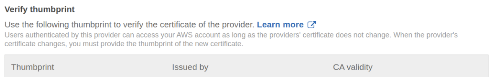

# Integrated Authentication

클라우드 내 데이터에 접근하기 위해 
1. 서버 - 클라이언트 형식으로 인증 서버를 매개로 토큰을 받아 사용하거나 
2. 데이터 소스에서 직접 받은 토큰을 로컬에 저장하여 사용하는
방식이 있다.

데이터 소스에서 직접 받은 토큰을 로컬에서 저장하여 사용하면 유저가 토큰 유출에 대한 위험도가 있고, 데이터 소스가 늘어날수록 관리해야 하는 계정도 늘어난다.

keycloak을 통해 aws 인증 시스템을 생성하고자 한다. AWS에서 권장하는 인증 방식은 access key 대신 임시 보안 자격 증명(IAM Role)을 사용하고 모든 AWS 계정 루트 사용자 access key는 비활성화하는 것이다.

## [AWS SAML based User Federation using Keycloak](https://neuw.medium.com/aws-connect-saml-based-identity-provider-using-keycloak-9b3e6d0111e6)

- keycloak을 사용하여 AWS IAM에 SAML based Identity Provider를 추가한다.
- IdP를 통해 AWS에 federated user로 로그인할 수 있다.

SAML에서 보통 브라우저를 통해 assertion을 전송한다. SAML Request에서 ProtocolBinding을 HTTP-POST로 지정하여 POST를 사용하여 요청을 한다.

로컬에서 빠르게 keycloak 서버를 띄우기 위해 docker로 간단하게 배포하였다.
```console
$ docker run -p 8080:8080 --rm --name keycloak-test -e KEYCLOAK_ADMIN=admin -e KEYCLOAK_ADMIN_PASSWORD=admin quay.io/keycloak/keycloak:18.0.0 start-dev
```

1. keycloak에서 AWS를 client로 설정

    AWS를 client로 설정한다. keycloak에서 realm을 새로 생성해서 진행하는 것이 좋다. SAML metadata document를 사용하여 service provider(SP)로 AWS를 등록한다.  
    ```bash
    # saml-metadata.xml 다운로드
    curl -O https://signin.aws.amazon.com/static/saml-metadata.xml
    ```

    ```IDP Initiated SSO URL Name```에서 Target IDP initiated SSO URL은 `/realms/{real-name}/protocol/saml/clients/{URL name}`으로 구성되어 `amazon-aws`으로 설정하면 자동으로 `/realms/aws/protocol/saml/clients/amazon-aws`으로 변환되었다. 이에 따라 Base URL을 동일하게 설정해준다.

    

    scope에서 Default Realm Roles이 추가되어 AWS Role 전달시 SAML오류가Full Scope Allowed는 비활성화한다.

    AWS에서 설정하기 위해 SAML Metadata IDPSSODescriptor를 다운받는다.
    ```bash
    curl -o SAML-Metadata-IDPSSODescriptor.xml "http://localhost:8080/realms/aws/protocol/saml/descriptor"
    ```
2. AWS에서의 keycloak연동을 위한 identity provider 구성

    identity provider 설정 시 위에서 받은 SAML-Metadata-IDPSSODescriptor.xml를 활용한다.  

3. federation을 위한 AWS role 구성

    SAML 2.0 federation을 기반으로 role을 생성한다.

4. Keycloak에서 users/groups/roles 등 mappings 구성
    - `https://aws.amazon.com/SAML/Attributes/Role`
    - `https://aws.amazon.com/SAML/Attributes/RoleSessionName`
    - `https://aws.amazon.com/SAML/Attributes/SessionDuration`

    mapping이 누락되면 아래와 같이 누락된 항목에 대해 오류가 발생한다.
    ```
    RoleSessionName is required in AuthnResponse (Service: AWSSecurityTokenxxxx; Status Code: 400; Error Code: InvalidIdentityToken; Request ID: xxx; Proxy: null). Please try again.
    ```

### CLI 및 SDK를 사용한 프로그래밍 방식에서 사용 제한
[AWS CLI를 사용하여 AssumeRole을 호출하고 임시 사용자 자격 증명을 저장](https://aws.amazon.com/ko/premiumsupport/knowledge-center/aws-cli-call-store-saml-credentials/)을 참고하여 SAML에서 사용하는 assertion을 받아 터미널에서 인증하고자 한다.

브라우저에서 개발자 콘솔을 통해 SAML post 로그를 활용한다. 사전적으로 개발자 콘솔에서 SAML 패널이 없으면 따로 확장 프로그램을 추가한다.


saml 문서를 인코딩된 값인 SAMLResponse를 `samlresponse.log`에 저장하여 아래와 같이 AWS 임시 credential를 부여받는다. 
```
aws sts assume-role-with-saml --role-arn arn:aws:iam::123456789012:role/keycloak --principal-arn arn:aws:iam::123456789012:saml-provider/keycloak --saml-assertion file://samlresponse.log
```
하지만 아래와 같은 오류가 발생하였다. 
```
An error occurred (InvalidIdentityToken) when calling the AssumeRoleWithSAML operation: Invalid base64 SAMLResponse (Service: AWSOpenIdDiscoveryService; Status Code: 400; Error Code: AuthSamlInvalidSamlResponseException
```

이는 업로드한 연동 메타데이터 파일에 선언되어 있는 issuer와 SAML 응답의 issuer가 일치하지 않는 경우 발생할 수 있다고 한다. 메타데이터 파일은 IAM에서 IdP를 생성할 때 AWS에 업로드하는 파일이다. 


## [AWS user account OpenID federation using Keycloak](https://neuw.medium.com/aws-account-openid-federation-using-keycloak-40d22b952a43)

SAML 대신 OpenID Connect 프로토콜을 이용하여 CLI나 SDK에서 인증받을 수 있도록 한다. 
SAML과 마찬가지로 AWS에서 Role을 기반으로 임시 credential를 사용한다. 

1. keycloak에서 AWS를 client로 설정  
    open-connect 프로토콜을 사용하여 client를 생성한다. 

    추가적으로 이후에 터미널에서 직접 로그인하는 경우 `direct access grants`가 비활성화되어 있으면 아래와 같이 오류가 발생하게 된다.
    ```
    {
        "error": "unauthorized_client",
        "error_description": "Client not allowed for direct access grants"
    }
    ```
    이를 해결하기 위해 settings에서 `direct access grants`를 활성화시켜야 한다. 

2. AWS에서의 keycloak연동을 위한 identity provider 구성
OpenID Connect 기반의 Identity Provider를 생성하는데 Provider URL를 기입시 **provider의 HTTPS가 열려있어야 한다.** thumbprint를 인증해서 아래와 같이 verify한다.  
    

3. federation을 위한 AWS role 구성

    web identity를 기반으로 role을 생성한다.

4. Keycloak에서 users/groups/roles 등 mappings 구성

이후에 터미널에서 `curl`을 통해 access token을 발급받는다.
```
token=$(curl -s "https://{keycloak-server-URL}/auth/realms/data/protocol/openid-connect/token" -d grant_type=password -d client_id="aws-open-id" -d client_secret={client-secret} -d username=test -d password=test)
```

해당 access token을 기반으로 AWS STS에서 [`AssumeWithWebIdentity`](https://docs.aws.amazon.com/ko_kr/STS/latest/APIReference/API_AssumeRoleWithWebIdentity.html)를 이용하여 임시 credential를 부여받는다.
```                                                           
aws sts assume-role-with-web-identity --role-arn arn:aws:iam::123456789012:role/DEMO_OPEN_ID_READ_ONLY --web-identity-token $token --role-session-name keycloak
```
[Accessing Keycloak Endpoints Using Postman](https://www.baeldung.com/postman-keycloak-endpoints)에서 Keycloak endpoints를 확인할 수 있다.

python SDK를 사용하면 아래와 같이 사용할 수 있다.
```python
import boto.sts 
import boto.s3
import requests
import json

region = "us-east-1"

data = {
    'grant_type': 'password',
    'client_id': 'aws-open-id',
    'client_secret': client_secret,
    'username': 'test',
    'password': 'test',
}

response = requests.post('https://{keycloak-server-URL}/auth/realms/data/protocol/openid-connect/token', data=data)
access_token = json.loads(response.text)['access_token']

role_arn = "arn:aws:iam::123456789012:role/DEMO_OPEN_ID_READ_ONLY"
role_session_name = "keycloak"

conn = boto.sts.connect_to_region(region)
credentials = conn.assume_role_with_web_identity(role_arn, role_session_name, access_token).credentials    

s3conn = boto.s3.connect_to_region(region,
                     aws_access_key_id=credentials.access_key,
                     aws_secret_access_key=credentials.secret_key,
                     security_token=credentials.session_token)
 
buckets = s3conn.get_all_buckets()
 
print('Simple API example listing all S3 buckets:') # >> [bucket list]
```

