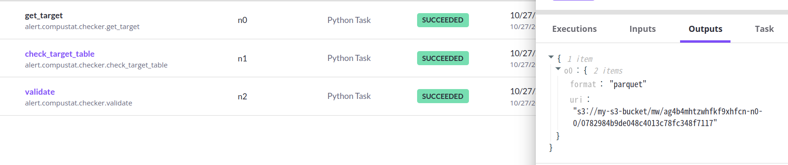

# [INFO] Snowflake Assignment of Resource Monitors
Snowflake Resource Monitor는 account level에서 모든 웨어하우스에서 credit 사용량을 확인할 수 있는 모니터링이다.


# [ERROR] ValueError: Type of Generic List type is not supported, Only generic univariate typing.List[T] type is supported.
Flyte에서 annotation으로 data type을 정의할 때 list가 아닌 `typing.List`로 정의해야 한다. **trasport를 위해 Flyte에서는 pickle을 활용하는데 이는 버전에 따라 호환되지 않을 문제가 있어 Flyte에서 지원하는 type을 사용해야 한다.**
```
{"name": "flytekit", "levelname": "WARNING", "message": "Unsupported Type ~T found, Flyte will default to use PickleFile as the transport. Pickle can only be used to send objects between the exact same version of Python, and we strongly recommend to use python type that flyte support."}
```

# [ERROR] conditional run in Flyte
특정 task 실행 결과에 따라 다음 task를 실행하려는데 다음과 같이 설정하면 오류가 발생한다.
```python
    (
        conditional(f"alert").if_( validate(result=result).is_true() ).then( do_action() )
    )
    
```
결과값을 변수로 할당하여 조건을 할당해야 한다.

```python
    validation = validate(result=result)
    (
        conditional(f"alert").if_( validation.is_true() ).then( do_action() )
    )
```
# [INFO] data( pd.DataFrame ) transport
```python
@workflow
def set_alert() -> None:
    target = pd.DataFrame(
        [
            {"target_date":last_monthend,"threshold": 10000},
            {"target_date":last_monthend, "threshold": 10000},
            {"target_date":last_day, "threshold": 10000},
        ]
    
    )
    result = check_target_table(target=target)
    send_alert(tables=result)
```
위의 경우는 다음과 같이 어떤 파일을 복사할 수 없다는 오류가 발생한다.
```
Message:

    Failed to get data from /tmp/flyte-r7wn254d/raw/e09563bbbd33... to /tmp/flyte4b_v3wrv/local_flytekit/3862c01cef872c8cb358ff41b26c1aae (recursive=True).

Original exception: cannot copy tree '/tmp/flyte-r7wn254d/raw/e09563bbbd33...': not a directory

User error.
```
다음과 같이 DataFrame을 task의 리턴값으로 받아 사용해야 한다.
```python

@task
def get_target() -> pd.DataFrame:
    today = pd.Timestamp.today()
    last_monthend = (today - pd.offsets.MonthEnd(1)).strftime("%Y-%m-%d")
    last_day = (today - pd.offsets.DateOffset(1)).strftime("%Y-%m-%d")

    return pd.DataFrame(
        [
            {"target_date":last_monthend,"threshold": 10000},
            {"target_date":last_monthend, "threshold": 10000},
            {"target_date":last_day, "threshold": 10000},
        ]
    
    )

@workflow
def set_alert() -> None:
    target = get_target()
    result = check_target_table(target=target)
    send_alert(tables=result)
```
`check_target_table`라는 task를 실행하는데 인풋으로 DataFrame을 받는데 데이터는 어딘가에 serialize되어 저장되어 있다. task를 실행할 때 데이터를 찾아 받아서 적용한다. 기존에는 DataFrame을 인풋으로 넣어도 `check_target_table`를 실행할 때 dataframe 자체가 아니라 저장공간을 전달받는다. 

*즉, 일련의 파이프라인을 생성하고 실제로 workflow, task를 실행할 때 실제 데이터가 생성 및 유입된다.*




- target의 uri 경로가 같은 것을 확인할 수 있다.( 포맷은 parquet으로 serialize되어 저장된다 )

## Considerations
문제는 작은 단위의 작업도 task로 실행해야 하는데, 쿠버네티스 위에서 돌아가다보니 하나의 pod로 띄워 실행되야 한다. 리소스가 비효율적으로 사용될 여지가 있다.
또한 데이터를 하나의 task내에서 처리할 때보다 task를 쪼개어 데이터를 전달받아 처리하면 시간이 훨씬 소요될 수 있다.

**효율적인 파이프라인 설계가 필요하다.**
