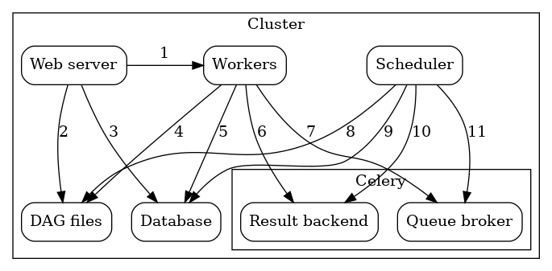

## Executor
Airflow Executor는 Task instance를 실행하기 위한 매커니즘이다.
Airflow를 구성할 때 한번에 하나의 Executor만 적용할 수 있다.

Executor Type은 2가지로 구분된다.
- 로컬에서 Task를 실행하거나( Local Executor )
- 원격 서버에서 Task를 실행( Remote Executor )

### LocalExecutor
- Debug Executor
- Local Executor
- Sequential Executor
default로 SequentialExecutor로 설정되어 있으나, **LocalExecutor로 변경하길 권장된다**.

### Remote Executors
- [Celery Executor](https://airflow.apache.org/docs/apache-airflow/stable/executor/celery.html)  
    - CeleryExecutor는 워커 수를 늘릴 수 있는 방법 중 하나이다.  
    

- CeleryKubernetes Executor
- Dask Executor
- [Kubernetes Executor](https://airflow.apache.org/docs/apache-airflow/stable/executor/kubernetes.html)  
    - Task Instance를 Kubernetes 클러스터 내에서 Pod로 실행시킨다. 이 때, **backend DB는 sqlite를 사용하지 않는다**.   
    - DAG에서 Task를 등록하면 KubernetesExecutor는 worker pod를 요청한다. 해당 Pod에서 Task를 실행하고 종료된다.   
    

## Xcom

XCom은 DAG내에서 task간에 데이터를 주고받기 위해 사용한다. Variable과 같이 key-value 형태이지만 DAG내에서만 공유할 수 있는 변수이다. 

XCom은 `key`및 `dag_id`, `task_id` 로 식별된다. 직렬화 가능한 모든 값을 가질 수 있지만 소량의 데이터용으로만 설계되어 있다. dataframe과 같은 큰 값을 전달하는 데 사용하지 않도록 한다.

XCom은 작업 인스턴스 의 `xcom_push`, `xcom_pull` 메서드를 사용한다. `do_xcom_push = True`이면  `return_value`를 통해 결과값을 자동으로 push할 수 있다. PythtonOperator의 경우 return이 자동적으로 Xcom 변수로 지정되게 된다.

> 참고 : [XComs - Airflow Documentation](https://airflow.apache.org/docs/apache-airflow/stable/concepts/xcoms.html)  
[Airflow Xcom 사용하기](https://dydwnsekd.tistory.com/107)
