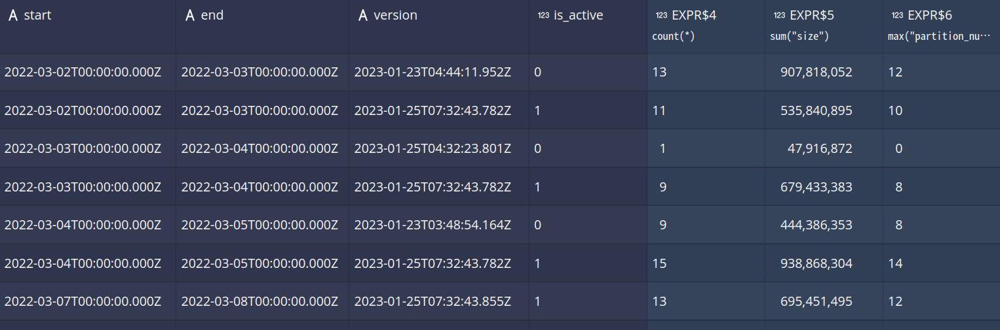

# [Druid]
## metadata storage

Druid SQL metadata tables인 sys schema에서 확인할 때와 metatdata storage로 설정한 postgresql에서 확인할 때와 segment와 task 정보가 다르다.

### sys schema - metadata

segment 정보를 확인할 수 있다.

```sql
select "start", "end", "version", "is_active", count(*), sum("size"), max("partition_num") from "sys"."segments" 
where "datasource" = 'option_order_012' group by "start", "end", "version", "is_active" order by "start"
```


- `is_active` 여부로 현재 활성화된 segment인지 확인 가능
- 같은 time range에 따라 version이 다르게 있다( 2023-01-23과 2023-01-25에 각각 같은 data source 이름으로 ingestion을 실행하였다 ). ingestion 실행 시간에 따라 version이 다르게 생성된다.

사이즈와 갯수는 아래와 같다  
```sql
select count(*) from "sys"."segments"
-- 876
select count(*) from "sys"."segments" where "is_active" = 1
-- 805
select sum("size") from "sys"."segments"  where "is_active" = 1
-- 47218517658
```

tasks 정보도 확인 가능한데 최근 시점만 나온다.  
```sql
select task_id, group_id, type, status from sys.tasks
```


### postgresql - metadata
우선 tasks 정보이다. 처음부터 생성된 task를 모두 포함하고 있다.

```sql
druid=# select concat(substring(id, 0, 20), '...') as id, created_date, active, type from druid_tasks;

           id           |       created_date       | active |         type          
------------------------+--------------------------+--------+-----------------------
 index_parallel_opti... | 2023-01-23T02:58:52.713Z | f      | index_parallel
 index_parallel_opti... | 2023-01-23T02:57:25.779Z | f      | index_parallel
 index_parallel_data... | 2023-01-23T03:03:14.565Z | f      | index_parallel
 single_phase_sub_ta... | 2023-01-23T03:46:50.857Z | f      | single_phase_sub_task
 single_phase_sub_ta... | 2023-01-23T03:46:50.999Z | f      | single_phase_sub_task
...
 index_parallel_opti... | 2023-01-25T06:00:22.830Z | f      | index_parallel
 index_parallel_sec_... | 2023-01-23T05:14:29.953Z | f      | index_parallel
 single_phase_sub_ta... | 2023-01-23T10:43:51.922Z | f      | single_phase_sub_task
 single_phase_sub_ta... | 2023-01-23T11:37:49.785Z | f      | single_phase_sub_task
 api-issued_kill_dat... | 2023-01-25T02:32:23.168Z | f      | kill
(20 rows)
```

segmens 정보는 다음과 같다. 전체 갯수가 sys schema와 다르다. 

```sql
druid=# select count(*) from druid_segments;
 count 
-------
  1690
(1 row)
```
같은 time range에 대해 version이 여러 개 존재한다.
```sql
druid=# select "start", "end", COUNT(distinct("version"))  from "druid_segments" group by "start", "end" order by "start";
          start           |           end            | count 
--------------------------+--------------------------+-------
 2022-03-02T00:00:00.000Z | 2022-03-03T00:00:00.000Z |     2
 2022-03-03T00:00:00.000Z | 2022-03-04T00:00:00.000Z |     3
 2022-03-04T00:00:00.000Z | 2022-03-05T00:00:00.000Z |     2
...

 2022-06-28T00:00:00.000Z | 2022-06-29T00:00:00.000Z |     2
 2022-06-29T00:00:00.000Z | 2022-06-30T00:00:00.000Z |     2
 2022-06-30T00:00:00.000Z | 2022-07-01T00:00:00.000Z |     3
(83 rows)
```

- 같은 data source로 ingestioin을 추가할 시 segments는 추가되나, version별로 생성되어 최신 버전에서 데이터를 조회하는 것으로 파악된다.  
    

## suitable for data warehouse?
> **Druid may not be the best fit for use cases that require complex joins, ad-hoc queries, or data warehousing scenarios where large amounts of data are loaded and processed in batch**. In those cases, more traditional data warehousing solutions, like Apache Hive or Apache Impala, may be more suitable.