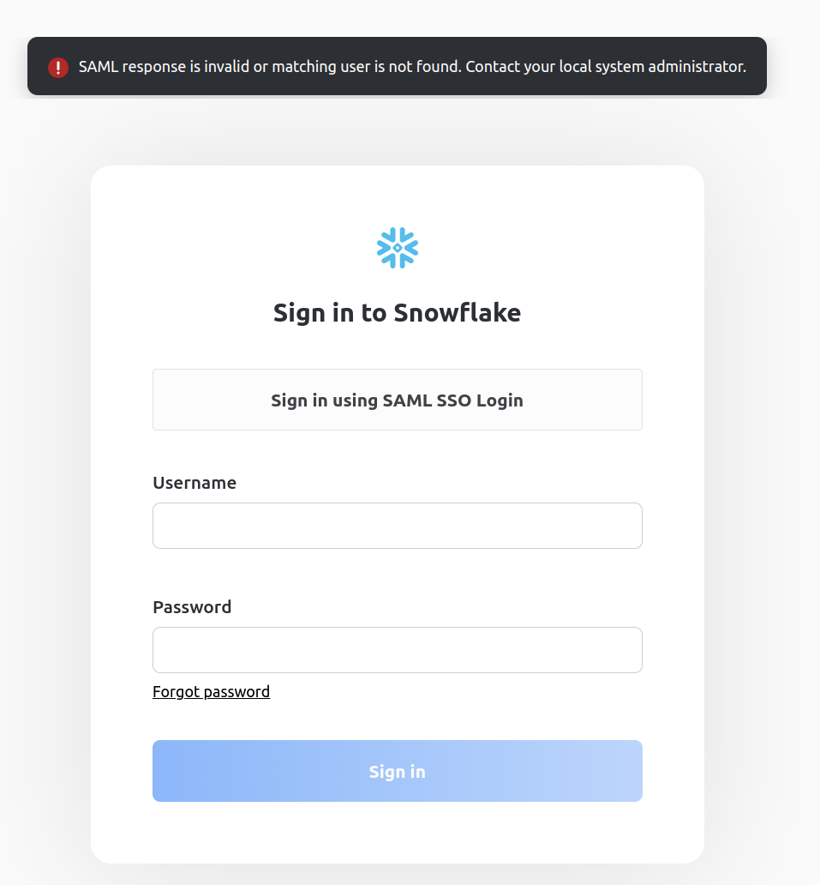

# [INFO] `git` 사용 - `rebase, `reset`
### `git rebase`
`git rebase`은 특정 branch와 HEAD를 맞추기 위한 git 명령어이다. MERGE작업이 많은 협업 코드 관리에서 필요성이 크다.

### `git reset`
git reset은 이미 COMMIT된 내역을 취소할 때 사용한다. 아래처럼

```bash
commit 00746c2cb668dd26c33af1dddee3fc979a60d9b3 (HEAD -> feature-branch)
...
commit b98d9ab6bf09ed9a463fcfb526e006ebf840c842 (origin/feature-branch)
...
commit aa7d7d7f17b162b611b9d81920db8ff7f298d4bb
...

# reset 적용 후
commit b98d9ab6bf09ed9a463fcfb526e006ebf840c842 (HEAD -> feature-branch, origin/feature-branch)
...
commit aa7d7d7f17b162b611b9d81920db8ff7f298d4bb
...
```

> [git add, commit, push 취소/변경/덮어쓰기(reset, revert, --amend)
](https://velog.io/@falling_star3/GitHub-git-add-git-commit-git-push-%EC%B7%A8%EC%86%8C%EB%B3%80%EA%B2%BD%EB%8D%AE%EC%96%B4%EC%93%B0%EA%B8%B0)

# [INFO] SCIM
Identity Provider와 Service Provider간에 User Identity 정보를 전송한다.
- REST( JSON ) 기반 프로토콜로 client, server를 정의한다.
- User CREATE/UPDATE/DELETE 이벤트가 발생하면 IdP에서 SCMI을 따라 SP에 자동으로 동기화된다.
- IdP에서 SP에서 Identity를 읽어와 User Directory에 추가한다.
 > [SCIM란?](https://www.okta.com/kr/blog/2017/01/what-is-scim/)
 
# [INFO] Keycloak - Event Logging 
Keycloak에서 user와 관련된 모든 이벤트는 기록될 수 있다. default로는 error 레벨 이벤트만 기록되나, 설정에서 storage를 활성할 수 있다.   


event를 확인하려면 `Login Events`에서 가능하다.  


### Event Listener
Event Listener는 이벤트에 대해 listen하여 트리거 형식으로 action을 실행한다. 

> [Keycloak Login Events](https://wjw465150.gitbooks.io/keycloak-documentation/content/server_admin/topics/events/login.html)

# [INFO] Keycloak - OpenID Connect parameter
- Standard Flow Enabled : 인증 코드를 포함하여 redirect 기반 인증 여부(Authrization Code Flow)
- Implicit Flow Enabled : 인증 코드를 제외하여 redict 기반 인증 여부(Implicit Flow)
- Direct Access Grants Enabled : 사용자의 username/password 접근 허용 여부
- Service Account Enabled : access token 검색 허용 여부
- Authorization Enabled : client별 권한 부여 여부
- Root URL
- Valid Redirect URIs : login/logout 후에 브라우저가 redirect하는 URI
- Admin URL
- Web Origins : CORS origin을 허용할 URI
- Backchannel Logout Session Required : backchannel logout에서 logout token에 대한 session ID 포함 여부

> [Keycloak SSO 설정하기](https://freestrokes.tistory.com/153)  

# [INFO] Keycloak - First Login Flow
첫 로그인시 Github과 같은 외부 IdP를 통해 사용자 login을 설정할 수 있다. `Authentication` tab에서 가능하다.  
> https://github.com/keycloak/keycloak-documentation/blob/main/server_admin/topics/identity-broker/first-login-flow.adoc
> [Github as Identity Provider in Keycloak](https://medium.com/keycloak/github-as-identity-provider-in-keyclaok-dca95a9d80ca)

# [INFO] Lambda scheduling
AWS CloudWatch Events-Schedule을 통해 Lambda를 배치로 실행할 수 있다. Lambda는 월 1백만건 요청까지는 무료이다.  
> 참고 : [AWS Lambda 로 Cron Job 돌리기 ](https://medium.com/itus-project/aws-aws-lambda-%EB%A1%9C-cron-job-%EB%8F%8C%EB%A6%AC%EA%B8%B0-c1c8875dc288)

# [ERROR] `We were unable to update your App Configuration: client_credentials flow can not be selected if client does not have a client secret. (Service: AWSCognitoIdentityProviderService; Status Code: 400; Error Code: InvalidOAuthFlowException; Request ID: xxxx)`

AWS Cognito User Pool에서 resource server와 custom scope를 추가하여 해결 가능하다.
- resource server : access token이 포함된 application으로부터 인증된 요청을 처리한다.
- custom scope : resource server에 대한 API 호출을 정의한다.  
> [Amazon Cognito User Pools – Client Credentials](https://jobairkhan.com/2019/02/10/aws-cognito-user-pools-client-credentials/)

# [INFO] AWS Cognito - OAuth 2.0 grants types
### Authorization code grant
User Pool token이 직접적으로 사용하기 보다 authorization code를 통해 인증된다.
 

- `https://AUTH_DOMAIN/oauth2/authorize`에 HTTP GET 요청한다. `response_type`=`code`
- CSRF 토큰은 쿠키로 반환된다. authentication page로 자동으로 redirect된다. 
- 1. `https://AUTH_DOMAIN/login`에 user credentials를 POST 요청하거나 2. 외부 IdP인 경우 해당 authencation page에서 `https://AUTH_DOMAIN/saml2/idpresponse`로 redirect된다.  
- Cognito에서 user pool credentials를 검증하거나 provider tokens/assertions를 받으면 `redirect_uri`에 세팅된 URL로 돌아간다.
- redirected URL에 호스팅되는 app은 query parameters에서 **authorization code를 추출하여 User Pool token으로 교환**한다. 교환은 ` https://AUTH_DOMAIN/oauth2/token`에 POST 요청을 통해 이루어진다. 
	- Authorization header는 `Basic BASE64(CLIENT_ID:CLIENT_SECRET)`로 설정된다. 
	- JSON response는 `id_token`( *scope에 openid가 추가된 경우에만 제공된다* ), `access_token`, `refresh_token`, `expires_in`, `token_type`이 반환된다. 

### Implicit grant
authorization code를 사용할 수 없는 상황에서 User Pool token을 직접 사용한다.


- `response_type`=`token`
- redirected URL에 호스팅되는 app은 query parameters에서 access toekn과 id token을 추출한다.

### Client credentials grant
application에 credentials를 부여하여 machine-to-machine간 요청을 허용한다.


- `grant_type` : `client_credentials`
- Cognito authorization server로부터 JSON response에 `access_token`, `refresh_token`, `expires_in`, `token_type`이 반환된다.

> [Understanding Amazon Cognito user pool OAuth 2.0 grants](https://aws.amazon.com/ko/blogs/mobile/understanding-amazon-cognito-user-pool-oauth-2-0-grants/)

# [INFO] AWS Cognito - Using tokens with user pools
ID token은 authenticated user의 identity에 대한 claim를 포함하는 반면 access token은 authenticated user, user's groups, scopes에 대한 claim을 포함한다.
- 로그인이 성공하면 session을 만들고, ID, access, refresh token를 반환한다.

> [Using tokens with user pools](https://docs.aws.amazon.com/cognito/latest/developerguide/amazon-cognito-user-pools-using-tokens-with-identity-providers.html)

# [ERROR] Pulumi Kubernetes 
```
Diagnostics:
  kubernetes:helm.sh/v3:Release (keycloak):
    error: failed to create chart from template: values don't meet the specifications of the schema(s) in the following chart(s):
    keycloak:
    - hostAliases: Invalid type. Expected: array, given: null
    - imagePullSecrets: Invalid type. Expected: array, given: null
    - args: Invalid type. Expected: array, given: null
    - extraPorts: Invalid type. Expected: array, given: null
    - command: Invalid type. Expected: array, given: null
```
- helm으로 실행하기 위한 yaml 파일에서 `[]`이 인식되지 않는다. pulumi내에서 사용하는 helm 버전이 업데이트가 되지 않는 것으로 추측된다.
- 아래와 같이 None으로 입력하여 해결하였다
	```
	imagePullSecrets: #[]
	hostAliases: #[]
	```


# [ERROR] Pulumi Kubernetes
```
Diagnostics:
  kubernetes:networking.k8s.io/v1:Ingress (ingress):
    error: resource default/ingress-b2f39954 was not successfully created by the Kubernetes API server : Ingress.extensions "ingress-b2f39954" is invalid: metadata.name: Invalid value: "ingress-b2f39954": a lowercase RFC 1123 subdomain must consist of lower case alphanumeric characters, '-' or '.', and must start and end with an alphanumeric character (e.g. 'example.com', regex used for validation is '[a-z0-9]([-a-z0-9]*[a-z0-9])?(\.[a-z0-9]([-a-z0-9]*[a-z0-9])?)*')
```
- Kubernetes 리소스를 생성하는데 metadata.name 값 타입에 대한 제한이 있다.

# [ERROR] Snowflake - `There can only be one enabled SAML2 integration`
SAML 기반의 security integrationd은 하나만 생성이 가능하다.

# [INFO] Snowflake - SAML integration security option
`saml2_enable_sp_initiated = true;`로 설정하면 Snowflake console 로그인 시 Sign in using SAML SSO Login이 항상 뜨게 된다.


# [ERROR] Snowflake - Keycloak ERROR 400 Bad Request
- Keycloak에서 Sign Documents를 활성화하지 않으면 Authentication Redirect에서 snowflake 400 에러가 발생한다.
	
- Keycloak에서 Snowflake client 설정에서 Sign Documents를 활성화시키도록 한다.
	


# [ERROR] Keycloak - Github 연동 시 `The+redirect_uri+MUST+match+the+registered+callback+URL+for+this+application`
```
https://auth.qraft.ai/auth/realms/data-infra/broker/github/endpoint?error=redirect_uri_mismatch
&error_description=The+redirect_uri+MUST+match+the+registered+callback+URL+for+this+application.
&error_uri=https%3A%2F%2Fdocs.github.com%2Fapps%2Fmanaging-oauth-apps%2Ftroubleshooting-authorization-request-errors%2F%23redirect-uri-mismatch
&state=..
```
- Github 설정에서 Authorization callback URL을 수정한다.


# [ERROR] Snowflake No User


외부 IdP를 사용할 경우 로그인하려는 user가 Snowflake에서 존재해야 한다( username과 동일한 이메일을 가진 조건으로 )

# [ERROR] `: json: cannot unmarshal number into Go struct field EnvVar.spec.template.spec.containers.env.value of type string`
```
- name: DB_VENDOR
  value: postgres
- name: DB_ADDR
  value: postgres-service
- name: DB_PORT
  value: "5432"
- name: DB_DATABASE
  value: database
- name: DB_USER
  value: keycloak
- name: DB_PASSWORD
  value: "password"
```
PORT=5432도 string으로 적용해야 한다.

# [INFO] Snowflake security integration - `EXTERNAL_OAUTH_SCOPE_DELIMITER`
```sql
CREATE [ OR REPLACE ] SECURITY INTEGRATION [IF NOT EXISTS]
...
  [ EXTERNAL_OAUTH_SCOPE_DELIMITER = '<string_literal>' ] -- Only for EXTERNAL_OAUTH_TYPE = CUSTOM
```
EXTERNAL_OAUTH_SCOPE_DELIMITER = 'string_literal'
Specifies the scope delimiter in the authorization token.

The delimiter can be any single character, such as comma (',') or space (' ').
> https://docs.snowflake.com/en/sql-reference/sql/create-security-integration-oauth-external.html

# [ERROR] Pulumi - secret을 stack간에 복사할 경우
```
error: failed to decrypt encrypted configuration value 'snowflake:password': [400] Message authentication failed
This can occur when a secret is copied from one stack to another. Encryption of secrets is done per-stack and
it is not possible to share an encrypted configuration value across stacks.
```
stack마다 secret을 설정해야 한다.

# [ERROR] Snowflake - `ERROR:GRANTING INDIVIDUAL PRIVILEGES ON IMPORTED DATABASE IS NOT ALLOWED. USE 'GRANT IMPORTED PRIVILEGES' INSTEAD.`
Snowflake shared table에 권한을 부여할 때 권한에 제한이 있으므로 `IMPORTED PRIVILEGES`만 가능하다.

> [Error:Granting individual privileges on imported database is not allowed. Use 'GRANT IMPORTED PRIVILEGES' instead.](https://community.snowflake.com/s/article/Error-Granting-individual-privileges-on-imported-database-is-not-allowed-Use-GRANT-IMPORTED-PRIVILEGES-instead)

# [ERROR] Snowflake Pulumi 
### 원인 코드( Pulumi )
```
snowflake.SamlIntegration(
        resource_name=f"{resource_name}-saml-custom",
        name="SAML_KEYCLOAK",
        enabled=True,
        saml2_issuer=issuer,
        saml2_provider="Custom",
        saml2_sso_url=f"{issuer}/protocol/saml",
        saml2_x509_cert=x509_cert,
        saml2_enable_sp_initiated=True,
        saml2_sp_initiated_login_page_label="SAML SSO Login",
        saml2_sign_request=True
    )
```
### 오류 발생
```
panic: interface conversion: interface {} is bool, not string
    goroutine 65 [running]:
    github.com/Snowflake-Labs/terraform-provider-snowflake/pkg/resources.CreateSAMLIntegration(0x7fe951f93e68?, {0x16af9e0?, 0xc0007e16c0})
    	/home/runner/go/pkg/mod/github.com/!snowflake-!labs/terraform-provider-snowflake@v0.37.0/pkg/resources/saml_integration.go:188 +0xb85
    github.com/hashicorp/terraform-plugin-sdk/v2/helper/schema.(*Resource).create(0x19b9f00?, {0x19b9f00?, 0xc000048108?}, 0xd?, {0x16af9e0?, 0xc0007e16c0?})
    	/home/runner/go/pkg/mod/github.com/pulumi/terraform-plugin-sdk/v2@v2.0.0-20220505215311-795430389fa7/helper/schema/resource.go:685 +0x178
    github.com/hashicorp/terraform-plugin-sdk/v2/helper/schema.(*Resource).Apply(0xc00072f930, {0x19b9f00, 0xc000048108}, 0x0, 0xc000928800, {0x16af9e0, 0xc0007e16c0})
    	/home/runner/go/pkg/mod/github.com/pulumi/terraform-plugin-sdk/v2@v2.0.0-20220505215311-795430389fa7/helper/schema/resource.go:827 +0x83a
    github.com/pulumi/pulumi-terraform-bridge/v3/pkg/tfshim/sdk-v2.v2Provider.Apply({0x16ce718?}, {0x16ef679, 0x1a}, {0x0?, 0x0}, {0x19bfa60?, 0xc000928800})
    	/home/runner/go/pkg/mod/github.com/pulumi/pulumi-terraform-bridge/v3@v3.24.1/pkg/tfshim/sdk-v2/provider.go:112 +0x19b
    github.com/pulumi/pulumi-terraform-bridge/v3/pkg/tfbridge.(*Provider).Create(0xc000534240, {0x19b9f70?, 0xc000738570?}, 0xc0009ca0f0)
    	/home/runner/go/pkg/mod/github.com/pulumi/pulumi-terraform-bridge/v3@v3.24.1/pkg/tfbridge/provider.go:866 +0x643
    github.com/pulumi/pulumi/sdk/v3/proto/go._ResourceProvider_Create_Handler.func1({0x19b9f70, 0xc000738570}, {0x163eb00?, 0xc0009ca0f0})
    	/home/runner/go/pkg/mod/github.com/pulumi/pulumi/sdk/v3@v3.33.1/proto/go/provider.pb.go:2614 +0x78
    github.com/grpc-ecosystem/grpc-opentracing/go/otgrpc.OpenTracingServerInterceptor.func1({0x19b9f70, 0xc000738270}, {0x163eb00, 0xc0009ca0f0}, 0xc00003a1c0, 0xc0007d2228)
    	/home/runner/go/pkg/mod/github.com/grpc-ecosystem/grpc-opentracing@v0.0.0-20180507213350-8e809c8a8645/go/otgrpc/server.go:57 +0x3f9
    github.com/pulumi/pulumi/sdk/v3/proto/go._ResourceProvider_Create_Handler({0x168ce00?, 0xc000534240}, {0x19b9f70, 0xc000738270}, 0xc000250960, 0xc000506e00)
    	/home/runner/go/pkg/mod/github.com/pulumi/pulumi/sdk/v3@v3.33.1/proto/go/provider.pb.go:2616 +0x138
    google.golang.org/grpc.(*Server).processUnaryRPC(0xc0001a1dc0, {0x19c06b8, 0xc000500b60}, 0xc000448240, 0xc0008601b0, 0x23faaa0, 0x0)
    	/home/runner/go/pkg/mod/google.golang.org/grpc@v1.46.2/server.go:1283 +0xcfd
    google.golang.org/grpc.(*Server).handleStream(0xc0001a1dc0, {0x19c06b8, 0xc000500b60}, 0xc000448240, 0x0)
    	/home/runner/go/pkg/mod/google.golang.org/grpc@v1.46.2/server.go:1620 +0xa1b
    google.golang.org/grpc.(*Server).serveStreams.func1.2()
    	/home/runner/go/pkg/mod/google.golang.org/grpc@v1.46.2/server.go:922 +0x98
    created by google.golang.org/grpc.(*Server).serveStreams.func1
    	/home/runner/go/pkg/mod/google.golang.org/grpc@v1.46.2/server.go:920 +0x28a
 
    error: update failed
 
  snowflake:index:SamlIntegration (snowflake-saml-custom):
    error: transport is closing
``` 
- 처음에 `saml2_sign_request=True`를 추가하고 띄우려하면 위와 같이 오류가 발생한다.
- `# saml2_sign_request=True`처럼 주석처리 하고 실행한 뒤 재실행하면 오류가 발생하지 않는다.

# [ERROR] Snowflake desc
describe 실행시 소문자로 지정해도 자동으로 대문자로 변환된다. 
- 소문자로 설정했을 경우 조회되지 않는다.
	
- 대문자로 설정했을 때 조회된다.
	


