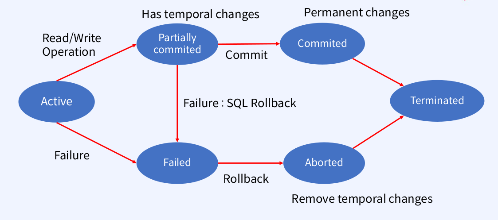

## Transaction

### Transaction state
우선 Transaction state의 흐름은 아래와 같다.

- Read/Write operation이 들어오면 임시적으로 저장됨( *partially commited* )
- *Commit*이 되어야 데이터가 영구 저장됨
- operation이 실패하면 *Rollback*되어 임시 저장된 데이터는 삭제됨

### Transaction schedules
트랜잭션은 **Serial( Serializable ) 스케줄**이라는 operation 의 순서를 정하는 스케줄이 있다. 스케줄을 통해 트랜잭션이 하나씩 순차적으로 실행되어 데이터 일관성이 유지된다.

생성된 트랜잭션 스케줄이 serial schedule과 동일할 때 serializable라고 한다. 아래 2가지로 측정된다:
- **Conflict Serializability** : non-conflict operation의 순서를 바꿔 serial schedule로 변환함
    - conflict operations : 2개의 서로 다른 트랜잭션에서 같은 데이터에 대해 operation이 있을 때 이중 하나가 write인 경우이다( 아래에서 S1, S2, S3 케이스 )
    
    
    
- **View Serializability**
    

### Precedence graph

Precedence graph는 스케줄의 conflict serializability을 테스트할 때 사용되는 그래프이다. 각 트랜잭션이 Graph의 노드라고 하고 트랜잭션 간 conflict가 있을 때 화살표( directed edge )로 표시할 수 있다. 만약 cycle이 없다면 conflict serializable 스케줄이 된다. 

- 이 경우에는, cycle이 생기므로 conflict serializable 스케줄이 될 수 없다.

트랜잭션 스케줄은 serializable을 만족해야 하고 복구 가능해야 한다. 

아래에서 T1 → T2 순의 트랜잭션이 있을 때 복구 불가능한 경우는 T1의 commit 전에 T2에서 commit이 되는 경우이다. 이 경우 데이터 일관성이 깨지게 되는데, T1에서 commit 이후에 T2에서 commit을 해야 복구가 가능하다. 즉, 스케줄은 Cascadeless해야 한다.

### COMMIT & ROLLBACK

COMMIT을 통해 트랜잭션을 완료한다.

COMMIT, ROLLBACK 이전의 데이터는

- 메모리 버퍼에만 영향을 받았기에 데이터 변경 이전으로 복구할 수 있음
- 현재 사용자는 SELECT문으로 결과를 확인할 수 있으나, 다른 사용자는 현재 사용자가 수정한 결과를 확인할 수 없음
- 변경된 행은 row lock이 걸려있어 다른 사용자가 동시에 수정할 수 없음

COMMIT 이후의 데이터는

- 변경 사항이 DB에 최종 반영됨
- 이전 데이터는 폐기됨
- 모든 사용자는 결과를 확인할 수 있음
- 관련된 행에 대한 잠금이 풀려 다른 사용자가 해당 행을 수정할 수 있음

COMMIT 이전이면 ROLLBACK을 통해 데이터 변경 사항이 취소되어 이전 상태로 복구된다.

### Recovery

트랜잭션의 operation 실행 중 장애가 발생하면 rollback해야 하는 **Atomicity**와 장애 후 commit된 트랜잭션 데이터는 유지되어야 한다는 **Durability**을 만족시키기 위한 복구 시스템이 있다. 복구는 write-ahead log(WAL)를 기반으로 이루어진다.
- 변경된 내용은 디스크에 먼저 기록함( Atomicity )
- Commit 전에 모든 내용에 대한 기록이 저장됨( Durability )

예를 들어, 기존의 (A: 8, B: 8)을 (A: 16, B: 16)으로 변경하고자 하면 아래와 같이 로그(WAL)가 기록된다.

1. Old값( A: 8, B: 8 )에 대한 로그를 기록하고, 변경 사항을 반영된 후 commit 로그를 flush한다.
    

2. New값( A: 16, B: 16 )에 대한 로그를 기록하고, commit 로그를 flush한 후, 변경 사항을 반영하고 END 로그를 추가한다.
    

WAL에서 UNDO 로그를 통해 충돌 이후에 commit되지 않은 변경 사항은 UNDO( 취소 )할 수 있도록 하고, REDO 로그를 통해 충돌 후 commit된 변경 사항은 REDO( raplay )한다.

---

### Reference 
[[DATABASE] TCL 이란? COMMIT, ROLLBACK, SAVEPOINT](https://mozi.tistory.com/209)
