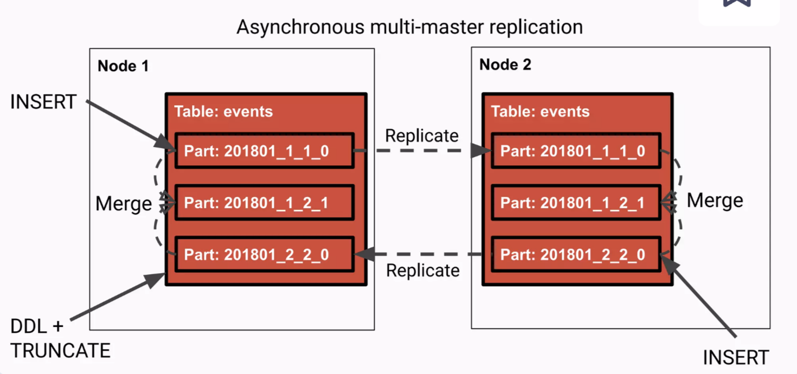

클릭하우스 ReplicatedMergeTree 테이블 엔진은 MergeTree 엔진을 기반으로 하며, 추가로 클러스터간 데이터를 복제한다. ReplicatedMergeTree는 동일한 데이터가 여러 노드에 걸쳐 복제되도록 하여 높은 가용성을 제공한다.

## ReplicatedMergeTree일때 머지가 이루어지는 방식

우선 ReplicatedMergeTree에서 복제는 ZooKeeper 기반으로 메타데이터를 관리하고, 각 노드는 ZooKeeper를 통해 서로의 상태를 확인한다. 각 노드는 자신의 복제본을 유지하며, 데이터가 추가되거나 변경될 때 이를 다른 노드에 전파하는데, 새로운 데이터가 삽입되면 리더 노드가 이를 처리하고 ZooKeeper에 이 정보를 기록한다. 다른 팔로워 노드들은 ZooKeeper에서 이 변경 사항을 감지하고, 리더 노드로부터 데이터를 복제한다.

새로운 data partr가 들어오면 머지는 리더 노드에서만 수행되는 것이 아니라, 각 노드에서 **독립적으로** 수행된더. **기본적으로 각 노드는 자신의 데이터 파티션을 병합**한다. 머지가 완료되면, 머지 파트는 각 노드에서 자체적으로 유지된다.



### ReplicatedMergeTree Merge 방식을 변경할 수 있는 설정값

- `always_fetch_merged_part` : 이 값이 true이면, 설정된 노드는 데이터 파트를 머지하지 않고 다른 노드에서 머지가 완료된 파트를 다운받는다. 
    - 기본값 = false, 기본적으로 각 노드에서 각자 데이터 파트를 병합한다.
- `execute_merges_on_single_replica_time_threshold` : 이 값이 0보다 크면 하나의 노드만 머지를 시작하고, 값이 설정된 노드는 설정된 값만큼의 시간을 기다려서 머지된 데이터 파트를 다운받는다. 
    - 머지 작업이 IO-bounded보다 CPU-bounded인 경우에 유리하다( 압축률이 높아야하는 경우, 집계나 계산 작업이 많은 경우, 여러 개의 작은 머지 작업들이 많은 경우 )
    - 기본값 = 0, 기본적으로 각 노드에서 각자 데이터 파트를 병합한다.

## 테스트

> `always_fetch_merged_part` , `execute_merges_on_single_replica_time_threshold`  설정을 바꾸면서 테이블 생성하여 다량의 INSERT 를 발생시켰다.
- 레플리카 노드는 2개

**`system.part_log` 로 머지 여부 확인**
`system.part_log`는 머지가 발생할 때의 과정을 로그로 기록한 시스템 테이블이다. 주요 칼럼에 대한 정보는 다음과 같다.

```text
event_type (Enum8) - Type of the event that occurred with the data part. Can have one of the following values:
    NewPart — Inserting of a new data part.
    MergeParts — Merging of data parts.
    DownloadPart — Downloading a data part.
    RemovePart — Removing or detaching a data part using DETACH PARTITION.
    MutatePart — Mutating of a data part.
    MovePart — Moving the data part from the one disk to another one.

merge_reason (Enum8) - The reason for the event with type MERGE_PARTS. Can have one of the following values:
    NotAMerge — The current event has the type other than MERGE_PARTS.
    RegularMerge — Some regular merge.
    TTLDeleteMerge — Cleaning up expired data.
    TTLRecompressMerge — Recompressing data part with the.
```

### 1. 노드 2개에 모두 적용
**클러스터에 기본 ReplicatedMergeTree 테이블 생성**

```sql
create or replace table test.sample on cluster dp (
    date DateTime64,
    id Int64,
    value String
)
Engine=ReplicatedMergeTree
order by ()
```

- 각 노드에서 레플리카가 생성되어 각자 머지된다.

**클러스터에 `execute_merges_on_single_replica_time_threshold` 세팅과 함께 ReplicatedMergeTree 테이블 생성**

```sql
create or replace table test.sample_execute_merges_on_single_replica_time_threshold(
    date DateTime64,
    id Int64,
    value String
)
Engine=ReplicatedMergeTree('/clickhouse/tables/{shard}/test/sample_execute_merges_on_single_replica_time_threshold', '{replica}')
order by ()
Settings execute_merges_on_single_replica_time_threshold=1
```

- 위의 경우와 유사하게 각 노드에서 레플리카 생성되어 각자 머지된다.

**클러스터에 `always_fetch_merged_part` 세팅과 함께 ReplicatedMergeTree 테이블 생성**

```sql
create or replace table test.sample_always_fetch_merged_part_1 on cluster dp (
    date DateTime64,
    id Int64,
    value String
)
Engine= ReplicatedMergeTree('/clickhouse/tables/{shard}/test/sample_always_fetch_merged_part_1', '{replica}')
order by ()
Settings always_fetch_merged_part=1

create or replace table test.sample_both_1 on cluster dp (
    date DateTime64,
    id Int64,
    value String
)
Engine= ReplicatedMergeTree('/clickhouse/tables/{shard}/test/sample_both_1', '{replica}')
order by ()
Settings execute_merges_on_single_replica_time_threshold=300, always_fetch_merged_part=1
```

- write이 발생한 노드에만 데이터가 삽입되고 replication_queue 에 MERGE_PARTS를 기다리는 작업들이 발생했다. 양쪽에서 머지가 발생하지 않는다.

```sql
select database, table, type, count(*) from  system.replication_queue where database='test' and table like '%sample%' group by 1,2,3
┌─database─┬─table─────────────────────────────┬─type────────┬─count()─┐
│ test     │ sample_always_fetch_merged_part_1 │ MERGE_PARTS │     170 │
│ test     │ sample_both_1                     │ MERGE_PARTS │     170 │
└──────────┴───────────────────────────────────┴─────────────┴─────────┘
```

```sql
SELECT
    table,
    event_time,
    event_type,
    merge_reason,
    any(part_name)
FROM system.part_log
WHERE table IN ('sample_both_1', 'sample_always_fetch_merged_part_1')
group by 1,2,3,4 order by 1,2
-- WRITE NODE( LEADER )
┌─table─────────────────────────────┬──────────event_time─┬─event_type─┬─merge_reason─┬─any(part_name)─┐
│ sample_always_fetch_merged_part_1 │ 2024-07-03 12:38:23 │ NewPart    │ NotAMerge    │ all_0_0_0      │
│ sample_always_fetch_merged_part_1 │ 2024-07-03 12:38:24 │ NewPart    │ NotAMerge    │ all_3_3_0      │
│ sample_always_fetch_merged_part_1 │ 2024-07-03 12:38:25 │ NewPart    │ NotAMerge    │ all_23_23_0    │
│ sample_always_fetch_merged_part_1 │ 2024-07-03 12:38:26 │ NewPart    │ NotAMerge    │ all_43_43_0    │
│ sample_always_fetch_merged_part_1 │ 2024-07-03 12:38:27 │ NewPart    │ NotAMerge    │ all_63_63_0    │
│ sample_always_fetch_merged_part_1 │ 2024-07-03 12:38:28 │ NewPart    │ NotAMerge    │ all_83_83_0    │
│ sample_both_1                     │ 2024-07-03 12:40:18 │ NewPart    │ NotAMerge    │ all_0_0_0      │
│ sample_both_1                     │ 2024-07-03 12:40:19 │ NewPart    │ NotAMerge    │ all_11_11_0    │
│ sample_both_1                     │ 2024-07-03 12:40:20 │ NewPart    │ NotAMerge    │ all_30_30_0    │
│ sample_both_1                     │ 2024-07-03 12:40:21 │ NewPart    │ NotAMerge    │ all_49_49_0    │
│ sample_both_1                     │ 2024-07-03 12:40:22 │ NewPart    │ NotAMerge    │ all_69_69_0    │
│ sample_both_1                     │ 2024-07-03 12:40:23 │ NewPart    │ NotAMerge    │ all_89_89_0    │
└───────────────────────────────────┴─────────────────────┴────────────┴──────────────┴────────────────┘
-- READ NODE( FOLLOWER )
┌─table─────────────────────────────┬──────────event_time─┬─event_type───┬─merge_reason─┬─any(part_name)─┐
│ sample_always_fetch_merged_part_1 │ 2024-07-03 12:38:23 │ DownloadPart │ NotAMerge    │ all_0_0_0      │
│ sample_always_fetch_merged_part_1 │ 2024-07-03 12:38:24 │ DownloadPart │ NotAMerge    │ all_2_2_0      │
│ sample_always_fetch_merged_part_1 │ 2024-07-03 12:38:25 │ DownloadPart │ NotAMerge    │ all_22_22_0    │
│ sample_always_fetch_merged_part_1 │ 2024-07-03 12:38:26 │ DownloadPart │ NotAMerge    │ all_43_43_0    │
│ sample_always_fetch_merged_part_1 │ 2024-07-03 12:38:27 │ DownloadPart │ NotAMerge    │ all_63_63_0    │
│ sample_always_fetch_merged_part_1 │ 2024-07-03 12:38:28 │ DownloadPart │ NotAMerge    │ all_82_82_0    │
│ sample_both_1                     │ 2024-07-03 12:40:18 │ DownloadPart │ NotAMerge    │ all_0_0_0      │
│ sample_both_1                     │ 2024-07-03 12:40:19 │ DownloadPart │ NotAMerge    │ all_10_10_0    │
│ sample_both_1                     │ 2024-07-03 12:40:20 │ DownloadPart │ NotAMerge    │ all_30_30_0    │
│ sample_both_1                     │ 2024-07-03 12:40:21 │ DownloadPart │ NotAMerge    │ all_49_49_0    │
│ sample_both_1                     │ 2024-07-03 12:40:22 │ DownloadPart │ NotAMerge    │ all_69_69_0    │
│ sample_both_1                     │ 2024-07-03 12:40:23 │ DownloadPart │ NotAMerge    │ all_89_89_0    │
└───────────────────────────────────┴─────────────────────┴──────────────┴──────────────┴────────────────┘
```

→ INSERT가 발생하여 NewPart 가 생기고 레플리카 노드에서 파트를 다운받지만 **머지가 이루어지지 않는다.** 양쪽에서 머지를 기다리는 것으로 보인다.

**머지된 데이터 파트를 받는 노드를 명시해서 지정해줘야 된다** → 한 노드에서만 settings 값을 붙여서 zookeeper path 만 동일하게 설정해서 생성

### 2. 노드 하나에만 설정해서 적용
- 노드 01 에는 테이블 그냥 생성
- 노드 02 에 각 세팅을 붙여서 생성

**노드 02 에만 `execute_merges_on_single_replica_time_threshold=600` 설정**

```sql
SELECT
    event_time,
    event_type,
    merge_reason,
    any(part_name)
FROM system.part_log
WHERE (database = 'test') AND (table LIKE 'sample_execute_merges_on_single_replica_time_threshold') AND (event_date >= '2024-07-03')
group by 1,2,3 ORDER BY 1

-- WRITE>> 노드 01
┌──────────event_time─┬─event_type─┬─merge_reason─┬─any(part_name)─┐
│ 2024-07-03 22:09:01 │ NewPart    │ NotAMerge    │ all_0_0_0      │
│ 2024-07-03 22:09:01 │ MergeParts │ RegularMerge │ all_0_5_1      │
│ 2024-07-03 22:09:02 │ MergeParts │ RegularMerge │ all_0_10_2     │
│ 2024-07-03 22:09:02 │ NewPart    │ NotAMerge    │ all_7_7_0      │
│ 2024-07-03 22:09:03 │ MergeParts │ RegularMerge │ all_0_30_6     │
│ 2024-07-03 22:09:03 │ NewPart    │ NotAMerge    │ all_28_28_0    │
│ 2024-07-03 22:09:04 │ NewPart    │ NotAMerge    │ all_49_49_0    │
│ 2024-07-03 22:09:04 │ MergeParts │ RegularMerge │ all_0_50_10    │
│ 2024-07-03 22:10:04 │ MergeParts │ RegularMerge │ all_0_59_12    │
│ 2024-07-03 22:18:55 │ RemovePart │ NotAMerge    │ all_0_0_0      │
└─────────────────────┴────────────┴──────────────┴────────────────┘
-- 노드 02
┌──────────event_time─┬─event_type───┬─merge_reason─┬─any(part_name)─┐
│ 2024-07-03 22:09:01 │ DownloadPart │ NotAMerge    │ all_0_0_0      │
│ 2024-07-03 22:09:02 │ MergeParts   │ RegularMerge │ all_0_10_2     │
│ 2024-07-03 22:09:02 │ DownloadPart │ NotAMerge    │ all_7_7_0      │
│ 2024-07-03 22:09:03 │ DownloadPart │ NotAMerge    │ all_28_28_0    │
│ 2024-07-03 22:09:04 │ DownloadPart │ NotAMerge    │ all_48_48_0    │
│ 2024-07-03 22:09:05 │ DownloadPart │ NotAMerge    │ all_0_55_11    │
│ 2024-07-03 22:10:04 │ MergeParts   │ RegularMerge │ all_0_59_12    │
│ 2024-07-03 22:19:05 │ RemovePart   │ NotAMerge    │ all_0_0_0      │
└─────────────────────┴──────────────┴──────────────┴────────────────┘

-- 노드 02에 WRITE 해도 유사함
```

- 각각 머지를 하긴 한다.
- 최종 파트 갯수 : 1

**노드 02 에만 `always_fetch_merged_part` 설정**

```sql
SELECT
    event_time,
    event_type,
    merge_reason,
    any(part_name)
FROM system.part_log
WHERE (database = 'test') AND (table LIKE 'sample_always_fetch_merged_part') AND (event_date >= '2024-07-03')
group by 1,2,3 ORDER BY 1
-- WRITE>> 노드 01
┌──────────event_time─┬─event_type─┬─merge_reason─┬─any(part_name)─┐
│ 2024-07-03 16:02:54 │ NewPart    │ NotAMerge    │ all_0_0_0      │
│ 2024-07-03 16:02:54 │ MergeParts │ RegularMerge │ all_0_4_1      │
│ 2024-07-03 16:02:55 │ NewPart    │ NotAMerge    │ all_16_16_0    │
│ 2024-07-03 16:02:55 │ MergeParts │ RegularMerge │ all_0_19_4     │
│ 2024-07-03 16:02:56 │ MergeParts │ RegularMerge │ all_0_39_8     │
│ 2024-07-03 16:02:56 │ NewPart    │ NotAMerge    │ all_37_37_0    │
│ 2024-07-03 16:02:57 │ MergeParts │ RegularMerge │ all_0_59_12    │
│ 2024-07-03 16:02:57 │ NewPart    │ NotAMerge    │ all_58_58_0    │
│ 2024-07-03 16:13:01 │ RemovePart │ NotAMerge    │ all_0_0_0      │
└─────────────────────┴────────────┴──────────────┴────────────────┘
-- 노드 02
┌──────────event_time─┬─event_type───┬─merge_reason─┬─any(part_name)─┐
│ 2024-07-03 16:02:54 │ DownloadPart │ NotAMerge    │ all_0_0_0      │
│ 2024-07-03 16:02:55 │ DownloadPart │ NotAMerge    │ all_16_16_0    │
│ 2024-07-03 16:02:56 │ DownloadPart │ NotAMerge    │ all_37_37_0    │
│ 2024-07-03 16:02:57 │ DownloadPart │ NotAMerge    │ all_58_58_0    │
│ 2024-07-03 16:13:12 │ RemovePart   │ NotAMerge    │ all_0_0_0      │
└─────────────────────┴──────────────┴──────────────┴────────────────┘

--노드01
┌──────────event_time─┬─event_type───┬─merge_reason─┬─any(part_name)─┐
│ 2024-07-03 22:40:18 │ DownloadPart │ NotAMerge    │ all_60_60_0    │
│ 2024-07-03 22:40:19 │ MergeParts   │ RegularMerge │ all_0_64_13    │
│ 2024-07-03 22:40:19 │ DownloadPart │ NotAMerge    │ all_62_62_0    │
│ 2024-07-03 22:40:20 │ MergeParts   │ RegularMerge │ all_0_84_17    │
│ 2024-07-03 22:40:20 │ DownloadPart │ NotAMerge    │ all_84_84_0    │
│ 2024-07-03 22:40:21 │ MergeParts   │ RegularMerge │ all_0_109_22   │
│ 2024-07-03 22:40:21 │ DownloadPart │ NotAMerge    │ all_105_105_0  │
│ 2024-07-03 22:49:17 │ RemovePart   │ NotAMerge    │ all_0_59_12    │
└─────────────────────┴──────────────┴──────────────┴────────────────┘

--WRITE>> 노드02
┌──────────event_time─┬─event_type───┬─merge_reason─┬─any(part_name)─┐
│ 2024-07-03 22:40:18 │ NewPart      │ NotAMerge    │ all_60_60_0    │
│ 2024-07-03 22:40:19 │ NewPart      │ NotAMerge    │ all_62_62_0    │
│ 2024-07-03 22:40:19 │ DownloadPart │ NotAMerge    │ all_0_64_13    │
│ 2024-07-03 22:40:20 │ NewPart      │ NotAMerge    │ all_84_84_0    │
│ 2024-07-03 22:40:20 │ DownloadPart │ NotAMerge    │ all_0_84_17    │
│ 2024-07-03 22:40:21 │ NewPart      │ NotAMerge    │ all_105_105_0  │
│ 2024-07-03 22:40:21 │ DownloadPart │ NotAMerge    │ all_0_109_22   │
│ 2024-07-03 22:48:52 │ RemovePart   │ NotAMerge    │ all_0_59_12    │
└─────────────────────┴──────────────┴──────────────┴────────────────┘
```

- 노드 01 에서만 머지(`MergeParts`) 가 발생하고 노드 02 에서는 Download만 발생한다.
    - 예시로 노드 01에서 머지하여 생긴 데이터 파트 all_58_58_0를 거의 동시에 다운받았다.
    - 노드02에 WRITE을 해도 새로운 데이터 파트만 생성되고 노드01에 복제되었다가 머지하면 노드02가 다운받았다.
- 최종 파트 갯수 : 1

**노드 02 에만 `execute_merges_on_single_replica_time_threshold`, `always_fetch_merged_part` 설정**

```sql
SELECT
    event_time,
    event_type,
    merge_reason,
    any(part_name)
FROM system.part_log
WHERE (database = 'test') AND (table LIKE 'sample_both_0%') AND (event_date >= '2024-07-03')
group by 1,2,3 ORDER BY 1

-- WRITE>> 노드 01
┌──────────event_time─┬─event_type─┬─merge_reason─┬─any(part_name)─┐
│ 2024-07-03 15:44:46 │ NewPart    │ NotAMerge    │ all_0_0_0      │
│ 2024-07-03 15:44:46 │ MergeParts │ RegularMerge │ all_0_4_1      │
│ 2024-07-03 15:44:47 │ NewPart    │ NotAMerge    │ all_12_12_0    │
│ 2024-07-03 15:44:47 │ MergeParts │ RegularMerge │ all_0_9_2      │
│ 2024-07-03 15:44:48 │ MergeParts │ RegularMerge │ all_27_33_1    │
│ 2024-07-03 15:44:48 │ NewPart    │ NotAMerge    │ all_32_32_0    │
│ 2024-07-03 15:44:49 │ MergeParts │ RegularMerge │ all_0_42_4     │
│ 2024-07-03 15:44:49 │ NewPart    │ NotAMerge    │ all_52_52_0    │
│ 2024-07-03 15:44:50 │ MergeParts │ RegularMerge │ all_0_57_6     │
│ 2024-07-03 15:54:02 │ RemovePart │ NotAMerge    │ all_0_0_0      │
│ 2024-07-03 16:25:19 │ MergeParts │ RegularMerge │ all_0_59_7     │
│ 2024-07-03 16:34:51 │ RemovePart │ NotAMerge    │ all_0_57_6     │
└─────────────────────┴────────────┴──────────────┴────────────────┘
-- 노드 02
┌──────────event_time─┬─event_type───┬─merge_reason─┬─any(part_name)─┐
│ 2024-07-03 15:44:46 │ DownloadPart │ NotAMerge    │ all_0_0_0      │
│ 2024-07-03 15:44:47 │ DownloadPart │ NotAMerge    │ all_10_10_0    │
│ 2024-07-03 15:44:48 │ DownloadPart │ NotAMerge    │ all_31_31_0    │
│ 2024-07-03 15:44:49 │ DownloadPart │ NotAMerge    │ all_50_50_0    │
│ 2024-07-03 15:44:51 │ DownloadPart │ NotAMerge    │ all_59_59_0    │
│ 2024-07-03 15:54:11 │ RemovePart   │ NotAMerge    │ all_0_0_0      │
│ 2024-07-03 16:25:25 │ DownloadPart │ NotAMerge    │ all_0_59_7     │
│ 2024-07-03 16:34:44 │ RemovePart   │ NotAMerge    │ all_0_57_6     │
└─────────────────────┴──────────────┴──────────────┴────────────────┘

--노드01
┌──────────event_time─┬─event_type───┬─merge_reason─┬─any(part_name)─┐
│ 2024-07-03 22:41:53 │ MergeParts   │ RegularMerge │ all_0_64_8     │
│ 2024-07-03 22:41:53 │ DownloadPart │ NotAMerge    │ all_60_60_0    │
│ 2024-07-03 22:41:54 │ MergeParts   │ RegularMerge │ all_0_69_9     │
│ 2024-07-03 22:41:54 │ DownloadPart │ NotAMerge    │ all_68_68_0    │
│ 2024-07-03 22:41:55 │ MergeParts   │ RegularMerge │ all_0_94_14    │
│ 2024-07-03 22:41:55 │ DownloadPart │ NotAMerge    │ all_90_90_0    │
│ 2024-07-03 22:41:56 │ MergeParts   │ RegularMerge │ all_0_114_18   │
│ 2024-07-03 22:41:56 │ DownloadPart │ NotAMerge    │ all_112_112_0  │
└─────────────────────┴──────────────┴──────────────┴────────────────

--WRITE>> 노드02
┌──────────event_time─┬─event_type───┬─merge_reason─┬─any(part_name)─┐
│ 2024-07-03 22:41:53 │ NewPart      │ NotAMerge    │ all_60_60_0    │
│ 2024-07-03 22:41:53 │ DownloadPart │ NotAMerge    │ all_0_64_8     │
│ 2024-07-03 22:41:54 │ NewPart      │ NotAMerge    │ all_68_68_0    │
│ 2024-07-03 22:41:54 │ DownloadPart │ NotAMerge    │ all_0_74_10    │
│ 2024-07-03 22:41:55 │ NewPart      │ NotAMerge    │ all_90_90_0    │
│ 2024-07-03 22:41:55 │ DownloadPart │ NotAMerge    │ all_0_94_14    │
│ 2024-07-03 22:41:56 │ NewPart      │ NotAMerge    │ all_112_112_0  │
│ 2024-07-03 22:41:56 │ DownloadPart │ NotAMerge    │ all_0_114_18   │
└─────────────────────┴──────────────┴──────────────┴────────────────┘
```

- 노드 01 에서만 머지(`MergeParts`) 가 발생하고 노드 02 에서는 Download만 발생한다.
    - 예시로 노드 01에서 머지하여 생긴 데이터 파트 all_0_59_7를 약 5초 후에 다운받았다.
    - 노드02에 WRITE을 해도 새로운 데이터 파트만 생성되고 노드01에 복제되었다가 머지하면 노드02가 다운받았다.
- 최종 파트 갯수 : 1

INSERT가 발생하면 NewPart로 즉시 데이터 파트가 생기고 Replica 노드는 새로 생긴 파트에 대해서 다운받지만 머지에 대한 설정값에 따라 병합을 하지 않는다. 머지의 대상이 되는 타겟 노드에서 머지가 실행되면 데이터 파트를 다운받고 이전의 파트는 제거하여 정리하는 것으로 보인다.

→ 머지를 할 때까지 기다렸다가 복제하는 것이 아니라 데이터 파트의 변화가 생길 때마다 다운받는 형식인 것으로 보인다.

### 추가 : MV를 고려할때 부하를 줄이려면

MV 데이터 삽입 시에

- MV에 계산, 집계, 압축 등이 많이 수행되면 CPU-bounded 로 데이터가 삽입될 때마다 실시간으로 집계를 계산해야 한다.
- CPU 사용률이 높을 것으로 예상되면 머지를 줄여 각 노드에서 파티션이 여러 개 생기고 CPU 사용률이 높아지는 것으로 줄일 수 있을 것 같다.

---

## Reference
[introduction-to-the-mysteries-of-clickhouse-replication-by-robert-hodges-and-altinity-engineering-team](https://www.slideshare.net/slideshow/introduction-to-the-mysteries-of-clickhouse-replication-by-robert-hodges-and-altinity-engineering-team/159491342#8)

https://kb.altinity.com/altinity-kb-setup-and-maintenance/altinity-kb-aggressive_merges/


