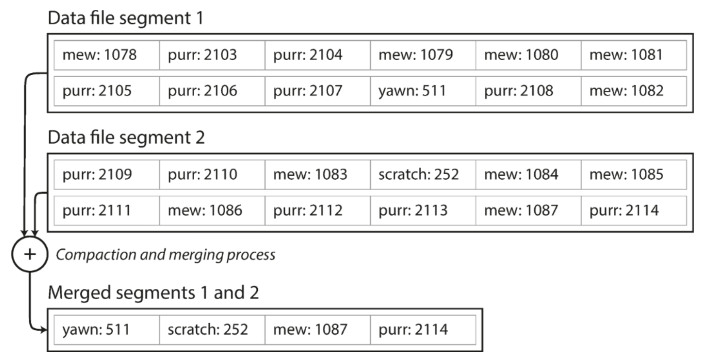
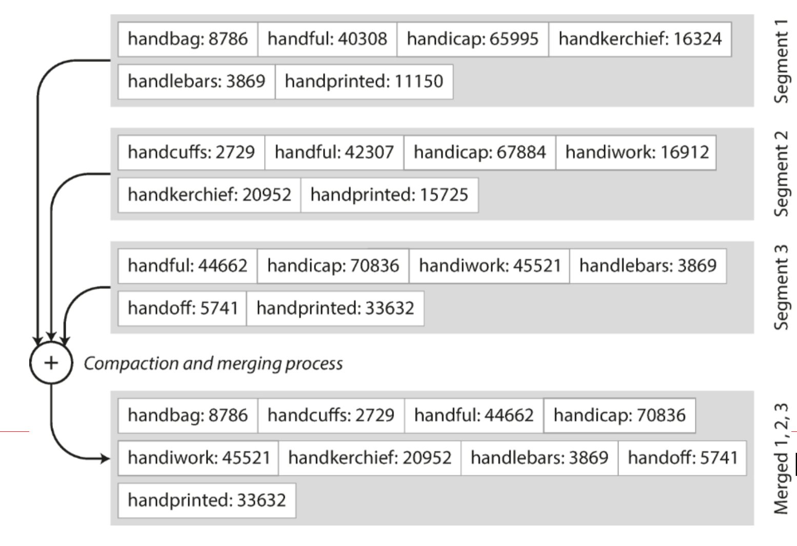
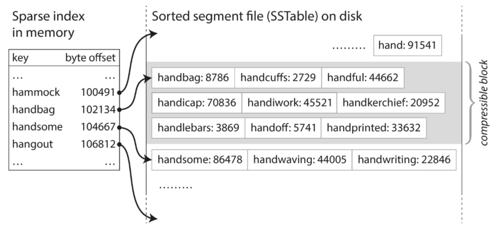
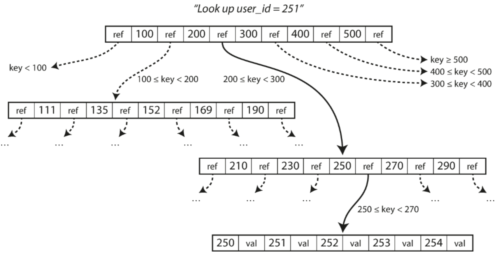
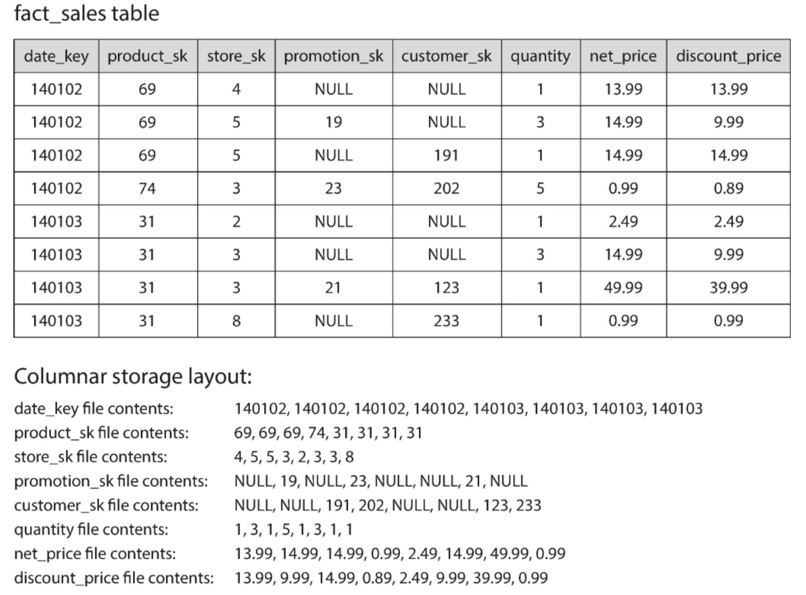
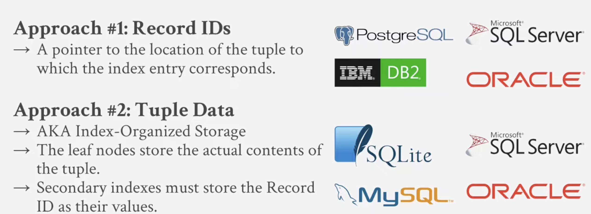

## Storage and Retrieval

인덱스는 기본 데이터에 나온 추가적인 구조다. 읽기 성능을 높여주지만 쓰기마다 인덱스를 업데이트해야 하기 때문에 쓰기 성능은 줄어든다

### 해시 인덱스
ex. Bitcask

- log-structured stoage segment로 일련의 key-value 데이터이다.
- 가장 간단한 방식은 인메모리 해시 맵에서 모든 키를 파일의 byte 오프셋으로 매핑하는 것이 있다.

- 키가 자주 업데이트되어야하는 경우에 유리하다.
- append-only 로그 구조이다. 파일로 저장하는데 디스크 공간 확보를 위해, 파일 크기가 임계치에 달하면 세그먼트 파일을 닫고 세그먼트를 압축하여 새로운 파일로 생성한다. 세그먼트 머지/압축은 백그라운드에서 실행되어 읽기/쓰기 작업을 동시에 받을 수 있다.

- append-only 로그 실제 구현에서 고려할 점
    - 파일 포맷
    - 레코드 삭제 - 레코드 삭제에 대한 레코드가 따로 필요하다
    - 충돌 복구 - 세그먼트 해시 맵의 스냅샷을 디스크에 저장하여 복구할 때 메모리에 빠르게 로드한다
    - 레코드 부분 기록 - 파일에 체크섬을 포함하여 손상된 부분이 감지된다 
    - 동시성 제어
- append-only로서의 장점
    - 세그먼트를 추가하고 머지하는 것은 sequential 쓰기 작업으로 random 쓰기보다 빠르다. 
    - 동시성 제어나 충돌 복구가 훨씬 편해짐
    - 머지를 통해 데이터 조각화 문제 방지
- 해시 인덱스의 단점
    - 키 수가 많으면 메모리에 맞지 않을 수 있다
    - 범위 쿼리가 비효율적이다 - 범위 내의 모든 키를 스캔하기 어려움

### SSTable / LSM-tree
#### SSTable(Sorted String Table)
- key-value 데이터에서 key가 정렬되어 있다. 각 머지된 세그먼트 파일에서 키는 한번만 나온다.

장점
- 머지를 통해(mergesort) 메모리 활용이 더 효율적이다.

- 모든 인덱스를 메모리에 저장할 필요가 없다(sparse index)

- 레코드를 블록으로 묶어 압축하여 디스크에 저장한다.

구현
- 쓰기가 들어오면, 인메모리 트리(memtable)에 추가한다. memtable이 커지면, SSTable 파일로 디스크에 저장한다.
- 읽기가 들어오면, 우선 memtable에서 키를 찾고 디스크 세그먼트에서 찾는다.
- 백그라운드에서 머지/압축이 일어난다.

문제
- 쓰기 충돌시 memtable에 있지만 디스크에 기록되지 않은 데이터가 손실될 수 있다

LSTM-Tree(Log-Structured Merge-Tree)
- 정렬될 파일을 머지/압축하는 원리를 따르는 스토리지 엔진을 뜻한다.
- 성능 최적화
    - 추가적인 bloom filter를 사용한다
    - SSTable을 머지/압축하는 전략이 있다 : size-tiered / level-tiered

#### B-Tree
- 가장 널리 사용되는 인덱스
- log-structured 인덱스들은 가변적 크기의 세그먼트로 나누어 순차적으로 쓴다. 반면 B-Tree는 고정 크기의 블록 또는 페이지로 나누어 쓴다.
- 각 페이지는 포인터처럼 주소로 사용된다

- 업데이트하려면 해당 키가 포함된 리프 페이지를 찾아 값을 업데이트하여 새로운 페이지를 덮어 쓴다.
    - log-structured 인덱스는 덮어쓰기 없이 새로운 파일을 만들어 머지를 통해 오래된/쓸모없는 파일은 삭제하는데 반해, 파일을 덮어쓰게 된다.
    
복원력을 높이기 위해
- write-ahead 로그(WAL)을 추가로 디스크에 쓴다
- 동시성 제어 : 경량 잠금인 latches를 통해 데이터를 보호한다.

최적화
- 페이지 덮어쓰기나 WAL 쓰기 대신 copy-on-write을 적용하기도 한다. 수정된 페이지를 다른 곳에 저장하고 새 버전은 새로운 페이지를 가르키도록 한다.
- 전체 키 대신 축약하여 저장한다.
- 가까운 키 간에 페이지가 디스크 상에서 근접할 필요가 없다.

LSM-Tree와 비교
- LSM-Tree가 보통 writes이 빠르고, B-Tree가 read가 빠르다 - LSM-Tree는 B-Tree 쓰기 성능이 좋은데, 페이지를 덮어쓰지 않고 append-only로 순차적 쓰기로 하기 때문
    - LSM-Tree는 머지/압축을 진행하므로 B-Tree가 다르게 데이터 조각화가 발생하지 않는다
    - 하지만 LSM-Tree는 떄로 한정된 리소스로 인해 머지/압축이 진행중인 쓰기/읽기 작업에 영향을 주거나 많은 쓰기에 영향을 받기도
- B-Tree - 보통 페이지 & WAL 쓰기로 디스크에 적어도 2번씩 써야한다. 
- log-structured 인덱스 - SSTable 머지/압축으로 여러 번 디스크에 다시 써야한다(write amplification).

### 기타 인덱스 구조
- clustered index - 인덱스 내에 해당되는 행을 저장
    - heap file - 인덱스는 위치에 대한 표시만 있을 뿐
- 다중 칼럼 인덱스 
- 전체 텍스트 검색 인덱스
- 메모리에 저장하는 인덱스 - 실제 데이터는 디스크에 저장되지만, 읽기는 메모리에서 불러옴 

### 트랜잭션 처리 및 분석
- 트랜잭션 처리란 일괄 처리 작업과 달리 클라이언트가 짧은 지연 시간의 읽기 및 쓰기를 수행할 수 있도록 하는 것을 의미한다.

### 데이터 웨어하우징
- 데이터 웨어하우스는 회사의 모든 다양한 OLTP 시스템에 있는 데이터의 읽기 전용 복사본을 보관한다. 주기적인 데이터 덤프나 CDC를 기반으로 OLTP 데이터베이스에서 데이터를 추출하고,분석에 적합한 스키마로 변환하고 정리하여 데이터 웨어하우스에 로드한다.

### 데이터 모델링
- 스타 스키마 
    - 팩트 테이블의 각 행은 특정 시간에 발생한 이벤트를 나타낸다.
    - 디멘젼 테이블은 팩트 테이블 칼럼에서 참조하는 외부 테이블인데, 차원은 이벤트의 누가, 무엇을, 어디서, 언제, 어떻게, 왜 수행했는지를 의미한다.

### column-oriented 스토리지

- 동일한 순서로 행을 포함하는 각 칼럼 파일이 존재한다.
- 압축률이 좋다 
- Cassandra와 HBase에는 Bigtable에서 상속한 컬럼 패밀리라는 개념이 있는데, 각 칼럼 패밀리 내에서 row의 모든 칼럼을 row key와 함께 저장하고 칼럼 압축을 사용하지 않기 때문에 row-oriented 모델이다.
- 메모리 / vectorized 처리
- 행이 삽입 순서는 상관없는데, 칼럼 순서를 정렬하여 인덱싱 메커니즘을 활용할 수 있다.
- Materialized view - 뷰와 달리 실제 데이터가 저장됨

---
*추가*

B+Tree

sequential IO
B-Tree는 트리의 모든 노드에 키와 값을 저장 - 각 키가 한 번만 표시
B+ 트리는 리프 노드에만 값을 저장
sibling pointer -> merge / split 때문에 필요
