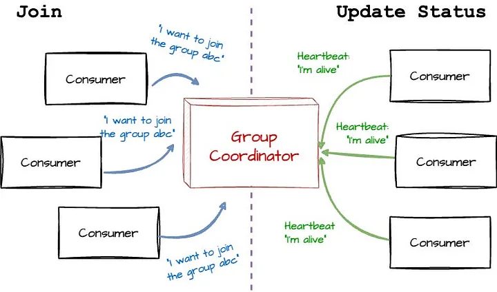
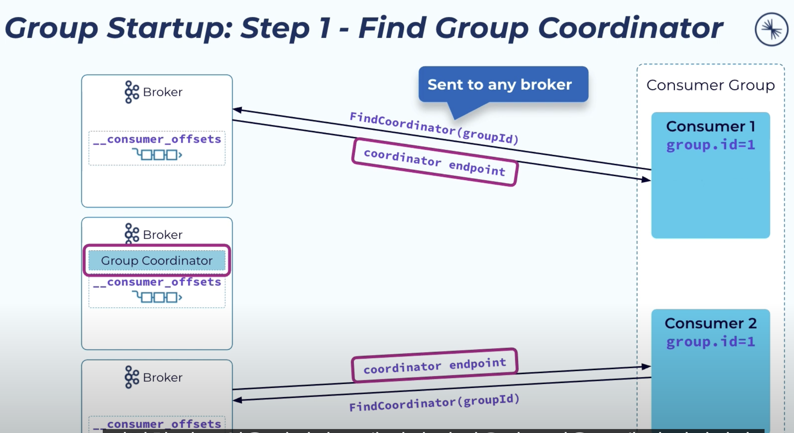
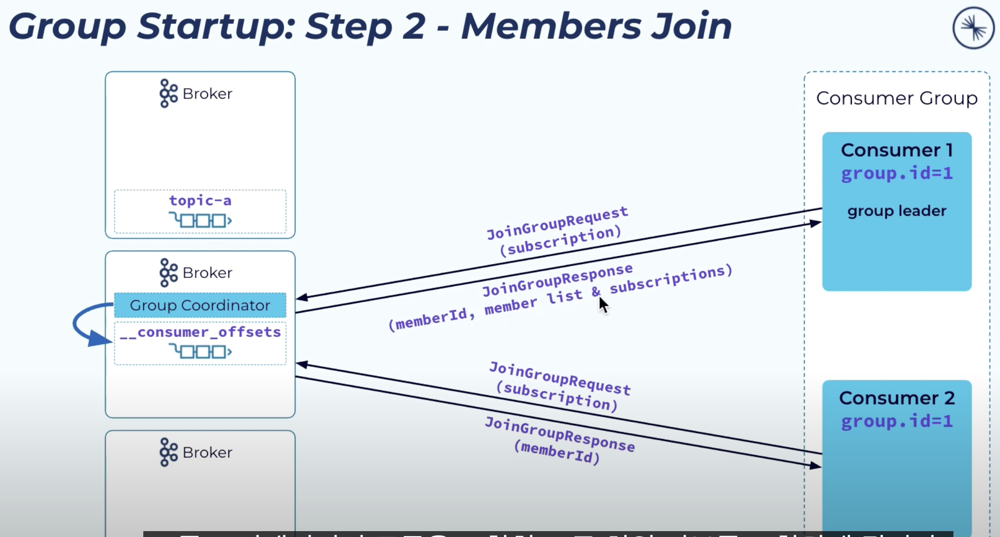
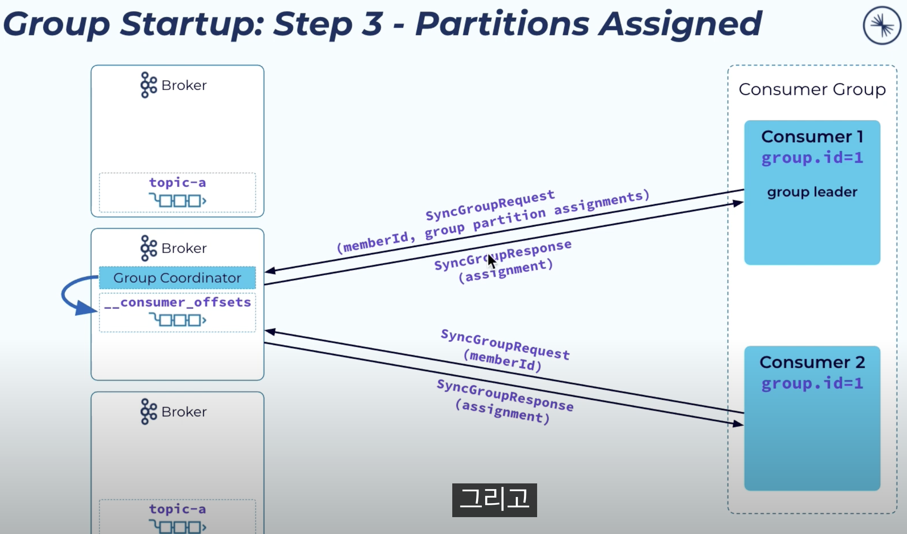
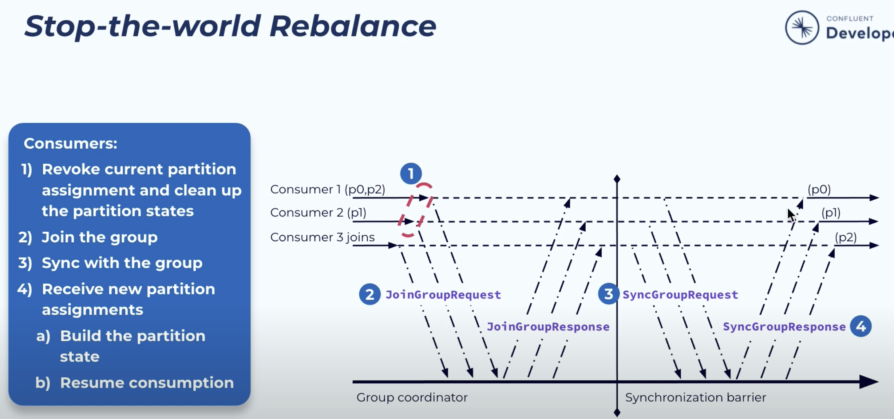
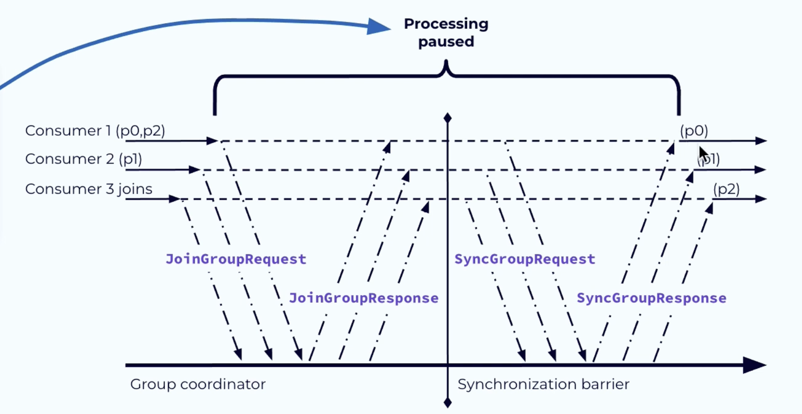
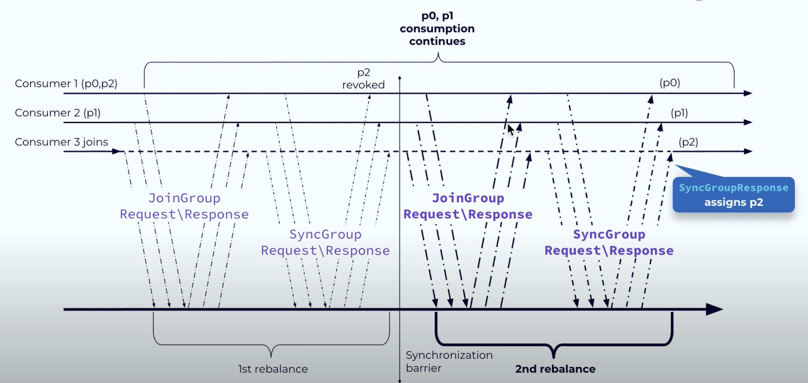

# Consumer Group

- 컨슈머는 컨슈머 그룹의 전담 브로커인 그룹 코디네이터를 요청을 보내 그룹에 합류하고, 파티션을 할당받는다. 같은 그룹의 모든 컨슈머는 같은 코디네이터에 연결하는데, 코디네이터는 컨슈머 목록을 관리하면서 그룹의 새 리더를 선출하기도 한다.
- 리더는 파티션 배치 계획을 만들어 코디네이터에 전달하는데, 파티션 배치 정책에는 라운드 로빈 / range 기반 / sticky 파티셔닝 등이 있다.
- 코디네이터는 그룹 내의 모든 컨슈머에게 배치 계획을 알려준다.
- 파티션 배치 계획에 따라 각 컨슈머는 할당받은 파티션에서 가장 최근 오프셋 기준으로 이후의 메시지를 읽어온다. 오프셋 정보는 상태 저장소에서 관리된다.

### **Consumer Group Coordinator**

- **Coordinator의 역할**
    - 특정 Consumer Group의 멤버십 관리와 **Rebalancing** 작업
    - Kafka 클러스터의 각 브로커는 하나 이상의 Consumer Group에 대한 Coordinator 역할 가능
- **__consumer_offsets 토픽**
    - 각 Consumer Group은 **__consumer_offsets**라는 특별한 토픽에 자신의 상태를 저장한다.
- **Coordinator 장애 처리**
    - Coordinator 역할을 맡고 있는 브로커가 장애가 발생하면, **파티션 리더십**이 다른 브로커로 이전한다.
    - 새로운 리더는 **로그 데이터를 읽어** Consumer Group의 상태를 복구한다.

### **Kafka의 Consumer Group 관리 및 파티션 할당 과정**

**Consumer Group에 참여**

- **소비자(Consumer)가 그룹에 참여 요청**
    - 컨슈머가 Consumer Group에 참여하고자 하면 **Coordinator**에게 "파티에 참여하고 싶다"는 요청을 보낸다.
    - 첫 번째로 그룹에 합류하는 컨슈머가 **리더(Leader)**가 된다.
    - 리더는 **Coordinator**로부터 현재 활성 상태인 모든 컨슈머의 목록을 받고, 각 컨슈머에게 할당할 파티션을 정한다.
- **리더의 역할**
    - Consumer Group의 리더는 **파티션을 각 컨슈머에게 공정하게 할당한다**
    - 리더는 단순히 첫 번째로 그룹에 합류한 컨슈머가 된다

**Heartbeat와 멤버십 유지**

- 각 컨슈머는 그룹에서 자신의 **멤버십(활성 상태)**과 **파티션 소유권**을 유지하기 위해 **Coordinator**에게 주기적으로 Heartbeat를 전송한다.
- Heartbeat는 백그라운드 스레드로 관리되며, Coordinator가 주기적인 Heartbeat를 받으면 해당 컨슈머가 정상적으로 작동하고 있다고 간주한다
- **Heartbeats 누락 시**
    - 특정 시간 동안 Heartbeat가 도착하지 않으면, Coordinator는 해당 컨슈머를 더 이상 활성 상태로 간주하지 않고 **Rebalancing(재조정)**을 발생시킨다
    - 이 과정에서 해당 컨슈머가 담당하던 파티션의 작업이 중단될 수 있다

**파티션 할당 전략**

- Kafka는 기본적으로 **PartitionAssignor 인터페이스**를 통해 파티션을 할당하며, 사용자는 다음 세 가지 기본 구현 중 하나를 선택할 수 있다
    1. **RangeAssignor**:
        - 토픽의 파티션을 컨슈머 수로 나눈 후, 각 컨슈머에게 균등하게 할당.
        - 나누어 떨어지지 않는 경우, 앞쪽 컨슈머가 더 많은 파티션을 받음.
    2. **RoundRobinAssignor**:
        - 모든 파티션을 순서대로 하나씩 돌아가며 컨슈머에게 할당.
    3. **StickyAssignor**:
        - 파티션을 가능한 균등하게 할당하며, **재조정(Rebalance)**이 발생해도 이전 할당이 최대한 유지되도록 설계.

그룹 합류 / 탈퇴 / 노드 장애>>

JoinGroup 요청 및 응답 >>

SyncGroup 요청 및 응답 >>

1. 먼저 group coordinator가 어디에 있는지 찾는다

2. group coordinator는 컨슈머에 파티션을 어떻게 할당해야하는지 정할 수 없기에 그룹 리더에게 컨슈머 멤버 아이디를 보낸다

3. 그룹리더는 파티션 계획을 응답으로 보내고 group coordinator는 각 컨슈머에게 할당받을 파티션 정보는 보낸다

조인 또는 탈퇴에 따른 리파티셔닝

1. 기존의 컨슈머는 우선 파티션 할당은 취소해야 한다
2. 이후 join - sync 를 거쳐 새로운 파티션을 할당받는다

하지만 새로 할당받을 때까지 시간이 걸리고, 전체 파티션을 새로 분배하지 않아도 되는 문제가 있다

- 해결방안? 

해결 방안 중 하나로 CooperativeStickyAssignor를 활용해서 전체 파티션 할당을 취소하지 않고 일부만 취소하여 join - sync 과정을 거친다. 할당되지 않은, 취소된 파티션만 새로 컨슈머를 할당받으면 전체 파티션을 취소할 필요가 없다.

