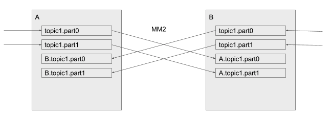

# Kafka Mirror Maker2
- [미러링 구성](#미러링-구성)
  - [단방향 미러링 설정](#단방향-미러링-설정)
  - [양방향 미러링 설정](#양방향-미러링-설정)
- [컨슈머 오프셋 복제](#컨슈머-오프셋-복제)
  - [오프셋 복제 흐름](#오프셋-복제-흐름)
- [아키텍처 구성 전략](#아키텍처-구성-전략)
  - [active - active 구성](#active---active-구성)
  - [active - standby 구성](#active---standby-구성)
- [MirrorMaker 2 배포 구성](#mirrormaker-2-배포-구성)
  - [Dedicated mirror maker 클러스터](#dedicated-mirror-maker-클러스터)
  - [기존의 커넥트 클러스터에서 커넥터 추가](#기존의-커넥트-클러스터에서-커넥터-추가)
- [Reference](#reference)


## 미러링 구성

### 단방향 미러링 설정

기본적으로 MM2는 하나의 소스 클러스터에서 타겟 클러스터로 데이터를 미러링한다. 미러링 시 A → B로 topic 을 복제하면, B에서는 A.topic 이름으로 생성된다.

```
clusters = A, B

A.bootstrap.servers = A_host1:9092, A_host2:9092, A_host3:9092
B.bootstrap.servers = B_host1:9092, B_host2:9092, B_host3:9092

A->B.enabled = true
A->B.topics = .*
```

### 양방향 미러링 설정

```
clusters = A, B

A.bootstrap.servers = A_host1:9092, A_host2:9092, A_host3:9092
B.bootstrap.servers = B_host1:9092, B_host2:9092, B_host3:9092

# A -> B 미러링 활성화
A->B.enabled = true
A->B.topics = .*

# B -> A 미러링 활성화
B->A.enabled = true
B->A.topics = .*
```

#### 양방향 미러링 시 고려해야 할 점

**무한 루프** 방지해야 한다. 양방향 미러링을 하면, A에서 B로 복제된 데이터가 다시 A로 복제되는 루프 문제가 발생할 수 있다.
이를 방지하기 위해 미러링된 토픽을 제외하는 필터를 설정한다
    
```
A->B.enabled = true
A->B.topics = ^((?!B\.).*)$  # B에서 온 미러링된 토픽은 복제하지 않음

B->A.enabled = true
B->A.topics = ^((?!A\.).*)$  # A에서 온 미러링된 토픽은 복제하지 않음
```

A→B 로 토픽 `topic` 미러링 시, `A.topic` 라는 토픽명으로 B 클러스터에 생성된다.


## 컨슈머 오프셋 복제
    
```
sync.group.offsets.enabled = true
```
이 설정을 추가하면 클러스터 간 컨슈머 그룹을 동기화하고 오프셋을 자동으로 복제한다.

### 오프셋 복제 흐름

1. 타겟 클러스터(B)의 컨슈머 → `B.checkpoints.internal`에서 오프셋을 가져와 적용
2. MM2의 MirrorCheckpointConnector → A의 오프셋을 `B.checkpoints.internal` 토픽에 복제

MirrorCheckpointConnector가 실행되지 않거나 내부 토픽이 없으면 오프셋 미러링이 동작하지 않는다


#### OffsetSync 기록
- `mm2-offset-syncs.A.internal` : 소스 ↔ 타겟 클러스터 오프셋 간 매핑을 기록한다.

```bash
./bin/kafka-console-consumer.sh --bootstrap-server A_host1:9092 \
  --topic mm2-offset-syncs.A.internal \
  --formatter org.apache.kafka.connect.mirror.formatters.OffsetSyncFormatter \
  --from-beginning
 
OffsetSync{topicPartition=new-topic-0, upstreamOffset=30, downstreamOffset=30}

```
- upstream_offset : 소스 클러스터 오프셋
- downstream_offset : 타겟 클러스터 오프셋


#### Checkpoint 기록
- `A.checkpoints.internal` : 특정 시점의 컨슈머 오프셋을 소스 클러스터(B)로부터 읽고, 해당 오프셋이 타겟 클러스터(A)에서 어디까지 처리되었는지 매핑해서 기록

```bash
./bin/kafka-console-consumer.sh --bootstrap-server A_host1:9092 \
  --topic A.checkpoints.internal \
  --formatter org.apache.kafka.connect.mirror.formatters.OffsetSyncFormatter \
  --from-beginning
 
 OffsetSync{topicPartition=mm-tester-1663864, upstreamOffset=0, downstreamOffset=562949953421312}
```

- 소스 클러스터의 mm-tester 토픽 1663864 파티션에서 offset 0에 있던 메시지 → 
타겟 클러스터의 같은 토픽/파티션에 offset 562949953421312로 복제됨

여기서 `562949953421312` = `0x2000000000000`가 의미하는 바는 MM2는 내부적으로 복제된 메시지 offset을 가짜 오프셋으로 활용한다는 것이다.

참고로 이렇게 큰 수를 사용하는 이유는:
- 복제된 메시지와 실제 타겟 클러스터의 native 메시지를 구분
- 일부 MM2 설정에서 logical offset space를 따로 유지하기 위해
- offset 공간이 겹치지 않게 하려는 목적

## 아키텍처 구성 전략

### active - active 구성



- 양방향 미러링 적용하고 각 클러스터에 토픽 추가, 서로를 미러링하는 토픽은 따로 있다
- 미러링되는 토픽 간에는 컨슈머 그룹 오프셋은 복제될 수 있으나 최초 생성된 토픽, 여기서 각 클러스터의 `topic1` 에는 오프셋이 다를 수 밖에 없다

### active - standby 구성


- active → standby 로 단방향 미러링
- failover이 발생하는 동안 메시지 유실이 발생할 가능성이 있음
- DCI 단절 일어나면 단방향 미러링 불가, 다른 DC의 클라이언트에서는 active 클러스터에 접속하지 못할 수 있음
- 미러링과 오프셋 복제가 간단하나 failover에 대한 시나리오 필요하다

## MirrorMaker 2 배포 구성

kafka 에서 제공되는 데이터 미러링 기능으로 3가지 방법으로 배포 가능하다

- 기존의 커넥트 클러스터에서 커넥터 생성 `connector.class": "org.apache.kafka.connect.mirror.MirrorSourceConnector"`
- dedicated mirror maker 클러스터 생성 `$ ./bin/connect-mirror-maker.sh mm2.properties`
- standalone 클러스터 생성 `./bin/connecti-standalone.sh worker.properties connector.properties`

standalone은 프로덕션 환경에선 운영하기 어려울 수 있으므로 처음 2가지 방법을 살펴본다

### Dedicated mirror maker 클러스터

```bash
dedicated.mode.enable.internal.rest = true
```

MM2 내에서 Connect REST API 활성화한다

- REST API 비활성화면 MM2 내 리더 - 팔로워 간 통신이 불가하여 새로운 토픽이 추가되어도 미러링되지 않는 문제가 있을 수 있다. 활성화하면 팔로워가 새로운 설정에 대해 REST API를 통해 리더에게 알릴 수 있다
- 리더는 설정을 업데이트하고, 전체 클러스터에 적용 가능하다

이 때, 기존에 같은 클러스터에 카프카 커넥트가 돌아가고 있으면 포트 충돌이 날수도 있다 `Caused by: java.io.IOException: Failed to bind to 0.0.0.0/0.0.0.0:8083`

```bash
clusters = kafka-B,kafka-A
kafka-B.bootstrap.servers = kafka-B-broker01:9092,kafka-B-broker02:9092,kafka-B-broker03:9092
kafka-A.bootstrap.servers = kafka-B-broker01:9092,kafka-B-broker02:9092,kafka-B-broker03:9092

# 양방향 미러링
kafka-B->kafka-A.enabled = true
kafka-A->kafka-B.enabled = true

# 모든 토픽과 그룹을 동기화하도록 설정(기본값)
topics=.*
groups=.*

# 각 클러스터에 독립적으로 존재해야하는 태스크 관련 정보를 가진 토픽은 복제하지 않도록 설정
topics.blacklist=.*[\\-\\.]internal, .*\\.replica, __consumer_offsets
groups.blacklist=console-consumer-.*, connect-.*, __.*

# Setting replication factor of newly created remote topics
replication.factor=3

############################# Internal Topic Settings  #############################
checkpoints.topic.replication.factor=3
heartbeats.topic.replication.factor=3
offset-syncs.topic.replication.factor=3
offset.storage.replication.factor=3
status.storage.replication.factor=3
config.storage.replication.factor=3

# 기존: replication.policy.class=org.apache.kafka.connect.mirror.DefaultReplicationPolicy

dedicated.mode.enable.internal.rest=true

emit.heartbeats.enabled = true
emit.checkpoints.interval.seconds = 1
emit.heartbeats.interval.seconds = 1

sync.topic.acls.enabled = true
sync.group.offsets.enabled = true
sync.group.offsets.interval.seconds = 1
sync.topic.acls.interval.seconds = 1
sync.topic.configs.enabled=true
sync.topic.configs.interval.seconds = 1

refresh.topics.enabled = true
refresh.groups.enabled = true
refresh.topics.interval.seconds = 1
refresh.groups.interval.seconds = 1

```

### 기존의 커넥트 클러스터에서 커넥터 추가

- Source Connector : 데이터 복제
- Checkpoint Connector : 컨슈머 그룹 오프셋 복제
- Hearbeat Connector :  MirrorMaker 2 인스턴스의 상태 확인

카프카 커넥트에 생성( 소스/타겟 카프카 커넥트 클러스터가 다르면 각각에 생성해야 됨 )

```bash
curl -X POST "http://kafka-B-broker01:8083/connectors"  -H "Content-Type: application/json" -d '{
    "name": "MM2-Checkpoint",
    "config":
    {
        "name": "MM2-Checkpoint",
        "connector.class": "org.apache.kafka.connect.mirror.MirrorCheckpointConnector",
        "clusters": "kafka-A, kafka-B",
        "source.cluster.alias": "kafka-A",
        "source.cluster.bootstrap.servers": "kafka-B-broker01:9092,kafka-B-broker02:9092,kafka-B-broker03:9092",
        "target.cluster.alias": "kafka-B",
        "target.cluster.bootstrap.servers": " kafka-B-broker01:9092,kafka-B-broker02:9092,kafka-B-broker03:9092",
        "source.admin.bootstrap.servers": "kafka-B-broker01:9092,kafka-B-broker02:9092,kafka-B-broker03:9092",
        "source.consumer.bootstrap.servers": "kafka-B-broker01:9092,kafka-B-broker02:9092,kafka-B-broker03:9092",
        "source.producer.bootstrap.servers": "kafka-B-broker01:9092,kafka-B-broker02:9092,kafka-B-broker03:9092",
        "target.admin.bootstrap.servers": "kafka-B-broker01:9092,kafka-B-broker02:9092,kafka-B-broker03:9092",
        "target.consumer.bootstrap.servers": "kafka-B-broker01:9092,kafka-B-broker02:9092,kafka-B-broker03:9092",
        "target.producer.bootstrap.servers": "kafka-B-broker01:9092,kafka-B-broker02:9092,kafka-B-broker03:9092",
        "enabled": "true",
        "tasks.max": "3",
        "topics": ".*",
        "groups": ".*",
        "topics.blacklist": ".*[\\-\\.]internal, .*\\.replica, __consumer_offsets, .*[\\-\\.]heartbeats",
        "groups.blacklist": "console-consumer-.*, connect-.*, __.*",
        "replication.factor" :"3",
        "checkpoints.topic.replication.factor" :"3",
        "heartbeats.topic.replication.factor" :"3",
        "offset-syncs.topic.replication.factor" :"3",
        "offset.storage.replication.factor" :"3",
        "status.storage.replication.factor" :"3",
        "config.storage.replication.factor" :"3",
        "emit.checkpoints.enabled": "true",
        "emit.heartbeats.enabled": "true",
        "emit.checkpoints.interval.seconds": "1",
        "emit.heartbeats.interval.seconds": "1",
        "sync.topic.acls.enabled": "true",
        "sync.group.offsets.enabled": "true  ",
        "sync.group.offsets.interval.seconds": "1",
        "sync.topic.acls.interval.seconds": "1",
        "sync.topic.configs.enabl": "true",
        "sync.topic.configs.interval.seconds": "1",
        "refresh.topics.enabled": "true",
        "refresh.groups.enabled": "true",
        "refresh.topics.interval.seconds": "1",
        "refresh.groups.interval.seconds": "1"
    }
}' 
curl -X POST "http://kafka-B-broker01:8083/connectors"  -H "Content-Type: application/json" -d '{

    "name": "MM2-Heartbeat",
    "config":
    {
        "name":  "MM2-Heartbeat",
        "connector.class": "org.apache.kafka.connect.mirror.MirrorHeartbeatConnector",
        "clusters": "kafka-A, kafka-B",
        "source.cluster.alias": "kafka-A", .. (이하 동일)
    }
}' 

curl -X POST "http://kafka-B-broker01:8083/connectors"  -H "Content-Type: application/json" -d '{
    "name": "MM2-Source",
    "config":
    {
        "name":  "MM2-Source",
        "connector.class": "org.apache.kafka.connect.mirror.MirrorSourceConnector",
        "clusters": "kafka-A, kafka-B",
         "source.cluster.alias": "kafka-A", .. (이하 동일)
    }
}'
```


---

## Reference

https://cwiki.apache.org/confluence/display/KAFKA/KIP-382%3A+MirrorMaker+2.0#KIP382:MirrorMaker2.0-Walkthrough:RunningMirrorMaker2.0

https://learn.conduktor.io/kafka/kafka-cluster-setup-overview/

https://docs.redhat.com/ko/documentation/red_hat_streams_for_apache_kafka/2.0/html/using_amq_streams_on_rhel/proc-mirrormaker-replication-str

https://docs.redhat.com/ko/documentation/red_hat_streams_for_apache_kafka/2.3/html/configuring_amq_streams_on_openshift/assembly-mirrormaker-str#proc-mirrormaker-replication-str

https://docs.redhat.com/ko/documentation/red_hat_streams_for_apache_kafka/2.5/html/deploying_and_managing_amq_streams_on_openshift/con-config-mirrormaker2-str#con-config-mirrormaker2-connectors-str

https://developers.redhat.com/articles/2023/11/13/demystifying-kafka-mirrormaker-2-use-cases-and-architecture#architecture_design_scenarios

https://cloud.samsungsds.com/serviceportal/assets/pdf/en/SDS_Technical_Guide_Configuring_Apache_Kafka_DR_using_MirrorMaker_2_v1_eng.pdf

https://cwiki.apache.org/confluence/display/KAFKA/KIP-382%3A+MirrorMaker+2.0

https://devidea.tistory.com/112

https://aiven.io/docs/products/kafka/kafka-mirrormaker/concepts/disaster-recovery/active-passive-setup

https://aiven.io/docs/products/kafka/kafka-mirrormaker/concepts/disaster-recovery/active-active-setup