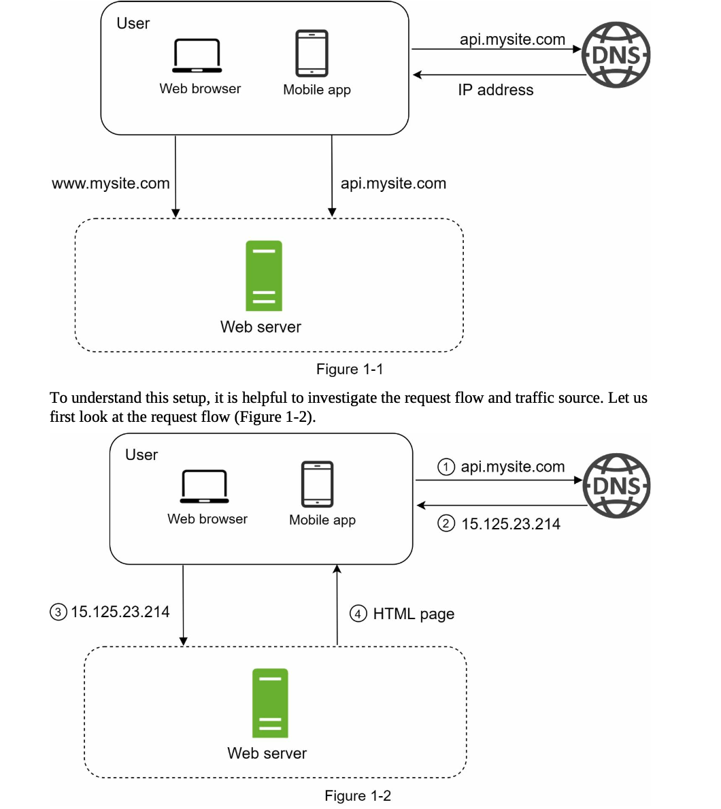

# 시스템 디자인



- 유저는 DNS를 통해 도메인(api.mystie.com)의 ip를 찾아내 접속한다. ip 주소로 HTTP 요청이 전달되고 HTML 페이지나 JSON 응답을 받는다.

```jsx
GET /users/12 – Retrieve user object for id = 12
```

- web server 는 DB에서 데이터를 가져오는데 보통 RDBMS를 쓴다. 하지만 latency가 낮거나 비정형 데이를 다루거나 대규모 데이터를 저장해야하는 경우 다른 데이터베이스를 사용한다.


- 로드밸런서를 통해 웹 서버들간에 트래픽을 분산시키다. 유저는 로드밸런서의 ip를 찾아내 접속하고 웹 서버는 직접적인 유저의 접속을 받지 않는다.
    - failover 가능 - 서버1이 다운되면 서버2로 자동접속
    - 트래픽 변화에 유연하게 대처


- 데이터베이스 다중화 - 쓰기 작업은 마스터에서만 받고 다른 레플리카 서버에 데이터를 복제한다. 읽기 작업은 레플리카 서버에서도 받을 수 있다
    - 읽기 성능을 병렬로 지원하여 개선
    - 안정성 및 가용성(failover 가능)
- 데이터베이스 확장
    - 스케일 업 - 서버의 스펙을 늘린다
    - 스케일 아웃 - 서버의 갯수를 늘리는데 샤딩이 필요하다. 샤딩 키를 잘 설정해 전체 데이터를 샤드로 나누어 분산 저장한다. 여기서 데이터 규모가 이븐하지 못해(샤드 소진이 발생하는 경우) 재샤딩을 하거나 / 핫스팟 문제( 특정 서버에 작업이 몰림 )가 발생하거나 / 조인이나 비정규화( 여러 샤드에서 질의해야 )에 대해 고려해야 한다


- Cache - 캐시를 두면 데이터베이스만 두는 것보다 요청을 훨씬 빠르게 처리 가능하다. 데이터베이스 부하도 줄여준다.
    - 고려 사항 - 데이터 갱신이 자주 발생하지 않는 것이 좋음 /  캐시 만료 및 eviction 관리 / 데이터 일관성 관리( 데이터베이스에 저장된 최신 데이터를 가져올 수 있어야 함 )  /  SPOF를 피하기 위해 캐시 서버 다중화
- CDN(Content Delivery Network ) - HTML 페이지와 같은 정적 콘텐츠를 캐시하여 유저에게 빠르게 보낸다. 유저와 지리적으로 가까운 CDN 서버에서 페이지를 받는게 훨씬 빠르다. CDN에서 캐시 미스가 나면 웹서버에서 가져와 저장한다.


- 웹 서버 수평 확장( stateless ) - 웹 서버에 상태(세션) 정보를 저장하지 않고 데이터베이스와 같은 공유 스토리지에 저장하면 어떤 유저의 요청이든 어떤 웹서버로든 전달되도 상관없다. sticky session( 특정 유저의 세션은 항상 같은 서버로만 접속해야 함 )을 신경쓰지 않아도 되어 로드밸런서의 부담도 줄어든다. 트래픽에 따라 오토스케일링 가능하다.


- 데이터센터 다중화 - 가장 가까운 데이터센터로 연결해야하기 때문에 지리적 라우팅이 필요하다.
    - DC 간 페일오버 가능
    - 고려 사항 - 트래픽 우회( GeoDNS는 가장 가까운 DC로 트래픽을 보낼 수 있어야) / 데이터 동기화( DC 간 데이터베이스 동기화 )


- 메시지 큐 - 데이터 내구성을 보장하며 비동기 통신을 지원하다. 메시지의 버퍼 역할을 해주고 비동기적으로 전송하다.
    - 서비스나 서버 간의 결합이 느슨해서 독립적인 확장 및 운영이 가능하다. 예를 들어 사진을 받아서 처리(보정)해야 한다고 하면 메시지를 비동기적으로 받아 작업 프로세스를 확장하며 처리량을 늘릴 수 있다

# 확장 고려해야 할 지표들

- QPS / TPS
- DAU / MAU

# Rate Limiting


- rate limit 초과 트래픽 처리 - rate limit 에 걸린 요청은 429 응답을 반환한다

# Consistent Hashing


- Consistent Hashing  - 해시 테이블 크기가 조정되면 평균 k/n개의 키만 새로 재배치한다.(k = 샤딩 키 갯수, n=샤드, 슬롯의 갯수 ). 해시 링 위에 해시 서버가 있고 해시 키에 따라 가장 가까운 서버에 배치된다.
    - 서버 추가나 제거시 키 위치에 따라 새로 위치한 가장 가까운 서버로 재배치하면 된다

```python
import hashlib

class ConsistentHashing:
    def __init__(self, nodes=None, replicas=3):
        self.replicas = replicas  # 가상 노드 수
        self.ring = {}  # 해시 링
        self.sorted_keys = []  # 정렬된 해시 키
        if nodes:
            for node in nodes:
                self.add_node(node)
    
    def _hash(self, key):
        """SHA-1 해시 값을 반환."""
        return int(hashlib.sha1(key.encode()).hexdigest(), 16)
    
    def add_node(self, node):
        """노드를 해시 링에 추가."""
        for i in range(self.replicas):
            virtual_node = f"{node}#{i}"
            hash_key = self._hash(virtual_node)
            self.ring[hash_key] = node
            self.sorted_keys.append(hash_key)
        self.sorted_keys.sort()
    
    def remove_node(self, node):
        """노드를 해시 링에서 제거."""
        for i in range(self.replicas):
            virtual_node = f"{node}#{i}"
            hash_key = self._hash(virtual_node)
            del self.ring[hash_key]
            self.sorted_keys.remove(hash_key)
    
    def get_node(self, key):
        """키에 해당하는 노드를 반환."""
        hash_key = self._hash(key)
        for sorted_key in self.sorted_keys:
            if hash_key <= sorted_key:
                return self.ring[sorted_key]
        return self.ring[self.sorted_keys[0]]  # 원형 링이므로 첫 번째로 순환

# 예제 사용
nodes = ["NodeA", "NodeB", "NodeC"]
ch = ConsistentHashing(nodes)

print(ch.get_node("my_key"))  # 특정 키가 할당될 노드
```

- 전통적인 재샤딩은 거의 대부분 키가 새로 배치되는 문제가 있다


- 가상 노드 - 기본 안정 해시는 서버 추가나 삭제에 따라 샤드 크기를 균등하게 유지하지 못하는 문제 가 있고, 키의 uniform 분포를 달성하기 어렵다는 문제가 있다. 이 때 하나의 해시 서버가 여러 개의 가상 노드를 가지면 각 서버는 여러 파티션을 관리할 수 있다.
    - 가상 노드 갯수가 늘어나면 샤드 크기 간에 표준 편차가 작아져서 키에 따라 데이터가 고르게 분포된다.

# Key-Value Store( ex. Cassandra, BigTable, DynamoDB )


- 유저는 API( put / get )을 통해 통신한다
- coordinator 노드를 통해 다른 노드들과 통신한다(프록시)

CAP 이론

- 일관성(모든 노드에서 동일한 데이터 보장) / 가용성(모든 요청에 대해 응답 가능) / 파티션 감내(네트워크 단절 허용 - DC간 네트워크가 단절되었거나 특정 노드에 연결이 안됨) - 두 가지만 만족시킬 수 있다
- 네트워크 단절은 피할 수 없는 문제이므로 보통 CP 아니면 AP
    - 일관성 선택 - 파티션 문제가 발생하면 데이터 불일치 문제를 피하기 위해 읽기/쓰기를 중단할수도( 가용성 X )
    - 가용성 선택 - outdated 데이터를 읽더라도 읽기/쓰기를 계속 허용( 일관성 X )

안정 해시를 통해

- 데이터 파티션 - 키에 따라 분산 저장
- 데이터 다중화 - 가용성 및 안정을 위해 비동기적으로 데이터를 복제함. 해시 링을 순회하면서 처음 만나는 N개 서버( 가상 노드 )에 복제함, 이 때 물리 서버는 겹치지 않도록 해야
- 데이터 일관성 - 쿼럼에 따라 N개의 레플리카 서버가 있을 때  R, W의 조건에 따라 strong consistency / weak consistency( eventual consistency ) 중에 일관성 수준을 만족한다.
    - strong consistency - R+W > N으로 읽기/쓰기 응답에 대한 조건을 만족할 때까지 작업 중단( 가용성 X )
    - weak consistency( eventual consistency ) - 일관성이 깨질 수 있지만 가용성을 유지하기 위해 계속 읽기/쓰기를 처리하면 데이터 불일치 해결

데이터 불일치 해결( inconsistency 해소 )

- 데이터 버저닝 - 데이터 변경 때마다 새로운 데이터 버전을 갱신, 각 버전의 데이터는 immutable
- 벡터 시계 - [서버, 버전]의 순서쌍을 데이터에 추가. 선행 버전, 후행 버전을 파악하고 버전 충돌이 일어난 경우 클라이언트에서 충돌을 해결하여 반영한다.


장애 처리


- 장애 감지 - 2대 이상의 서버가 하나의 서버에 대한 장애를 보고해야 장애로 감지함. 모든 노드간 멀티 캐스트를 구성하는 것은 비효율적이고, 분산형 장애 감지( 가십 프로토콜 )을 활용하는 것이 효율적임.
    - 가십 프로토콜 - 각 노드는 멤버십 목록을 가지고 각 멤버(노드) ID와 heartbeat 카운터를 주기적으로 체크한다. 일정 시간동안 갱신되지 않은 노드는 offline 상태(장애)로 가준한다.
- 일시적 장애 처리 - 장애가 인식되면 strict quorum에 따라 읽기/쓰기를 중단해야 한다. sloppy quorum을 따른다면 가용성을 높이기 위해 해시 링에서 장애가 아닌 서버 중에 W / R 서버를 선택한다. 장애 상태의 서버로 가는 요청은 선택된 다른 서버에서 대신 처리한다. 서버가 복구되면 따라잡지 못한 변경 사항을 일괄 반영하여 데이터 일관성을 보존한다( hinted handoff )
- 영구 장애 처리 - 영구적인 장애의 경우 anti-entropy 프로토콜을 통해 데이터 사본을 비교하여 최신 버전으로 갱신한다. 여기서 머클 트리라는 해시 트리를 활용한다. 두 머클 트리의 비교는 각 트리 노드의 해시값을 비교하여 다른 데이터를 갖는 버킷의 데이터를 동기화


쓰기 및 읽기


- 커밋 로그에 기록 - 데이터 캐시 저장 - 캐시가 차거나 어떤 임계치에 다다르면 디스크 SSTable에 데이터 플러시


- 캐시 히트면 메모리에서 가져오고, 캐시 미스면 블룸 필터를 거쳐 디스크 SSTable에서 데이터를 가져온다.

# Unique ID

트위터 스노우플레이크 ID


- datacenter ID / machine ID는 충돌이 발생할 수 있으니 신중히
- sequence numbr 는 ID 생성 때마다 1씩 증가

# URL 단축기


- 해시 함수를 적용해 단축 URL을 생성하는데 해시 함수는 16진수인 MD5, SHA-1 등을 적용하여 해시값의 앞부분만 활용하거나 62진법인 base-62를 통해 변환한다.

# 웹 크롤러

- **가정**: 매달 10억 개의 웹 페이지가 다운로드된다고 가정합니다.
- **QPS (초당 요청 수)**: 10억 페이지를 30일, 하루 24시간, 시간당 3600초로 나누면 약 초당 400페이지가 처리됩니다.
- **최대 QPS (Peak QPS)**: QPS의 두 배를 최대 QPS로 간주하며, 초당 800페이지로 계산합니다.
- **평균 웹 페이지 크기**: 각 웹 페이지의 크기를 평균 500KB로 가정합니다.
- **월별 저장 용량**: 한 달 동안 10억 페이지를 다운로드하면 약 500TB의 데이터가 필요합니다.
- **5년간 저장 용량**: 데이터를 5년 동안 저장한다고 가정하면, 월별 500TB × 12개월 × 5년으로 총 30PB의 저장소가 필요합니다.


- URL frontier - 다운로드할 URL
- Content Seen? - 중복 컨텐츠인지 확인하여 이미 저장된 경우면 버린다.
- Content Storage - HTML 문서를 저장한다.
- URL Seen? - 이미 방문한 URL인지, 미수집된 URL인지 확인한다. 블루 필터나 해시 테이블을 활용한다.
- URL Storage - 이미 방문한 URL을 저장한다.

데이터 수집 > URL frontier → HTML 다운로더 시 태스크( 미수집 URL ) 할당


- Queue router - 매핑 테이블은 호스트명과 큐에 매핑 정보를 갖고 있고, 같은 호스트의 URL은 동일한 큐로 전송된다.
- Queue selector - 각 웹사이트 호스트명마다 다운로드를 수행할 worker thread를 따로 둔다. 즉 별도의 큐를 할당하여 태스크를 가져간다. 전달된 URL은 각각 순차적으로 처리되고 작업 간에는 일정 시간 텀을 둘 수 있다.
- URL 저장소는 디스크에 있지만 IO 비용을 줄이고 태스크를 비동기적으로 처리하기 위해 메모리 버퍼에 큐를 둔다.

HTML 다운로더 최적화 >

- 분산 크롤링 - 여러 서버에서, 각 서버는 여러 스레드로 크롤링 작업을 수행한다.
- DNS 결과 캐시 - 크롤러 스레드 중에 DNS 조회를 하고 있으면 다른 스레드의 DNS 요청은 전부 볼록되므로 캐시를 활용한다
- 서버 지역성 활용 - 크롤링 서버를 지역별로 분산한다. 크롤링 대상 서버와 지역적으로 가까우면 페이지 다운로드하는데 시간이 줄어든다.
- 짧은 타임아웃 - 타임아웃을 짧게 하여 특정 페이지가 응답하지 않더라도 다음 페이지를 다운받도록 한다
- 안정성
    - 안정 해시를 통해 다운로드 서버를 쉽게 추가/삭제한다 - 상태 정보를 다운로더 서버가 갖고 있지 않으면 스케일링해도 데이터를 재배치하지 않아도 될 것 같은데 굳이?
    - 중간에 중단되도 재시작 가능하도록 크롤링 상태 정보와 수집된 데이터를 데이터베이스(디스크)에 저장한다. 단 서버는 stateless 하도록 한다.

# 분산 메시지 큐

- 프로듀서(Producer)는 메시지를 메시지 큐에 보냅니다.
- 컨슈머(Consumer)는 메시지 큐에서 메시지를 소비합니다.
- 메시지는 **반복적으로 소비**되거나 **한 번만 소비**될 수 있습니다.
- 과거 데이터를 **삭제(truncate)**할 수 있습니다.
- 메시지 크기는 **킬로바이트(KB) 단위**입니다.
- 메시지를 큐에 추가된 순서대로 **컨슈머에게 전달**할 수 있습니다.
- 데이터 전달 방식은 사용자가 **최소 1회(at-least once)**, **최대 1회(at-most once)**, **정확히 1회(exactly once)** 중에서 구성할 수 있습니다.


- 데이터는 파티션을 통해 여러 브로커 서버에 분산 저장된다. 토픽의 용량이 늘어나면 파티션 갯수를 늘려 확장할 수 있다. 하나의 파티션 내에서는 메시지 순서가 유지되고, 오프셋을 통해 파티션 내 메시지 위치를 추적한다.
- 프로듀서가 메시지를 전송할 때 한 토픽의 한 파티션으로 보내진다.
- 컨슈머 그룹을 통해 여러 토픽을 구독할 수 있고 같은 그룹내의 컨슈머는 메시지를 병렬로 가져올수 있다. 한 파티션 내의 메시지 순서를 보장하기 위해 한 파티션은 그룹 내에서 한 컨슈머만 읽는다(일대일모델). 처리량을 늘리려면 컨슈머를 추가하여 병렬성을 늘린다.
- state storage : 컨슈머 정보를 저장한다. 컨슈머 - 파티션 배치 관계를 갖고 있으며, 각 컨슈머 그룹의 각 파티션에서 마지막 오프셋 정보를 관리한다.
    - 데이터 패턴은 읽기/쓰기/갱신이  빈번하지만 양이 많지 않고, 삭제는 없다. 데이터 일관성이 중요하고 읽기/쓰기는 랜덤 탐색으로 이루어진다 → 주키퍼와 같은 key-value store가 적합하다
- metadata storage : 토픽 설정값이나 속성값 등을 저장한다( 파티션 수, 보관기간, 사본 배치 정보 등 )
    - 데이터 패턴은 갱신이  빈번하지 않으며 양이 많지 않으나 데이터 일관성이 중요하다. 읽기/쓰기는 랜덤 탐색으로 이루어진다 → 주키퍼와 같은 key-value store가 적합하다
- coordination service : service discovery( 어떤 브로커가 살아있는지 ) / 리더 선출( active controller 선정 )를 담당한다. 보통 주키퍼나 etcd를 활용한다.

전통적 메시지 큐와 다른 점 

- RabbitMQ와 같은 전통적 메시지 큐는 이벤트 스트리밍처럼 메시지 보관을 중요하게 다루지 않고 메시지가 컨슈머에 전달되는 기간동안만 보관한다. 또한 메시지 전달 순서도 보존하지 않는다.

메시지 모델

- point to point - 보통의 전통적인 메시지 큐 모델이다. 각 메시지는 하나의 컨슈머만 가져갈 수 있다. 컨슈머가 ack를 전송하면 큐에서 메시지는 삭제된다. 컨슈머 그룹을 통해 메시지당 일대일로 구독한다.
- publish / subscribe - 토픽을 통해 메시지를 주고 받는다. 토픽을 구독하는 모든 컨슈머에 메시지가 전달될 수 있다.

대역폭을 높이기 위해 

1. HDD의 높은 순차 탐색과 디스크 캐시 전략을 활용한다

데이터 저장

- **읽기/쓰기가 빈번**하고 갱신/삭제는 발생하지 않는다.  순차 읽기/쓰기 작업이 대부분이다.
- 읽기/쓰기가 동시간으로 자주 발생하기에 RDBMS 나 디비는 오히려 병목이 될 수 있다. WAL로그로 메시지를 append-only 파일로 디스크에 기록한다. WAL 읽기 / 쓰기는 전부 순차적이다.
    - 새로운 메시지가 들어오면 파티션 파일에 추가하며 오프셋을 증가시킨다.
    - 파일의 크기는 계속 커질테니 세그먼트 단위로 나누어 기록한다. 새 메시지는 active 세그먼트에만 구차가하고 이전의 파일은 비활성 상태로 바꿔 읽기 요청만 처리한다. 보관기간이 지난 파일은 삭제하여 정리한다.


1. 메시지 복사( 프로듀서 → 컨슈머로 전달되는 과정 )에 드는 비용 최소화

메시지 자료 구조


- key - 파티션을 정한다( 키가 없으면 랜덤으로 결정 ). 파티션은 hash(key) % (파티션갯수) 로 정해진다
- value - 페이로드

1. 배치 활용 - 소규모 IO를 줄이기 위해 메시지를 배치 단위로 일괄 전송하고 수신한다
- 네트워크 IO 줄이기 - 한번의 네트워크 요청으로 여러 메시지를 전송하여 네트워크 왕복 횟수를 줄인다
- 디스크 IO 줄이기 - 한번에 여러 메시지를 디스크에 기록하여 더 큰 순차쓰기가 발생하고, 디스크 캐시에도 더 큰 규모의 연속된 공간을 점유할 수 있게된다
- 대역폭을 늘리면, latency도 늘어나므로 배치 사이즈를 줄여야할 수 있다. 이 때 처리량을 높이기 위해 토픽 파티션 수를 늘리는 방법도 있다

프로듀서 / 컨슈머 

- Pull 모델 - 컨슈머가 메시지를 소비하는 속도를 정해서 메시지를 가져간다.


- 프로듀서 -  보로커에 라우팅 계층을 추가하여 어떤 파티션으로 메시지를 전달하지 정한다.
    - 라우팅 계층은 메타데이터 저장소에서 replica distribution plan을 캐시에 보관한다. 네트워크 비용을 줄이기 위해 프로듀서에 포함시키다.
    - 버퍼에 보관했다가 배치로 메시지를 전송한다
    - 리더 파티션에만 데이터를 전송한다


- 컨슈머 - 특정 파티션의 오프셋부터 메시지를 읽는다. 리더 파티션으로부터 데이터를 가져온다.

[consumer group](consumer%20group%201721d577edeb8055a3d6ca62ace10175.md)

데이터 동기화

- coordination service를 통해 브로커 중 하나를 리더로 선출하면 리더가 replica distribution plan을 만들어 메타데이터 저장소에 보관한다. 다른 브로커 팔로워는 해당 계획대로 데이터를 복제한다.
- commited offset - 해당 오프셋 이전의 모든 메시지는 ISR 집합 내 모든 레플리카에서 동기화가 완료되었다는 것을 의미한다. ISR은 각 레플리카에서 메시지를 받았다는 ack를 통해 확인한다.
    - ack = all - 모든 ISR이 메시지 수신 후 ack를 전송한다
    - ack = 1 - 리더만 메시지를 수신하고 ack를 전송한다
    - ack = 0 - ack를 기다리지 않는다. 응답 latency는 가장 적다
- 컨슈머는 리더 브로커로부터 메시지를 읽어가는데, 설계 및 운영이 단순하고 / 파티션 당 그룹별 한 컨슈머만 읽어가므로 연결이 생각보다 많이 생성되지 않고 / 토픽에 연결이 많아져도 파티션 및 컨슈머 수를 늘려 규모를 확장할 수 있기에 큰 문제는 없다
    - 하지만 지역적으로 가까운 DC에서 IRS 레플리카 중 메시지를 읽어가는 방법도 있다
    

메시지 전달 방식

- at most once
    - 프로듀서 - 토픽에 비동기적으로 메시지를 보내고 ack=0으로 실패해도 재전송하지 않는다.
    - 컨슈머 - 메시지를 읽고 처리하기 전에 커밋한다(autocommit 활성화 가능)
- at least cone
    - 프로듀서 - 동기 또는 비동기적으로 메시지를 보내고 ack=1 또는 ack=all로 구성하여 브로커에 대한 응답을 받고 재시도를 결정한다
    - 컨슈머 - 메시지를 성공적으로 읽고 처리한 경우에만 커밋한다(autocommit 비활성화). 중복 처리될 수 있으므로 컨슈머나 어플리케이션 단에서 중복 처리한다
- exactly once

# 광고 클릭 이벤트 집계

- **1일 활성 사용자(DAU)**: 10억 명.
- **가정**: 평균적으로 각 사용자가 하루에 광고를 1회 클릭한다고 가정.
    - 따라서, 하루 광고 클릭 이벤트는 10억 건.
- **광고 클릭 QPS(초당 요청 수)**:
    - 하루에 86,400초가 있으므로, 10억 건 ÷ 86,400초 ≈ 10,000 QPS.
- **최대 QPS(피크)**:
    - 평균 QPS의 5배로 가정.
    - 최대 QPS = 10,000 × 5 = 50,000 QPS.
- **광고 클릭 이벤트 크기**:
    - 단일 광고 클릭 이벤트는 0.1KB의 스토리지를 차지한다고 가정.
- **하루 스토리지 요구량**:
    - 0.1KB × 10억 건 = 100GB.
- **월간 스토리지 요구량**:
    - 100GB × 30일 ≈ 3TB.


- Recalculation only 데이터 집계 - 버그 발생시 원본 데이털르 다시 읽어 데이터를 재계산해야 한다. 로우 데이터 저장소에서 데이터를 가져와 전용 재계산 프로세스에서 처리하고 두번째 메시지 큐로 전송한다. 실시간 데이터 처리와 분리한다.

데이터 모델


- 원본 데이터와 집계 결과 데이터를 따로 저장한다 - 원본 데이터를 디버깅 및 백업 데이터로 활용한다. 직접 쿼리해서 집계하는 것은 비효율적이므로 따로 집계 결과를 저장한다
- 읽기 연산 빈도는 낮으나 쓰기 작업이 많을 것으로 추정되어 쓰기 및 시간 범위 쿼리에 최적화된 카산드라나 InfluxDB를 활용하는 것이 좋겠다

비동기 처리

- 메시지 큐를 도입하여 서비스 간 결합을 끊고 데이터를 비동기적으로 처리한다.


- 여기서 집계 서비스에서 데이터를 데이터베이스에 바로 저장하진 않고 메시지 큐를 활용한다(  exactly once ) 컨슈머에서 커밋을 수동으로 관리하여 at most once로 메시지를 처리하도록 하고, 중복 처리되지 않도록 관리한다. atomic commit을 통해 로우 데이터와 집계 데이터 저장하는 부분이 한번에 커밋되도록 설계하여 부분 실패를 방지한다

람다 vs 카파 아키텍쳐

- 스트림 처리 - 데이터를 오는 대로 처리하고 거의 실시간으로 집계 결과를 생성한다


- 람다 - 스트림 및 배치 처리를 두 가지 경로로 동시에 처리한다
- 카파 - 스트리 및 배치 처리를 한 가지 경로로 결합하여 처리한다

집계 타임스탬프

- 이벤트 시각 - 광고 클릭 발생 시간(추천)
- 처리 시각 - 집계 처리 시간

네트워크 지연이나 비동기적 처리 환경으로 인해 두 시간 간에는 격차가 생길 수 있다. 


- 늦게 도착한 이벤트는 워터마크를 활용하여 처리한다. 워터마트는 집계 윈도우의 확장을 의미한다. 가령 15초 워터마크르르 윈도우마다 붙이면 늦게 도착한 이벤트도 처리 가능하다

카프카 메시지 전달

- at least once로 데이터를 처리해야 한다.


- atomic commit으로 다운스트림 카프카까지 정상적인 처리가 완료되면 업스트림 카프카로 ack를 전송한다. 다운스트림 카프카에 전송 전에 장애가 발생할 수 있으니 오프셋 정보를 외부 스토리지에 저장한다.
- 파티션 - 같은 광고 id 이벤트는 같은 파티션에 저장하기 위해 ad_id를 파티션 키로 설정한다.


- 각 ad_id 마다 별도의 처리 스레드로 병렬로 처리하거나 노드를 여러 대 두어 멀티 프로세싱으로 처리한다

[uber realtime exactly once](uber%20realtime%20exactly%20once%201721d577edeb808197d9c724231d69c5.md)

# 호텔 예약 시스템


- Public API Gateway - rate limiting, 인증 등의 기능을 지원하는 fully managed service다.
- DB 확장 - 예약 이력은 cold storage로 옮기거나 샤딩을 적용한다. 샤딩을 적용하면 한 서버에서 감당해야 할 DB 부하를 분산시킬 수 있다. 예를 들어 QPS = 30000 이면 각 샤드( 샤드 16개라고 하면 ) 노드는 30000/16 = 1875 의 QPS만 처리하면 된다
- 캐시 적용 - 데이터 로딩 속도와 DB 확장성에 문제가 된다면 예약 서비스 같은 경우에는 캐시를 둘 수 있다. 잔여 객실 데이터를 조회하는 경우 캐시 활용이 가능한데, 실제 데이터베이스의 데이터 일관성을 위해 동기화가 필요하다(CDC)
- 동시성 제어
    - 멱등키를 통해 유일성 조건을 추가하여 이중 예약을 해결한다
    
    
    
    - 비관적 락 - 사용자가 레코드를 업데이트하려고 하면 락을 걸어 동시 업데이트 방지한다( `SELECT ... FOR UPDATE` ) 다른 트랜잭션은 업데이트 하려는 트랜잭션이 있으면 먼저 종료되길 기다려야한다. 여러 레코드에 락을 걸면 데드락이 발생할 수 있고 확장성에 제한이 생겨 DB 성능이 악화될수 있다
    
    
    
    - 낙관적 락 - 여러 사용자가 업데이트하는 것을 허용한다. 버전 번호와 타임스탬프를 통해 락을 구현한다. 다음 버전 번호는 이전 버전 번호에 +1 큰 값이어야 하고, 해당 조건이 안 맞으면( 유효성 검사 실패 ) 트랜잭션은 중단하고 재시도한다. 보통 비관적 락보단 빠른데, 만일 동시성이 너무 높다면 결국 하나의 트랜잭션만 버전 번호를 1 올리는데 성공할 것이고 다른 트랜잭션은 재시도를 계속 하게 될 것이므로 성능이 안 좋아질 수 있다.
    - 데이터베이스 제약 조건 설정( ex. `CONSTRAINT 'check_room_count CHECK(('total_inventory - total_reserved >= 0))` ) - 제약 조건을 위반하면 트랜잭션을 중단한다. 구현이 쉬우나 마찬가지로 경쟁이 심하면( 동시성이 너무 높으면 ) 실패하는 연산이 많이 나올 것이다

# S3와 유사한 객체 저장소

저장소 시스템

- 블록 스토리지 - HDD나 SSD와 같이 서버에 물리적으로 연결된 드라이브다. 로우 블록을 서버에 volume 형태로 마운트한다. 서버는 로우 블록을 포맷하여 파일 시스템으로 활용 가능하다. 데이터베이스나 VM의 경우 로우 블록을 직접 제어한다.
- 파일 스토리지 - 블록 스토리지 위에서 구현되며 파일/디렉토리를 쉽게 다루기 위해 추상화하여 제공된다. 데이터는 계층적으로 구성된 디렉토리에 보관된다.
- 객체 스토리지 - 데이터 영속성을 높이고 대규모 어플리케이션을 지원하며 비용을 낮추는 구조다( 주로 데이터 아카이브 ). 모든 데이터는 수평적 구조 내의 객체로 보관된다. 데이터는 REST API로 접근한다( 객체마다 URI가 있다 )