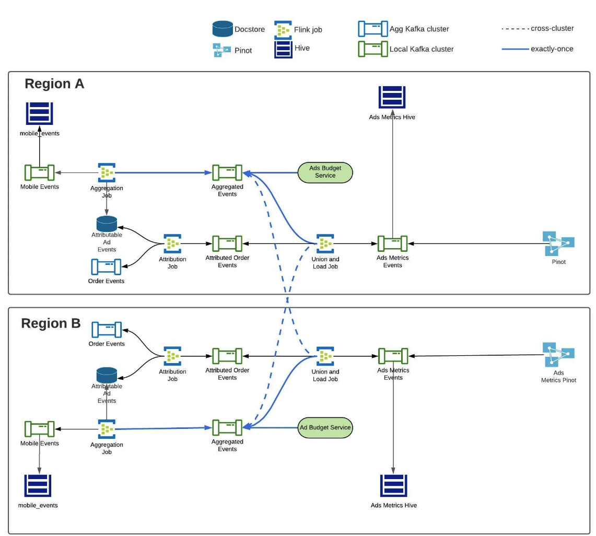

# uber realtime exactly once

[https://www.uber.com/en-KR/blog/real-time-exactly-once-ad-event-processing/](https://www.uber.com/en-KR/blog/real-time-exactly-once-ad-event-processing/)

[https://flink.apache.org/2018/02/28/an-overview-of-end-to-end-exactly-once-processing-in-apache-flink-with-apache-kafka-too/](https://flink.apache.org/2018/02/28/an-overview-of-end-to-end-exactly-once-processing-in-apache-flink-with-apache-kafka-too/)

### **Flink와 Kafka를 활용한 Exactly-Once 보장**

- **Flink와 Kafka의 트랜잭션 처리**
    - Flink와 Kafka는 트랜잭션 처리를 통해 메시지가 **트랜잭션 상태로 저장**되도록 보장한다
    - Flink는 KafkaConsumer에서 **“read_committed” 모드**를 활성화하여 트랜잭션 상태의 메시지만 읽는다 - Kafka의 **Two-Phase Commit Protocol**(2단계 커밋 프로토콜)
- **Aggregation 작업에서 고유 ID 생성**
    - *고유 식별자(UUID)**를 각 레코드에 생성하여 idempotency(멱등성)와 중복 제거를 보장한다.

### **Flink Aggregation 작업**

- **원시 이벤트 처리**
    - Flink의 Aggregation 작업은 Kafka에서 원시 이벤트를 읽고, 이를 **1분 단위로 집계한다**
    - 타임스탬프를 분 단위로 잘라내어(Truncation) 광고 식별자와 함께 **복합 키(Composite Key)**로 사용한다
- **Tumbling Window 트리거**
    - 집계된 결과는 1분마다 Kafka Sink로 전송되고 초기 상태는 **“uncommitted(미커밋 상태)”**
    - 이후 Flink의 Checkpointing(체크포인트)가 2분마다 트리거되면, 메시지는 **“committed(커밋 상태)”**로 변환된다
- **Two-Phase Commit Protocol**
    - Kafka의 읽기 오프셋과 커밋된 메시지를 동기화하여 정확한 데이터 처리가 이루어지도록 보장한다

### **Downstream 소비자 처리**

- **Committed 이벤트만 읽기**
    - Kafka 토픽의 소비자(e.g., Ad Budget Service, Union & Load Job)는 **“read_committed” 모드**로 설정되어 **커밋된 이벤트만 처리한다**
    - Flink에서 실패로 인해 발생할 수 있는 미커밋 이벤트는 무시한다
    - Flink가 복구되면, 미커밋된 이벤트를 다시 처리하고 새 집계 결과를 Kafka에 커밋한다
- UUID 활용

### **Pinot에서 Upsert 활용**

Aggregation Job >

Attribution Job >

Union / Load Job >

## **End-to-end Exactly Once Applications with Apache Flink**

- Data Source: KafkaConsumer를 사용하여 Kafka에서 데이터를 읽음.
- Window  데이터를 윈도우로 묶어 집계 처리.
- Data Sink: KafkaProducer를 사용하여 데이터를 Kafka로 다시 씀.

- Flink는 2단계 커밋 프로토콜을 사용하여 **분산 트랜잭션의 일관성**을 유지한다
1. **Pre-Commit**: 각 연산자(operator)가 데이터를 상태 백엔드(state backend)에 저장하거나 외부 시스템에 "Pre-Commit" 상태로 저장한다
    - **체크포인트 시작**
        - Flink의 **JobManager**는 데이터 스트림에 **Checkpoint Barrier(체크포인트 경계)**를 삽입.
        - 이 Barrier는 데이터 스트림을 현재 체크포인트에 속하는 데이터와 다음 체크포인트에 속하는 데이터로 나눔.
    - **Internal State 처리**
        - 내부 상태(예: 윈도우 집계 결과)는 Flink의 상태 백엔드(state backend)에 저장.
        - Flink는 내부 상태를 자동으로 관리하며, Pre-Commit 단계에서 별도의 추가 작업이 필요하지 않음.
    - **External State 처리**
        - 외부 상태(예: Kafka에 데이터 쓰기)는 2단계 커밋 프로토콜을 통해 처리.
        - Pre-Commit 단계에서 외부 시스템에 데이터를 "Pre-Commit" 상태로 저장.
2. **Commit**: 모든 연산자가 Pre-Commit을 완료하면, 최종적으로 데이터를 "Committed" 상태로 변환
    - **체크포인트 완료**
        - 모든 연산자가 Pre-Commit을 완료하면 Flink의 JobManager는 **Checkpoint-Completed Callback**을 실행.
    - **Commit 실행**
        - 내부 상태를 가진 연산자는 추가 작업 없이 상태를 확정.
        - 외부 상태를 가진 연산자는 외부 시스템에 데이터를 **Commit** 상태로 변환.
    - **실패 처리**
        - Commit이 실패하면 Flink 애플리케이션은 이전 성공한 체크포인트 상태로 롤백.
        - 이후 애플리케이션은 재시작 전략에 따라 다시 실행되고 Commit이 재시도됨.

