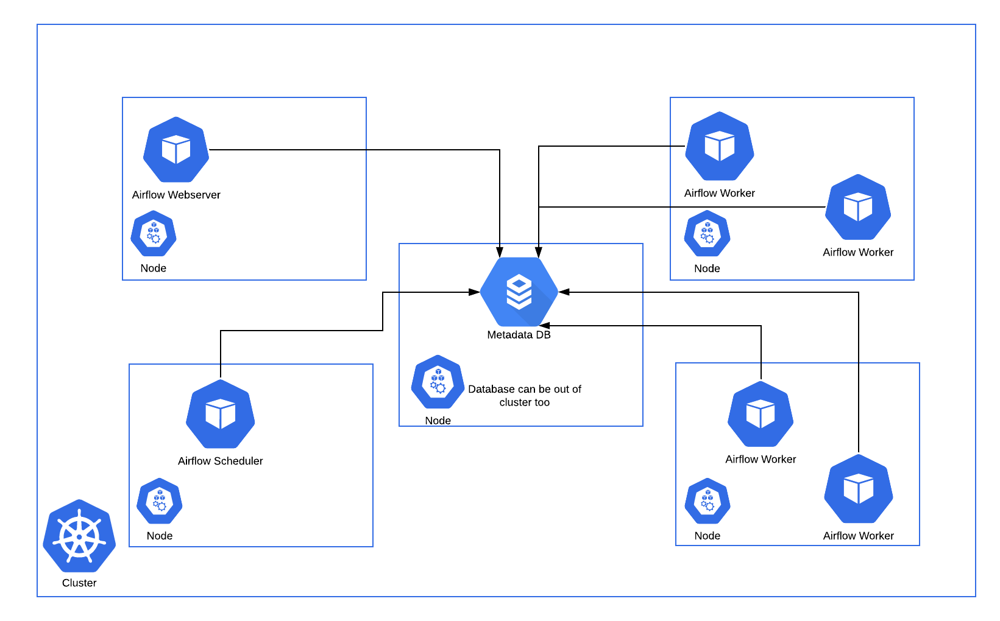

Airflow Executor는 Task instance를 실행하기 위한 매커니즘이다.
Airflow를 구성할 때 한번에 하나의 Executor만 적용할 수 있다.

Executor Type은 2가지로 구분된다.
- 로컬에서 Task를 실행하거나( Local Executor )
- 원격 서버에서 Task를 실행( Remote Executor )

LocalExecutor는 다음과 같이 있다. default로 SequentialExecutor로 설정되어 있으나 LocalExecutor로 변경하길 권장된다.
- Debug Executor
- Local Executor
- Sequential Executor

Remote Executors는 아래와 같다.
- [Celery Executor](https://airflow.apache.org/docs/apache-airflow/stable/executor/celery.html)
- CeleryKubernetes Executor
- Dask Executor
- [Kubernetes Executor](https://airflow.apache.org/docs/apache-airflow/stable/executor/kubernetes.html)

Remote Executor를 좀 더 살펴보자.
### CeleryExecutor
CeleryExecutor는 워커 수를 늘릴 수 있는 방법 중 하나이다.

### KubernetesExecutor
Task Instance를 Kubernetes 클러스터 내에서 Pod로 실행시킨다. 이 때 backend DB는 sqlite를 사용하면 안된다. 
DAG에서 Task를 등록하면  KubernetesExecutor는 worker pod를 요청한다. 해당 Pod에서 Task를 실행하고 종료된다. 

