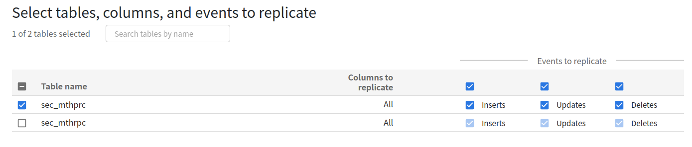

# Cloud SQL - Data Fusion - BigQuery

Cloud SQL과 BigQuery 데이터를 동기화하기 위해 Data Fusion을 사용하여 파이프라인을 [A Deep dive into Cloud Data Fusion "Replication" Feature | CDC pipeline from MS SQL Server to](https://blog.searce.com/a-deep-dive-into-cloud-data-fusion-replication-feature-cdc-pipeline-from-ms-sql-server-to-5534ef58f074)
와 같이 설계하였다.

Cloud SQL에서 MySQL의 경우 binary log를 활성화하여 Data Fusion에서 CDC를 기반으로 업데이트가 진행될 수 있도록 한다.

## MySQL - BigQuery Replicate

[Database replication to BigQuery using change data capture | Cloud Architecture Center | Google Cloud](https://cloud.google.com/architecture/database-replication-to-bigquery-using-change-data-capture)



초기 데이터는 BigQuery에 덤프해놓고 이후에 변경 사항은 CDC에서 처리한다. 변경된 데이터를 Delta table에 올리고 기존의 Main Table과 MERGE 한다.

다음과 같은 조인 방식이 있다.

- **즉각적 일관성 방식**: 쿼리는 복제된 데이터의 현재 상태를 반영합니다. 즉각적 일관성에는 기본 테이블과 델타 테이블을 조인하는 쿼리가 필요하며 각 기본 키에 대한 최신 행을 선택합니다.
    
    ```bash
    bq mk --view \
    "SELECT * EXCEPT(change_type, row_num)
    FROM (
      SELECT *, ROW_NUMBER() OVER (PARTITION BY id ORDER BY change_id DESC) AS row_num
      FROM (
        SELECT * EXCEPT(change_type), change_type
        FROM \`**$(gcloud config get-value project).cdc_tutorial.session_delta**\` UNION ALL
        SELECT *, 'I'
        FROM \`**$(gcloud config get-value project).cdc_tutorial.session_main\**`))
    WHERE
      row_num = 1
      AND change_type <> 'D'" **cdc_tutorial.session_latest_v**
    ```
    
- **비용 최적화 방식**: 데이터 가용성이 약간 지연되는 대신 더 빠르고 저렴한 쿼리가 실행됩니다. 주기적으로 데이터를 기본 테이블에 병합할 수 있습니다.
    
    ```bash
    bq query \
    'MERGE `cdc_tutorial.session_main` m
    USING
      (
      SELECT * EXCEPT(row_num)
      FROM (
        SELECT *, ROW_NUMBER() OVER(PARTITION BY delta.id ORDER BY delta.change_id DESC) AS row_num
        FROM `**cdc_tutorial.session_delta**` delta )
      WHERE row_num = 1) d
    ON  m.id = d.id
      WHEN NOT MATCHED
    AND change_type IN ("I", "U") THEN
    INSERT (id, username, change_id)
    VALUES (d.id, d.username, d.change_id)
      WHEN MATCHED
      AND d.change_type = "D" THEN
    DELETE
      WHEN MATCHED
      AND d.change_type = "U"
      AND (m.change_id < d.change_id) THEN
    UPDATE
    SET username = d.username, change_id = d.change_id'
    ```
    
- **하이브리드 방식**: 요구사항 및 예산에 따라 즉각적 일관성 방식 또는 비용 최적화 방식을 사용합니다.

## Data Fusion
data fusion replication으로 BigQuery로 데이터를 복사할 수 있는데 postgresql 은 없다. 


MySQL로 연동하려면 binary log를 활성화시켜야 한다.

```
$ gcloud config set projectyour-project-id
$ gcloud sql instances patch --enable-bin-logyour-instance-name
```
  

## Connect to Cloud SQL 관련 참고


public IP는 Authorization이 필요한데 위의 방법 중에 사용해야 한다.


private IP는 따로 authorization이 필요없고 같은 VPC내이면 접속이 가능하나 sidecar로 proxy를 사용하는 것이 권장된다.


**Recommended** : application에 sidecar로 Proxy를 사용하는 것이 좋다.

GKE에서 사용하려면 SA( service account )key를 secret으로 생성해서 mount해야 한다.


[Connecting to Cloud SQL from Kubernetes](https://www.youtube.com/watch?v=CNnzbNQgyzo)

>💡 AWS RDS와는 좀 다른 것 같다. RDS는 퍼블릭 엑세스를 허용하면 외부에서도 바로 접근이 가능한데 Cloud SQL은 public IP를 사용해도 authorization이 필요하여 Proxy나 authorized network를 사용해야 한다.

### 외부에서 연결

외부에서 연결하려면 `cloud_sql_proxy` 를 설치해서 쓰거나 authorized network를 설정해서 IP를 허용해줘야 한다.


```bash
$ ./cloud_sql_proxy -credential_file=/${HOME}/admingcpacnt.json -instances=project:asia-northeast3:test-replicate=tcp:3306 &
# 연결이 생성됨을 확인할 수 있다.
2022/03/31 15:33:25 Rlimits for file descriptors set to {Current = 8500, Max = 1048576}                                                           
2022/03/31 15:33:25 using credential file for authentication; email=admingcpacnt@project.iam.gserviceaccount.com
2022/03/31 15:33:26 Listening on 127.0.0.1:3306 for project:asia-northeast3:test-replicate
2022/03/31 15:33:26 Ready for new connections
2022/03/31 15:33:26 Generated RSA key in 182.999362ms
2022/03/31 15:35:00 New connection for "project:asia-northeast3:test-replicate"
2022/03/31 15:35:00 refreshing ephemeral certificate for instance project:asia-northeast3:test-replicate
2022/03/31 15:35:00 Scheduling refresh of ephemeral certificate in 54m59.22683158s
2022/03/31 15:35:00 Instance project:asia-northeast3:test-replicate closed connection
...
```

[About connection options | Cloud SQL for MySQL | Google Cloud](https://cloud.google.com/sql/docs/mysql/connect-external-app)

### [ How the Cloud SQL Auth proxy works ]

The Cloud SQL Auth proxy works by having a local client running in the local environment. Your application communicates with the Cloud SQL Auth proxy with the standard database protocol used by your database.

The Cloud SQL Auth proxy **uses a secure tunnel to communicate** with its companion process running on the server. Each connection established through the Cloud SQL Auth proxy creates one connection to the Cloud SQL instance.

When an application connects to Cloud SQL Auth proxy, it checks whether an existing connection between it and the target Cloud SQL instance is available. **If a connection does not exist, it calls Cloud SQL Admin APIs to obtain an ephemeral SSL certificate and uses it to connect to Cloud SQL**. Ephemeral SSL certificates expire in approximately an hour. Cloud SQL Auth proxy refreshes these certificates before they expire.

While the Cloud SQL Auth proxy can listen on any port, it creates outgoing or egress connections to your Cloud SQL instance only on port 3307. Because Cloud SQL Auth proxy calls APIs through the domain name `sqladmin.googleapis.com`, which does not have a fixed IP address, all egress TCP connections on port 443 must be allowed. If your client machine has an outbound firewall policy, make sure it allows outgoing connections to port 3307 on your Cloud SQL instance's IP.


[About the Cloud SQL Auth proxy | Cloud SQL for MySQL | Google Cloud](https://cloud.google.com/sql/docs/mysql/sql-proxy#authentication-options)


    
## Quotas
할당량 제도가 있다. 리전마다, 리소스마다 할당량이 정해져 있어 그 이상을 넘어서는 사용할 수 없다. 할당량이 남아도 어떤 리전의 리소스를 쓰고자 할 때 전부 사용 중이라면 쓸 수가 없다. 

Data Fusion에서 파이프라인을 배포하고 시작하니 provisioning이 실패하였다. 너무 많은 리소스로 설정해버려서 오버하게 된 것 같다.

```bash
PROVISION task failed in REQUESTING_CREATE state for program run program_run:default.test-2.-SNAPSHOT.worker.DeltaWorker.f10567d8-b0e7-11ec-a3f1-42bae283f4a8 due to Dataproc operation failure: INVALID_ARGUMENT: Insufficient 'CPUS' quota. Requested 1.0, available 0.0..
```


[Resource quotas | Compute Engine Documentation | Google Cloud](https://cloud.google.com/compute/quotas#gcloud)
