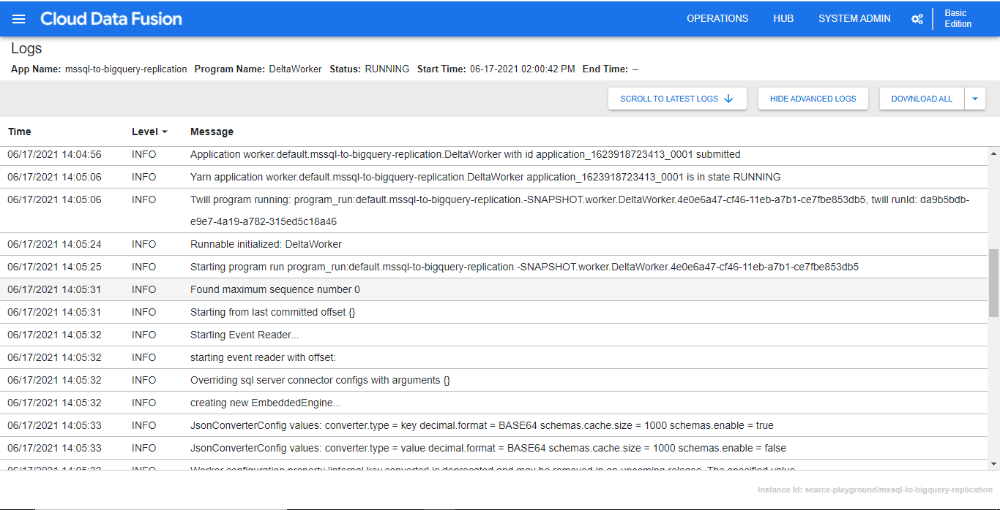

# Data Fusion

> Cloud Data Fusion is a fully managed service created by Google on the Google Cloud that supports data integration of multiple sources at any scale. It enables code-free deployment of ETL and ELT pipelines in a visual point and click environment, **while the execution happens automatically in a Cloud Dataproc environment**. No code is required to blend environments from multiple cloud sources and on-premises databases, either batch or streaming sources. Furthermore, the pipeline created can be easily validated, shared and reused across various teams in your organization.  
Data fusion is built on [CDAP](https://cdap.io/), an open-source framework for building data analytics applications that combine a user interface with a back-end stack of services in a Hadoop cluster.

[Introduction to Cloud Data Fusion](https://datadice.medium.com/introduction-to-cloud-data-fusion-1e2a3c2bf5ca)

### CDAP
Cask Data Application Platform (CDAP)
>CDAP는 개발자에게 데이터 및 애플리케이션 추상화를 제공하여 애플리케이션 개발을 단순화 및 가속화하고, 광범위한 실시간 및 일괄 사용 사례를 처리하고, 엔터프라이즈를 만족시키면서 프로덕션에 애플리케이션을 배포할 수 있는 Hadoop 에코시스템을 위한 통합 오픈 소스 애플리케이션 개발 플랫폼입니다.  
CDAP는 응용 프로그램을 만들고 핵심 CDAP 서비스에 액세스하기 위한 개발자 API(응용 프로그래밍 인터페이스)를 제공합니다. CDAP는 HBase, HDFS, YARN, MapReduce, Hive 및 Spark와 같은 기존 Hadoop 인프라에 애플리케이션 및 데이터를 배치하는 다양한 서비스 모음을 정의하고 구현합니다.  
간단한 MapReduce 작업과 완전한 ETL(추출, 변환 및 로드) 파이프라인에서 복잡한 엔터프라이즈 규모의 데이터 집약적 애플리케이션에 이르기까지 다양한 애플리케이션을 실행할 수 있습니다.

[https://github.com/cdapio/cdap](https://github.com/cdapio/cdap)

### Dataproc in Data Fusion Replication

no-of nodes, memory per node와 같은 설정에 따라 **Dataproc** Workers를 생성하게 된다.

**Dataproc** cluster를 생성하고 소스DB에 연결하여 binary log로부터의 CDC를 사용하게 된다.

- Data Fusion 하나의 인스턴스 내에서 한 개의 job을 기준으로 하나의 클러스터가 생성
- Worker node가 없는 단일 노드 클러스터에서는 실행이 되지 않는 것 같음
- 크기가 1 ~ 10GB인 테이블 11개인 경우 20분동안 active table이 하나였는데 크기가 1GB이하인 테이블 99개의 경우 20분 동안 3개의 active table이 발생( 사이즈가 작아서 그런지 전체 행 복제 완료한 것으로 보임 ) : throughput 은 1GB/hr였음

→  테이블의 갯수보다 **크기에 따라** task의 진척도에 차이가 있는 것 같다.( replicate하려는 테이블 갯수가 더 많은데도 같은 throughput에서 활성화되는데 더 빠름 )