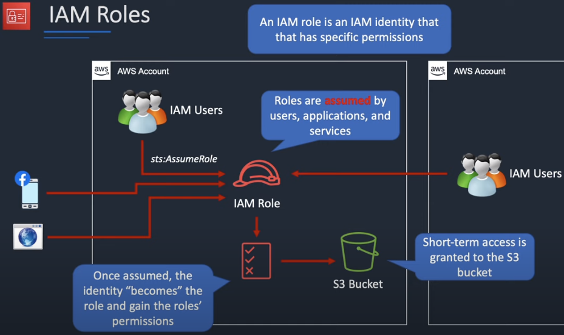
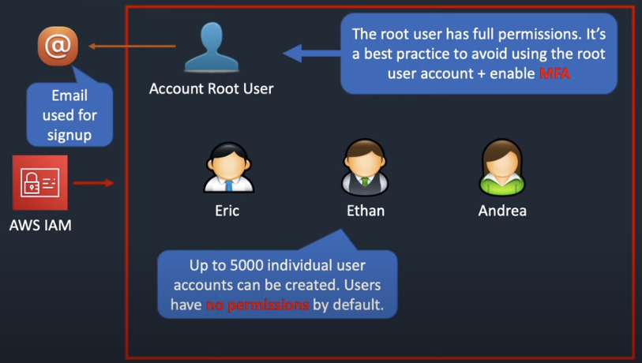

## IAM의 정책 및 권한

- policy는 자격 증명(user, user group 또는 role)이나 리소스와 연결될 때 해당 권한을 정의하는 AWS의 객체입니다. AWS는 IAM 보안 주체인 user나 role에서 요청을 보낼 때 policy를 평가하여 허용하거나 거부할지 결정합니다. 대부분 AWS에서 JSON 문서로 저장된다.

**Policy**

- **[Identity-based policies](https://docs.aws.amazon.com/IAM/latest/UserGuide/access_policies.html#policies_id-based) :** managed 및 inline 정책을 identity( user나 group 또는 role )에 연결한다.
- **[Resource-based policies](https://docs.aws.amazon.com/IAM/latest/UserGuide/access_policies.html#policies_resource-based)** : inline 정책을 특정 resource에 연결한다.
- **[Permissions boundaries](https://docs.aws.amazon.com/IAM/latest/UserGuide/access_policies.html#policies_bound) :** managed 정책을 IAM 엔터티(사용자 또는 역할)에 대한 권한 경계로 사용한다.
- **[Organizations SCP](https://docs.aws.amazon.com/ko_kr/IAM/latest/UserGuide/access_policies.html#policies_scp)** : AWS Organizations 서비스 제어 정책(SCP)을 사용하여 조직 또는 조직 단위(OU)의 계정 멤버에 대한 최대 권한을 정의한다.
- **[Access control lists (ACLs)](https://docs.aws.amazon.com/IAM/latest/UserGuide/access_policies.html#policies_acl) :** ACL을 사용하여 ACL이 연결된 리소스에 액세스할 수 있는 다른 계정의 보안 주체를 제어한다. 다만 JSON 정책 문서 구조를 사용하지 않은 유일한 정책 유형입니다
- **[Session policies](https://docs.aws.amazon.com/IAM/latest/UserGuide/access_policies.html#policies_session)**

**Role**

A role is an IAM identity that you can create in your account that has specific permissions. An IAM role has some similarities to an IAM user. Roles and users are both AWS identities with permissions policies that determine what the identity can and cannot do in AWS. However, instead of being uniquely associated with one person, a role can be assumed by anyone who needs it. A role does not have standard long-term credentials such as a password or access keys associated with it. Instead, when you assume a role, it provides you with temporary security credentials for your role session.

**ARN**

Amazon 리소스 이름(ARN)은 AWS 리소스를 고유하게 식별합니다.

```bash
arn:partition:service:region:account-id:resource-id
arn:partition:service:region:account-id:resource-type/resource-id
arn:partition:service:region:account-id:resource-type:resource-id
```

- partition : aws  region group ( aws )
- service : iam, ..


### [Overview of Users, Groups, Roles and Policies](https://www.youtube.com/watch?v=PjKvwxTTSUk)

- 태초에 account root user가 생성되는데 모든 권한을 가지고 있다.
- 이후에 생성되는 user는 기본적으로 권한이 없고 고유의 arn값으로 구분된다.



- 최대 10명의 user로 **Group**을 구성할 수 있다.
- **Policy**를 통해 permissions을 부여받는다. 형식은 json 형식으로 작성된다.
- **Role**은 특정 권한들로 구성된 identity인데, 위임받아 사용이 가능하다.
- 위임하게 되면 role에 해당된 permission을 획득하여 서로 다른 AWS account 간에 주고 받을 수 있는 특징이 있다.



### [AWS JSON 정책 요소: Principal](https://docs.aws.amazon.com/ko_kr/IAM/latest/UserGuide/reference_policies_elements_principal.html)

- `Version` : default는 `2008-10-17`이지만, `2012-10-17`을 명시한다.
- `Statement` :
    - `Effect` : `Allow` , `Deny`
    - `Action` : 허용 또는 거부할 AWS 서비스의 작업, 리소스, 조건 등으로 `dynamodb:DeleteItem` , `s3:GetObject` 와 같은 형식이다.
    - `Resource` : arn을 사용하여 지정하는데 `"arn:aws:s3:::DOC-EXAMPLE-BUCKET/*"` 와 같은 형식이다.
    - `Principal` : 허용 또는 거부할 보안 주체를 명시하는데 `{ "AWS": "arn:aws:iam::123456789012:root" }`,  `{ "AWS": "123456789012" }` 와 같이 권한을 위임할 계정을 추가한다.
    - `Sid` : statement 고유의 식별자