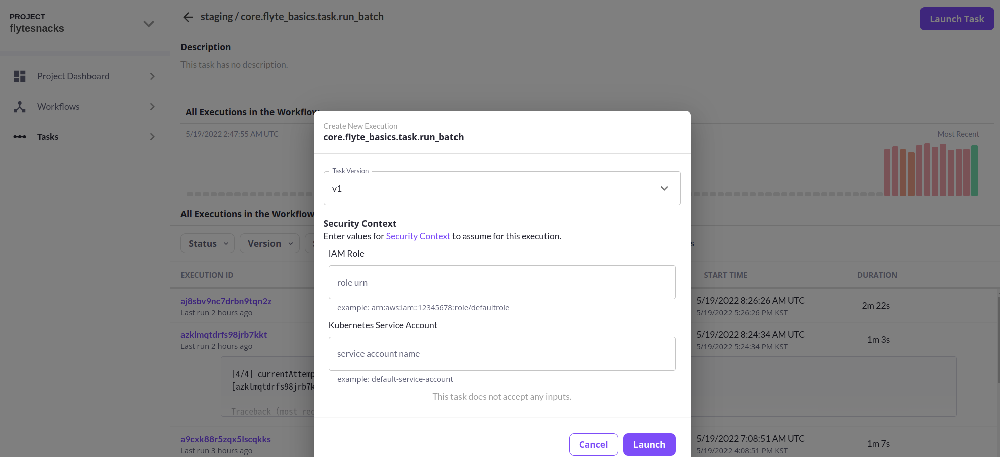

## Execute Single Task

### run sample

flyte의 전체 배포를 미니 버전으로 한번에 할 수 있도록 sandbox를 이용하였다.

```
$ flytectl sandbox start
```

1. task를 먼저 정의한다. 아래와 같은 형식으로 작성하였다. 계산 과정은 따로 분리하기 위해 패키지로 설치하여 import하여 사용하였다.

```
##### core/flyte_basics/task.py #####
from flytekit import task, ..

@task(
    retries=2
)
def run_batch() -> int:

    from my_package import *
    
    try:
      ...
      retun 1
    except:
      ....
      return 0

```

2. task 실행을 위한 도커 이미지는 [flytesnacks/cookbook/core at master · flyteorg/flytesnacks](https://github.com/flyteorg/flytesnacks/tree/master/cookbook/core)  를 참고하였다.

```
##### core/Dockerfile ####
FROM python:3.8-slim-buster
LABEL org.opencontainers.image.source https://github.com/flyteorg/flytesnacks

ENV VENV /opt/venv
ENV LANG C.UTF-8
ENV LC_ALL C.UTF-8
ENV PYTHONPATH /root
### This is necessary for opencv to work
RUN apt-get update && apt-get install -y libsm6 libxext6 libxrender-dev ffmpeg build-essential curl

WORKDIR /opt
RUN curl https://sdk.cloud.google.com > install.sh
RUN bash /opt/install.sh --install-dir=/opt
ENV PATH $PATH:/opt/google-cloud-sdk/bin

WORKDIR /root
### Install the AWS cli separately to prevent issues with boto being written over
RUN pip3 install awscli

### Copy the makefile targets to expose on the container. This makes it easier to register
COPY in_container.mk Makefile
### Copy the actual code
RUN mkdir core
COPY . core/

RUN mv core/sandbox.config /root
### Virtual environment
RUN python3 -m venv ${VENV}
ENV PATH="${VENV}/bin:$PATH"
### Install Python dependencies
RUN pip install -r core/requirements.txt
RUN pip freeze
...(추가적으로 필요한 변수 설정이나 과정 진행)

### This tag is supplied by the build script and will be used to determine the version
### when registering tasks, workflows, and launch plans
ARG tag
ENV FLYTE_INTERNAL_IMAGE $tag

```

- Flyte에서 내부적으로 aws-cli와 gcp-cli에 의존성을 갖고 있어 설치가 필요하다.
- `requirements.txt` 에는 `flytekit>=0.32.3` 이 포함되어 있어야 하고 그 필요한 패키지를 추가한다.
- 빠른 등록을 위해 Makefile을 추가하였다.( *공식 깃헙 예제에서 제시하는데 확인이 좀 더 필요한다*. )
- `FLYTE_INTERNAL_IMAGE`가 환경변수 도커 이미지 tag로 설정된다.

추가적으로, task에서 `@task(  container_image = xxx )`처럼 `container_image`가 설정되어 있으면 `FLYTE_INTERNAL_IMAGE`가 override되어 적용된다.

3. sandbox를 이용하는 경우 `flyte-sandbox` 컨테이너 내부에 전체 코드를 복사하여 도커 이미지를 빌드하면 Docker Registry를 거치지 않아도 이미지를 사용할 수 있다.

```
$ docker cp core flyte-sandbox:/
$ docker exec -it flyte-sandbox /bin/bash
$ cd core
$ docker build . --tag "flytebasics:v1" -f Dockerfile

```

4. User side에서 task를 호출하기 위해 패키지로 빌드하여 flyte 클러스터에 등록한다. 등록을 위해 task를 패키지로  serialize하고 등록할 `project` , `domain` , `version` 을 명시한다.

```
$ pyflyte --pkgs core.flyte_basics package --image flytebasics:v1 -f
$ flytectl register files --project flytesnacks --domain staging --archive flyte-package.tgz --version v1

```

같은 project - domain에 같은 버전, 이름의 task가 존재하면 오류가 발생한다. 중복되서 올라갈 수 없다.

5.  flyte console을 들어가서 확인하면 task가 등록되었음을 알 수 있다. `Launch Task`를 눌러 실행해본다.  
  
실행이 시작되면 쿠버네티스 콘솔에서 로그를 확인할 수 있다.


{project}_{domain} 형식의 namespace에서 Pod가 생성되어 실행되었음을 알 수 있다.( `aj8sbv9nc7drbn9tqn2z-fuunhdti-0` ) pod state를 떠나서 **작업이 완료되도 자동으로 삭제되지 않는다.**

```
$ kubectl get pods -n flytesnacks-staging
NAME                              READY   STATUS      RESTARTS   AGE
...
a9tfz8mvvvwc6n879rdw-fuunhdti-3   0/1     Error       0          6h47m
a4kjvqr94fc4v655q6zd-fuunhdti-3   0/1     OOMKilled   0          4h57m
aj8sbv9nc7drbn9tqn2z-fuunhdti-0   0/1     Completed   0          98m
```

### **Resource limit/requests**

default로 pod 자체의 resource는 아래와 같이 설정되어 있다.

```
Limits:
      cpu:     100m
      memory:  200Mi
    Requests:
      cpu:     100m
      memory:  200Mi

```

따라서 resource 사용량이 초과하는 경우 Pod는 OOMKilled로 도중에 죽어버린다. ****`@task` **에서 resource 설정을 아래와 같이 따로 추가해야 한다.**

```
@task(
    requests=Resources(mem='2Gi'),
    limits=Resources(mem='4Gi'),
    ..
)
def task(..):

```

이 후 패키지를 빌드하고 등록하려면 전체 설정 제한(1Gi)에 걸린다는 아래와 같은 오류가 발생한다.

```
flytectl register files --project flytesnacks --domain staging --archive flyte-package.tgz --version v10
 ----------------------------------------------------------------- -------- -------------------------------------------------------- 
| NAME                                                            | STATUS | ADDITIONAL INFO                                        |
 ----------------------------------------------------------------- -------- -------------------------------------------------------- 
| /tmp/register1285179946/0_core.flyte_basics.task.run_batch_1.pb | Failed | Error registering file due to rpc error: code =        |
|                                                                 |        | InvalidArgument desc = Requested MEMORY limit [4Gi] is |
|                                                                 |        | greater than current limit set in the platform         |
|                                                                 |        | configuration [1Gi]. Please contact Flyte Admins to    |
|                                                                 |        | change these limits or consult the configuration       |
 ----------------------------------------------------------------- -------- -------------------------------------------------------- 
1 rows
Error: rpc error: code = InvalidArgument desc = Requested MEMORY limit [4Gi] is greater than current limit set in the platform configuration [1Gi]. Please contact Flyte Admins to change these limits or consult the configuration

```

따라서 [Configuring Your Flyte Deployment - Flyte](https://docs.flyte.org/en/latest/deployment/cluster_config/general.html)  에 따라 추가적으로 해당 project-domain에서 사용할 **리소스 제한을 늘려줘야 한다.**

```
##### tra.yaml #####
defaults:
    cpu: "1"
    memory: 1GiB
limits:
    cpu: "2"
    memory: 10GiB
project: flytesnacks
domain: staging

$ flytectl update task-resource-attribute --attrFile tra.yaml
```

Task를 실행하게 되면 도커 이미지에 있는 코드를 불러 실행된다. 로컬에서 패키지를 빌드하여 task를 호출하지만 **실제 실행하게 되면 로컬 코드와 무관하게 도커 이미지 내에서 작동한다.** 실제로 로컬에서 호출한 task 코드와 flyte admin에서 실행한 task 코드가 살짝 다른데 오류 없이 컨테이너상의 코드대로 동작하였다. 로컬에서 패키지를 빌드하여 등록하는 과정에 대한 검토가 좀 더 필요하다.

```
##### local task code #####
@task(
    retries=2
)
def run_batch() -> int:

##### in sandbox #####
@task(
    requests=Resources(mem='2Gi'),
    limits=Resources(mem='4Gi'),
    retries=2
)
def run_batch() -> int:

```