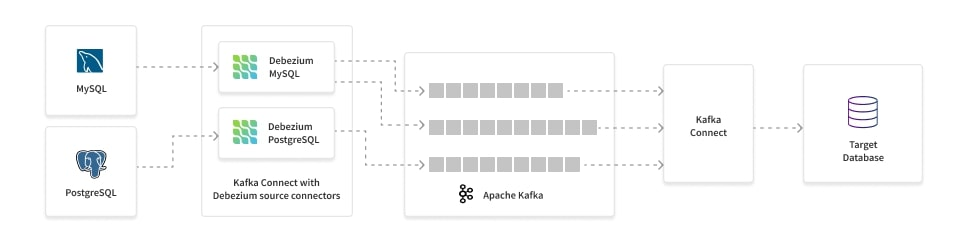

# Replication by CDC

## CDC pipeline

CDC 파이프라인을 통해 데이터의 point-in-time이 가능하도록 한다. 크게는

1. TRIGGER 기반 : 테이블에 트리거를 걸어 쿼리 이력을 관리한다.
2. UPDATE TIMESTAMP 사용 : 업데이트 시간에 대한 칼럼을 추가하여 쿼리 실행 시간을 기반으로 관리한다.
3. LOG 기반 : PostgreSQL의 경우 WAL을 활용하여 관리한다.

와 같이 사용하는데 LOG 기반의 CDC가 가장 많이 활용된다.



[How to Implement CDC for MySQL and Postgres](https://rockset.com/blog/cdc-mysql-postgres/)

[CDC & CDC Sink Platform 개발 1편 - CDC Platform 개발](https://hyperconnect.github.io/2021/01/11/cdc-platform.html)

### PostgreSQL CDC 

[Change Data Capture (Postgres) | Materialize Documentation](https://materialize.com/docs/guides/cdc-postgres/)

[PostgreSQL Change Data Capture (CDC): The Complete Guide](https://datacater.io/blog/2021-09-02/postgresql-cdc-complete-guide.html#cdc-logical-replication)

(MySQL버전도 있음)

## AWS RDS to GCP Cloud SQL Read-replica

RDB migration은 primary key가 있는 테이블을 대상으로 한다. 


GCP Database Migration 서비스를 통해 AWS RDS( PostgreSQL )에서 GCP Cloud SQL로 replicate하고자 한다.

[Upgrade your Amazon RDS for PostgreSQL or Amazon Aurora PostgreSQL database, Part 2: Using the pglogical extension | Amazon Web Services](https://aws.amazon.com/ko/blogs/database/part-2-upgrade-your-amazon-rds-for-postgresql-database-using-the-pglogical-extension/), 
[Configure Source Database in Database Migration](https://cloud.google.com/database-migration/docs/postgres/configure-source-database)를 통해 먼저 logical replication이 가능하도록 source DB의 설정을 수정해야 한다.

### configuration 수정
먼저 Parameter Group에서 `rds.logical_replication = 1`로 설정한다. default.postgres13 그룹에서 설정하려니 요청이 실패한다는 오류가 발생한다. 
공식문서를 확인하니 아래와 같다.

>RDS 설정 수정  
사용자 지정 DB 파라미터 그룹의 파라미터 값을 수정할 수 있습니다. **하지만 기본 DB 파라미터 그룹의 파라미터 값은 변경할 수 없습니다.** DB 파라미터 그룹의 값을 수정하는 동안 문제가 발생하면 다음과 같은 일반적인 문제를 검토합니다.  
1)[SET](https://dev.mysql.com/doc/refman/5.7/en/set-statement.html)와 같은 명령을 사용하는 경우 이러한 명령은 RDS DB 인스턴스 구성을 업데이트하는 데 사용할 수 없으므로 오류가 발생할 수 있습니다.  
2)DB 인스턴스 구성을 업데이트할 수 없는 경우 기본 RDS DB 파라미터 그룹의 값을 변경할 수는 없기 때문일 수 있습니다.  
3)파라미터 값을 변경했지만 변경 사항이 적용되지 않은 경우 일부 수정 사항이 즉시 적용되기 않았기 때문일 수 있습니다.  -
4)어떤 상황에서도 DB 파라미터를 수정할 수 없는 경우 **수정 가능** 파라미터의 속성 값이 **false**이기 때문일 수 있습니다.

[Amazon RDS DB 파라미터 그룹의 값 수정](https://aws.amazon.com/ko/premiumsupport/knowledge-center/rds-modify-parameter-group-values/)

파라미터 그룹을 새로 생성하여 수정하였더니 변경되었다.

```bash
postgres=> select * from pg_extension;
  oid  |  extname  | extowner | extnamespace | extrelocatable | extversion | extcon
fig | extcondition 
-------+-----------+----------+--------------+----------------+------------+-------
----+--------------
 14287 | plpgsql   |       10 |           11 | f              | 1.0        |       
    | 
 58004 | pglogical |       10 |        58003 | f              | 2.4.0      |       
    | 
(2 rows)

postgres=> show wal_level;
 wal_level 
-----------
 logical
(1 row)
```

파리미터를 수정하면 DB 인스턴스를 재부팅하여 반영이 된다.

### pglogical 설치
`pglogical`을 설치하기 위해서 위와 같은 파라미터 설정에서 `shared_load_libraries`에 `pglogical`을 추가해야 한다.
>Run the CREATE EXTENSION IF NOT EXISTS pglogical command on every database on your source instance. This installs the pglogical extension into the database. 

설치는 하나의 스키마가 아니라 DB 인스턴스 대상의 전체 스키마에 적용 해주어야 한다. 처음에 `postgres` 에만 적용하여 Data Migration에서 pglogical이 설치되지 않았다는 메시지가 나온다.

