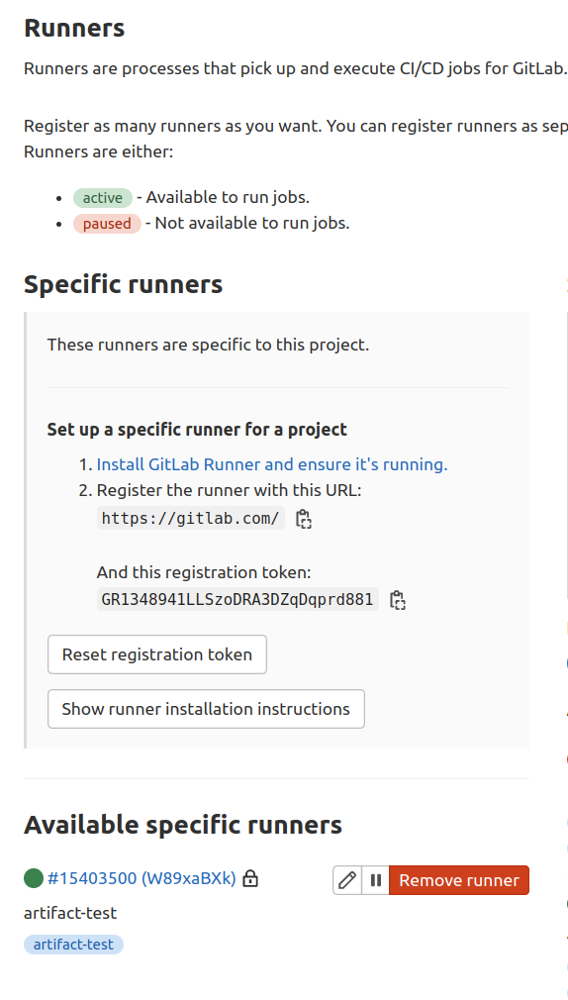

# Private Pypi with AWS CodeArtifact and CI/CD

## AWS Codeartifact

### Concepts

소프트웨어 패키지를 안전하게 저장 및 공유할 수 있도록 하는 managed artifact repository 서비스이다.  
pip, npm, gradle 과 같은 빌드 및 패키지 관리자와 사용이 가능하다.

- AWS KMS( AWS Key Management Service ) 도메인의 모든 코드를 하나로 보호할 수 있다.
- 모든 CodeArtifact 저장소는 단일 도메인의 멤버이다.
- 하나 이상의 레포가 있는 팀에는 **하나의 프로덕션 도메인**을 사용하는 것이 권장된다.
- 패키지 관리자를 통해 패키지를 저장소에 게시할 수 있다.
- PyPi 같은 public 저장소에 대한 외부 연결을 통해 오픈 소스 패키지도 가져올 수 있다.
- **upstream**을 통해 한 레포지토리에서 동일한 도메인의 다른 레포지토리에서 패키지를 사용할 수 있도록 설정이 가능하다. Upstream 레포지토리에서 사용하는 모든 패키지 버전을 downstream 저장소에 사용할 수 있다.

**Domain**

레포지토리의 상위 수준 엔티티이다.
- 각 레포지토리는 단일 도메인의 멤버이며 다른 도메인으로 이동이 불가하다.
- 패키지를 검색하고 공유할 수 있도록 모든 코드가 포함된 단일 프로덕션 도메인을 사용하는 것이 좋다.

**Repository**

코드 저장소 집합이다.
- 패키지 버전은 하나의 집합에 각각 매핑된다.
- pip, npm CLI를 사용하여 패키지를 가져오고 게시하기 위한 엔드포인트를 노출한다.


### bug report
pulumi로 CodeArtifact domain, repository를 생성하는데 아래와 같이 Role ARN이 필요하다는 오류가 발생한다.
```
error: 1 error occurred:
        * error configuring Terraform AWS Provider: credential type source_profile requires role_arn, profile mfa
```
`AWSCodeArtifactAdminAccess`권한이 부여된 role을 따로 위임하여 해결하였다.


## Gitlab CI/CD

### CI/CD Pipeline
CI/CD는 Jobs와 Stages로 구성된다.  
Jobs는 runner에 의해 실행되는데 같은 Stages 내에서 여러 Jobs가 병렬로 실행된다.  
하나의 stage가 성공적으로 종료되면 파이프라인은 다음 stage로 넘어가고, 실패하면 실행되지 않고 파이프라인이 종료된다.
파이프라인은 `.gitlab-ci.yml`에 정의된다.


## Gitlab CiCd로 AWS CodeArtifact에 배포하기

[Publis Python Packages to Codeartifact using Poetry](https://stackoverflow.com/questions/65331736/how-can-i-publish-python-packages-to-codeartifact-using-poetry)

### Gitlab Runner

#### docker로 실행하기
1. gitlab-runner 컨테이너에 탑재된 volume에 대해 로컬 시스템을 사용한다. 
```bash
docker run -d --name gitlab-runner --restart always \
  -v /srv/gitlab-runner/config:/etc/gitlab-runner \
  -v /var/run/docker.sock:/var/run/docker.sock \
  gitlab/gitlab-runner:latest
```

아래와 같이 register한다.
```
docker run --rm -it -v /srv/gitlab-runner/config:/etc/gitlab-runner gitlab/gitlab-runner register
```

2. volume을 따로 생성해준다.
```console
$ docker volume create gitlab-runner-config
$ docker run -d --name gitlab-runner --restart always \
    -v /var/run/docker.sock:/var/run/docker.sock \
    -v gitlab-runner-config:/etc/gitlab-runner \
    gitlab/gitlab-runner:latest
```

register는 아래와 같이 실행한다. 
```
docker run --rm -it -v gitlab-runner-config:/etc/gitlab-runner gitlab/gitlab-runner:latest register
```

#### update configuration
변경된 config를 업데이트하려면 재시작한다.

```console
docker restart gitlab-runner
```

#### register runner
gitlab repository - [Settings] - [CI/CD] - [Runners]Expand에서 제공하는 registration token을 이용해 runner를 등록한다.
이후 필요한 설정을 입력한다. runner executor를 `docker`로 설정하면 프로젝트를 실행할 기본 도커 이미지를 설정할 수 있다.

`docker-image`는 gitlab CI/CD pipeline이 작동할시 job이 실행되는 런타임 환경을 구성하기 위한 이미지이다. 

gitlab runner 컨테이너가 실행 중인 경우 아래와 같이 register한다.
```console
docker container exec -it gitlab-runner gitlab-runner register -n \
--url http://{{ip}} \
--registration-token {{token}} \
--description gitlab-runner \
--executor docker \
--docker-image {{default-image}} \
--docker-volumes /var/run/docker.sock:/var/run/docker.sock
```
아래와 같이 available runner가 생긴다.  


#### edit `.gitlab-ci.yml`

`.gitlab-ci.yml`에서 각 job에 대해 적용할 gitlab runner tag를 명시해준다. gitlab runner tag는 위에서 runner에 대해 설정해준 tag이다.

```
stages:
  - build
  - test
  - deploy

build-job:
  stage: build
  script:
    - poetry build
  tags:
    - artifact-test
```

