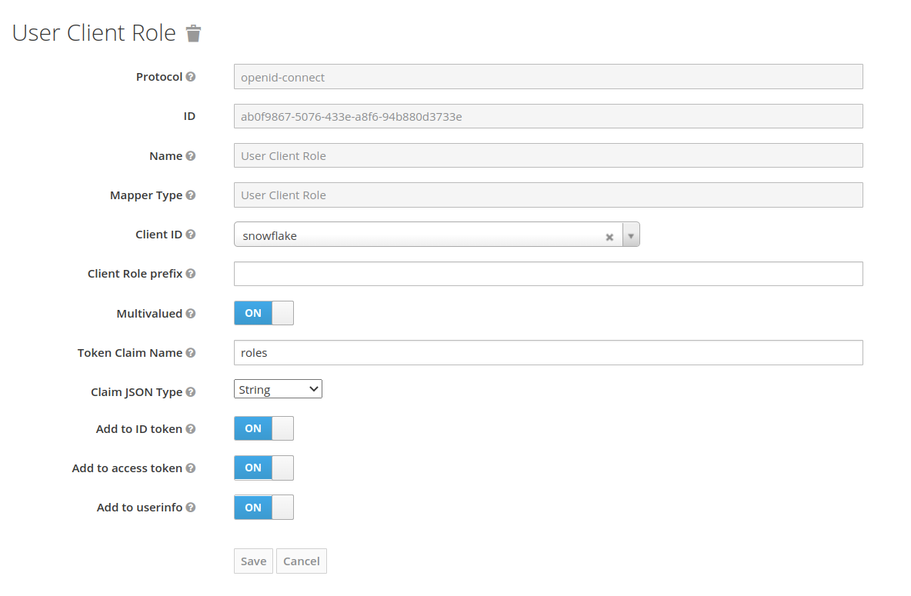

# Keycloak - Snowflake 연동

## Setup
[AWS COGNITO AS CUSTOM OAUTH PROVIDER WITH SNOWFLAKE](https://community.snowflake.com/s/article/How-to-use-AWS-Cognito-and-Lambda-to-generate-a-Authorization-token-and-use-Scopes-for-Oauth-with-Snowflake)를 참고하였다.

#### 1. 먼저 snowflake에서 사용하기 위해 client를 생성한다.


- Client Protocol : openid-connect
- Access Type : confidential  
    client password로 접근하기 위해 confidential로 설정한다.
- Valid Redirect URL : *  
    로그인 시 Redirect할 URL을 설정한다.
- Direct Access Grants Enabled
- Standard Flow Enabled

#### 2. snowflake 연결을 위해 사용할 role을 명시하기 위해 role을 생성한다.


- `readonly` 라는 이름의 role을 사용할 것이기에 `session:role:readonly`를 추가한다.

#### 3. ID Token에서 Client Role에 대한 사항을 claim으로 추가하기 위한 mapper를 생성한다.

#### 3-1) `roles`


- Mapper Type : User Client Role
- Client ID : snowflake
- Add to ID token : ON
- Token Claim Name : roles

#### 3-2) `upn`
Builtin에서 claim을 추가할 수 있다.


#### 4. Snowflake에서 keycloak연동을 위한 security integration을 생성한다.

```sql
CREATE OR REPLACE security integration external_oauth_custom
type = external_oauth
enabled = true
external_oauth_type = custom
external_oauth_issuer = 'https://{keycloak_domain_name}/auth/realms/{real_name}'
external_oauth_rsa_public_key = '...'
external_oauth_audience_list = ('...')
external_oauth_scope_mapping_attribute = 'roles'
external_oauth_token_user_mapping_claim = 'upn'
external_oauth_snowflake_user_mapping_attribute = 'login_name'
external_oauth_any_role_mode = 'ENABLE';
```
- `external_oauth_rsa_public_key` : Keycloak Realm Setting - Keys 에서 RSA256 Public Key를 복사하여 붙인다.
- `external_oauth_scope_mapping_attribute` : role mapping을 위해 ID Token를 디코딩할 시 사용할 role에 대한  claim 이름을 입력한다.
- `external_oauth_token_user_mapping_claim` : token user mapping에서 사용할 claim 이름을 사용한다.
- `external_oauth_snowflake_user_mapping_attribute` : snowflake 에서의 user mapping은 login_name으로 이루어진다.  

#### 5. readonly role을 생성한다. 
```sql
create or replace role readonly;
grant {previlege} on warehouse {warehouse_name} to role readonly;
grant {previlege} on database {database_name} to role readonly;   
```


## [How we got Single Sign-On to work with Snowflake, SAML2 and Keycloak! The signed certificate version](https://frost-stefan.medium.com/how-we-got-single-sign-on-to-work-with-snowflake-saml2-and-keycloak-53f047824296)

> references

[Snowflake Configure External OAuth](https://docs.snowflake.com/en/user-guide/oauth-ext-custom.html#configuration-procedure)

[Using ANY role with external OAuth](https://docs.snowflake.com/en/user-guide/oauth-pingfed.html?&_ga=2.171557027.2083766784.1655097623-600134530.1651033897#using-any-role-with-external-oauth)


### stackoverflow
[Keycloak : Invalid parameter redirect URI](https://stackoverflow.com/questions/45352880/keycloak-invalid-parameter-redirect-uri)

[Keycloak : Obtain id_token](https://stackoverflow.com/questions/49322417/obtain-id-token-with-keycloak)

[Keycloak : Include the roles of requested scopes in generated tokens](https://stackoverflow.com/questions/65782574/keycloak-include-the-roles-of-requested-scopes-in-generated-tokens)

### authorizatoin
[Keycloak get Authorizatoin Code in JSON](https://stackoverflow.com/questions/52311757/keycloak-get-authorization-code-in-json)

[Keycloak: Authorization Code Grant Example](https://www.appsdeveloperblog.com/keycloak-authorization-code-grant-example/)

[Call Your API Using the Authorization Code Flow](https://auth0.com/docs/get-started/authentication-and-authorization-flow/call-your-api-using-the-authorization-code-flow#customize-tokens)

[Create an Authorization Server with OAuth](https://help.sigmacomputing.com/hc/en-us/articles/360053705993-OAuth-with-Snowflake)