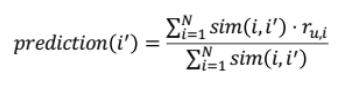

2주차 강의의 key word 는 아래와 같다. 
- Content-based , TF-IDF
- Collaborative Filtering
- 유사도

## Content-based , TF-IDF

### Content-based
Content-based 추천은 유저 과거에 선호한 아이템과 비슷한 아이템을 추천하는 컨셉이다. 영화 추천을 예로 들면, 배우나 감독이 같은 영화나 비슷한 장르의 영화를 추천한다. 

아이템 기반으로 추천을 하기 위해 아이템의 feature를 기반으로 item profile을 만든다. 영화의 경우는 작가, 제목, 배우, 장르, 감독 정보로 feature를 구성할 수 있다. item profile은 벡터로 표현하여 0,1 binary나 실수값으로 구성된다.

텍스트가 대상이면 item profile은 주요 단어들의 집합으로 표현될 수 있다. 주요 단어는 단어에 대한 중요도를 나타내는 score를 기준으로 정할 수 있는데 Text Mining에서는 TF-IDF를 많이 사용한다. 

### TF-IDF
단어 `w`가 문서 `d`에 자주 등장하고, 전체 문서 `D`에서는 적게 등장하면 `w`는 `d`를 설명하는 주요 feature라고 하고 TF-IDF값이 높게 나타난다.


- TF : 단어 `i`가 문서 `j`에 등장하는 횟수
- IDF : 전체 문서에서 단어  `i`가 등장하는 비율. IDF값의 크기에 smoothing을 위해 log를 취함.


Item Profile은 TF-IDF로 벡터화해서 표현된다.
User Profile은 유저가 선호한 item vector의 평균을 사용하거나 선호도로 Normalize한 평균을 사용한다. item vector를 기반으로 구성하기에 item vector와 동일한 차원을 갖는다.

유저의 아이템에 대한 평점 예측은 **코사인 유사도**를 기반으로 계산된다. 코사인 유사도는 두 벡터의 각도를 이용하는 유사도로 user vector와 item vector간 유사도가 클수록 관련성이 높다고 할 수 있다. 
평점 예측은 유저가 선호도를 표시한 모든 item vector와 선호도를 활용한다.  
예측하려는 아이템 i에 대해 유저가 선호한 아이템 집합 I에 속하는 각 아이템간의 유사도를 계산하여 평점의 가중 평균으로 사용한다.  


[ 예시 ]
유저 A가 선호한 영화가 3개(m1, m2, m3) 있고, 
```
rating_m1 = 3.0, m1_vector = [0.2, 0.4, 1.2, 1.5]
rating_m2 = 2.5, m2_vector = [0.4, 0.7, 0.3, 0.5]
rating_m3 = 4.0, m3_vector = [0.3, 1.2, 1.0, 1.0] 
```
예측하려는 영화 m4( m4_vector = [-.4, 1.4, 3.1, 1.0] )에 대해 유사도를 계산하여
```
sim(m4, m1) = cos(m4_vector, m1_vector) = 0.83
sim(m4, m2) = cos(m4_vector, m2_vector) = 0.72
sim(m4, m3) = cos(m4_vector, m3_vector) = 0.88
```
평점을 구할 수 있다.
```
prediction(m4) = (0.83 * 3.0 + 0.72 * 2.5 + 0.88 * 4.0) / (0.83 + 0.72 + 0.88) = 3.2
```


content-based 추천은 유저에게 추천할 때 다른 유저의 데이터가 필요하지 않고 새로운 아이템을 추천하며 유사도를 통해 설명이 가능한 장점이 있다. 하지만 아이템의 적합한 피쳐를 찾는데 어려움이 있고 한 분야의 추천 결과만 중복해서 발생할 수 있다.

## 2-2. Collaborative Filtering
Collaborative Filtering은 많은 유저의 선호도 정보로 관심사를 예측하는 방법이다. 예를 들어 쿠팡에서 제시하는 다른 고객이 함께 구매한 상품이 있다. 

Collaborative Filtering은 크게 다음과 같이 분류된다.
#### **Neighborhood-based CF**
메모리 기반 CF. 유저/아이템 간의 유사도에 크게 의존하는 기법이다. 데이터의 sparsity에 취약하다.
- User-based : 유저간 유사도를 통해 연관도 높은 유저의 선호 아이템 추천
- Item-based : 아이템간 유사도를 통해 연관성 높은 아이템 추천

#### **Model-based CF**
모델 기반의 CF. Parametric ML를 사용하여 모델의 파라미터는 데이터 정보로 구성되고 파라미터를 업데이트하여 최적화한다.
- Singular Value Decomposition
- Matrix Factorization( SGD, ALS, BPR )
- Probabilistic Model
- DL

#### **Hybird CF**
- Content-based Recommendation과 결합.

Neighborhood-based CF 에서 유저/아이템 벡터는 데이터가 고정되어 사용되지만 Model-based CF는 유저/아이템 벡터가 업데이트되는 벡터로 데이터가 모델 학습에만 사용된다. 

Collaborative Filtering은 유저 A의 아이템 I에 대한 평점을 예측하는 것으로 아래와 같은 과정에 따른다. 
1. user - item matrix 생성
2. 유사도 기준을 정해 유저 or 아이템 간 유사도를 계산
3. matrix의 비어 있는 평점을 예측 
하지만 matrix의 대부분이 Nan인 경우가 많아 sparsity의 문제점이 있다. 적어도 sparsity가 99.5%를 넘지 않도록 하는 것이 좋다. 

### User-based Collaborative Filtering
<u>유저</u>간의 유사도를 구해 비슷한 유저가 선호한 아이템을 추천하는 방식이다. 
[예시]  


Alex의 Thor에 대한 user-based CF 평점 예측은 아래와 같이 할 수 있다.
1. Average : 다른 유저(Bob, Tom)의 Thor 평점의 평균을 사용한다.
```
Rating(Alex, Thor) = (4+4)/2 = 4
```
2. Weighted Average : 유사도를 가중치로 평점의 가중평균값을 사용한다.
```
Rating(Alex, Thor) = (4*sim(Alex, Bob) + 4*sim(Alex, Tom)) / (sim(Alex, Bob) + sim(Alex, Tom))
```

위와 같은 Absolute Rating의 문제는 유저마다 후하게 또는 박하게 평점을 내릴 수 있어 절대적이지 않다는 점이 있다. 이를 해결하기 위해 유저가 내린 절대 평점을 사용하지 않고 유저의 평균 평점에서 deviation을 구해 평점 데이터를 deviation 데이터로 바꿔서 사용한다.
평점을 예측하는 것이 아닌 deviation으로 예측하여 유저의 평균 평점에서 더해 평점을 구한다. 


#### K Nearest Neighbors Collaborative Filtering
유사한 유저를 모두 사용하지 않고 가장 유사한 K명의 유저를 이용해 평점을 예측하는 방식이다.


### Item-based Collaborative Filtering
<u>아이템</u>간의 유사도를 구해 연관성이 높은 아이템을 추천하는 방식이다. 
Alex의 Thor에 대한 item-based CF 평점 예측은 유사도가 높을 것으로 추정되는 Spider-man, Iron Man 정보를 이용해
```
Rating(Alex, Thor) = (sim(Thor, Spider-man)*5 + sim(Thor, Iron Man)*4)/(sim(Thor, Spider-man) + sim(Thor, Iron Man))
```
으로 구할 수 있다.

Item-based도 User-based와 동일하게 평균과 가중치 평균 평점 예측 방식을 적용한다.

Item-based와 User-based CF를 비교하면,

[ User-based ]
- 구현이 보다 다양한 추천 결과를 제공할 수 있다는 점이 있다.
- Sparsity, Cold Start에 더 취약하다.
- Pearson 유사도가 성능이 더 좋다.

[ Item-based ]
- 보통 User-based보다 성능이 더 좋으며, 아이템 간 유사도가 더 robust하다. 유저가 선호했던 아이템과 연관성이 높은 아이템을 추천하기에 설명하기 더 쉽다.
- Cosine 유사도가 성능이 더 좋다.

## 2-3. 유사도
- Cosine 유사도 : 두 벡터가 각도로 방향이 얼마나 유사한가  


- Mean Squared Difference 유사도 : 유저-아이템의 점수 차이를 활용  


- Jaccard 유사도 : 두 집합이 얼마나 유사한 아이템을 공유하고 있는가  


- Pearson 유사도 : (X, Y의 함께 변하는 정도) / (X, Y가 따로 변하는 정도)  


※ 강의노트는 러닝 스푼즈의 추천시스템 구현하기 수업을 듣고 정리한 내용이다. 