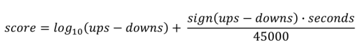

이번 시간의 key word는 다음과 같다.
- 인기도 기반 추천
- 연관분석
- 평가 지표

추천 시스템은 크게 유저 정보, 아이템 정보, 유저-아이템 상호작용 정보를 기반으로 이루어진다. 
- 유저 정보
- 아이템 정보
- 유저 - 아이템 상호작용 정보
    - Explicit Feedback : 만족도에 대한 정보로 ex. 평점이 있다. 
    - Implicit Feedback : binary 정보로 ex. 구매이력이 있다. 

보통 추천 문제는 유저에게 추천하려는 아이템에 **랭킹**을 매겨 Top K개를 추천하는 문제이거나 유저의 선호도를 **예측**하는 문제로 적용된다. 

추천 시스템의 주된 문제점의 keyword는 Cold Start, Scalability, Dense Sparsity가 있다. Cold Start는 새로운 유저나 아이템에 대한 학습 데이터가 부족하다는 의미다. Scalability는 유저와 아이템이 많아지는 경우 데이터 양이 기하급수적으로 증가하여 연산 과정에 부담이 생길 수 있음을 의미한다. Sparsity는 유저 - 아이템 상호작용 정보가 부족하다는 뜻인데 주로 데이터에서 Nan값이 많음을 나타낸다. 

## 1-1. 인기도 기반 추천
인기도의 척도는 조회수, 평점, 리뷰 갯수, 좋아요/싫어요 갯수가 있다. 보통 조회수가 가장 많은 아이템( Most Popular ) 또는 평균 평점이 가장 높은 아이템( Highly Rated )을 추천하게 된다. 

### Most Popular
스코어를 측정할 때 시간과 조회수를 고려한다.

![]9https://reddit-marketing.pro/wp-content/uploads/2020/06/reddit-the-principle-of-ranking-algorithms-using-the-example-of-Reddit-and-HackerNews-002.jpg

#### Hacker News Formula

시간이 지날수록 t가 커지므로 score는 작아진다. 이를 조정하기 위해 gravity(G)라는 상수를 사용한다. 

#### Reddit Formula

popularity와 포스팅이 게시된 절대시간으로 구성된다. 최신 포스팅일수록 score가 높아지고 오래된 포스팅은 vote가 많아야 높은 score를 가질 수 있다. 

### Highly Rated
스코어를 측정할 때 신뢰할 수 있는 평점인지와 평가 갯수를 고려한다. 

평점은 평균값을 사용하되 리뷰 갯수에 따라 보정해준다. 0.5 또는 평균 평점(5점 만점인 경우 평균이나 3.0)을 이용하여 리뷰 갯수가 너무 적은 경우 보정할 수 있다. 리뷰 갯수가 많으면 평점은 평균값과 유사해진다,

## 1-2. 연관분석( Association Rule )
데이터에서 구매나 조회이력 중 연속된 거래간의 규칙을 발견하기 위해 적용된다.

규칙 분석은 주어진 거래 데이터에서 하나의 상품과 함께 등장하는 다른 상품간의 관계를 통해 이루어진다.
예를 들어 기저귀를 구매한 이력에서 연관된 상품이 맥주가 자주 등장하면 {기저귀} → {맥주}로 연관 규칙을 찾을 수 있다.

연관 규칙 분석의 기초를 이루는 몇 가지 용어가 있다.
- itemset : 1개 이상의 item 집합. k-itemset은 k개의 item으로 이루어지는 set을 의미한다.
- support count : 전체 거래 내역에서 itemset이 등장하는 횟수. 
- support : itemset이 전체 거래 내역에서 등장하는 비율.

예를 들어 itemset = {빵, 우유, 기저귀}라 하고 해당 itemset이 전체 거래(5)에서 3번 등장하면 support count = 3, support = 3/5라고 할 수 있다. 특히, **frequent itemset**은 미리 설정한 최소 support값 이상인 itemset을 의미한다.

연관 규칙의 척도에는 **support**, **confidence**, **lift**가 있다. 
- support : frequent itemset을 찾거나 불필요한 연산을 줄일 때 주로 사용한다.
- confidence : X가 존재할 때 Y의 확률로 유용한 조건부 확률 규칙이다.
- lift : confidence / (Y의 확률)을 의미한다. lift=1이면 X,Y는 독립을 나타내고 1보다 크면 양의 상관관계, 작으면 음의 상관관계를 나타낸다.

itemset이 많을수록 연관 규칙은 기하급수적으로 많아지기에 유의미한 경우만 찾아 적용해야 한다.
연관 규칙을 제대로 사용하기 위해서는
1) support, confidence의 최소 임계치를 정해 의미 없는 규칙을 제거하고, 
2) 높은 lift값의 규칙을 평가하여 유의미한 규칙을 탐색해야 한다. 

### Brute-force approach
가능한 모든 연관 규칙에 대해 support, confidence를 계산한다. 1)에 따라 최소 support, confidence를 만족하는 규칙만 남기고 제거한다. 이 때 가능한 모든 경우를 대상으로 하기에 엄청난 계산량을 필요로 한다.

n개의 unique 아이템이 있다면 가능한 itemset의 갯수는 2^n으로 시간 복잡도도 이에 비례하여 증가한다.
wip..

## 1-3. 평가지표
새로운 추천 모델을 검증하기 위해서는 offline test가 이루어져야 하는데 유저로부터 수집한 데이터를 기반으로 모델 성능을 평가한다. 성능 지표에는 Precision@K, Recall@K, MAP, NDCG, Hit 비율, RMSE, MAE가 있다.

이후 offline test에서 검증된 모델로 실제 추천 결과를 서빙하는 Online A/B test를 거친다. 대조군(A)와 실험군(B)의 성능을 평가하는데 모델 성능 지표가 아닌 실제 비즈니스 지표가 사용된다.

### Precision/Recall
Precision, Recall은 binary 분류에서 주로 사용되는 지표이다.

- Precision : 예측 = True 중 실제 True인 비율
- Recall : 전체 True 중 실제 True인 비율 

### Mean Average Precision( MAP )
위의 정의에 따라 **Precision@K**는 추천한 K개 아이템 중 실제 유저가 선호한 아이템의 비율이고, **Recall@K**는 유저의 선호 아이템 중 추천한 아이템의 비율을 의미한다.
**Average Precision**는 Precision@1 ~ Precision@K 의 평균값을 의미한다. **Mean Average Precision @K**는 모든 유저의 **Average Precision**의 평균값이다.

### Normalized Discounted Cumulative Gain(NDCG)
추천 시스템에 가장 많이 사용되는 지표로 원래 검색을 위한 지표이다. 위와 마찬가지로 Top K 추천 리스트를 생성하여 유저가 선호한 아이템과 비교한다.
MAP은 관련 여부를 binary(0/1)로 평가하지만 NDCG는 관련도 값을 사용하여 유저에게 더 관련있는 아이템을 상위로 노출시킨다.

### Hit Rate @K
특정 유저의 선호하거나 클릭한 모든 아이템을 대상으로 하나의 아이템을 제거해 추천 모델을 학습한다. 이후 Top K 추천 리스트를 추출하여 제거한 아이템이 있다면 hit로 여긴다.

### MAE & RMSE
RMSE가 MAE보다 outlier에 취약한데 RMSE는 절대값이 없기에 대부분 머신러닝 모델에서 손실함수로 적용한다.

※ 강의노트는 러닝 스푼즈의 추천시스템 구현하기 수업을 듣고 정리한 내용이다. 